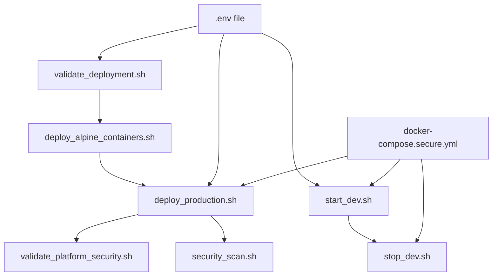

# Eunice Platform - Root Directory Scripts

This directory contains various scripts for managing the Eunice Research Platform deployment, development, and security validation.

## 📁 Script Categories

### 🚀 Development Scripts

- [`start_dev.sh`](#start_devsh) - Start development environment
- [`stop_dev.sh`](#stop_devsh) - Stop development environment

### 🏗️ Deployment Scripts

- [`deploy_production.sh`](#deploy_productionsh) - Production deployment
- [`deploy_alpine_containers.sh`](#deploy_alpine_containerssh) - Build all Alpine containers

### 🔒 Security & Validation Scripts

- [`security_scan.sh`](#security_scansh) - Vulnerability scanning
- [`validate_deployment.sh`](#validate_deploymentsh) - Deployment validation
- [`validate_platform_security.sh`](#validate_platform_securitysh) - Security validation

---

## 🚀 Development Scripts

### `start_dev.sh`

**Purpose**: Quick start script for local development environment using security-hardened Alpine containers.

**What it does**:

1. Loads environment variables from `.env` file
2. Stops any existing containers cleanly
3. Starts core infrastructure (Redis, PostgreSQL)  
4. Starts MCP server (central communication hub)
5. Starts core agents (Memory, Executor)
6. Starts API Gateway
7. Performs health checks on all services
8. Provides comprehensive status and usage information

**Usage**:

```bash
./start_dev.sh
```

**Services Started**:

- **Redis**: Message queue and caching (port 6380)
- **PostgreSQL**: Primary database (port 5433)
- **MCP Server**: WebSocket communication hub (port 9000)
- **Memory Agent**: Knowledge graph and context management (port 8009)
- **Executor Agent**: Task execution and workflow management (port 8008)
- **API Gateway**: REST API and frontend communication (port 8001)

**Health Endpoints**:

- API Gateway Health: `http://localhost:8001/health`
- API Documentation: `http://localhost:8001/docs`

**Prerequisites**:

- Docker and Docker Compose installed
- Sufficient system resources (2GB+ RAM recommended)
- Ports 5433, 6380, 8001, 8008, 8009, 9000 available

### `stop_dev.sh`

**Purpose**: Cleanly stop all development services and clean up containers.

**What it does**:

1. Stops all Docker Compose services
2. Removes orphaned containers
3. Provides restart instructions

**Usage**:

```bash
./stop_dev.sh
```

**Note**: This only stops containers, does not remove images or volumes.

---

## 🏗️ Deployment Scripts

### `deploy_production.sh`

**Purpose**: Complete production deployment script for the Eunice Research Platform.

**What it does**:

1. Validates system prerequisites (Docker, environment files)
2. Builds all necessary container images
3. Starts production services using `docker-compose.secure.yml`
4. Performs comprehensive health checks
5. Validates deployment readiness
6. Provides production monitoring information

**Usage**:

```bash
./deploy_production.sh
```

**Configuration**:

- Uses `docker-compose.secure.yml` for security-hardened deployment
- Requires `.env` file with production configuration
- Creates `logs/` directory for service logs

**Production Services**:

- All development services plus:
- Database Agent (port 8011)
- Literature Agent (port 8003)
- Planning Agent (port 8007)
- Research Manager (port 8002)
- Screening Agent (port 8004)
- AI Service (background)
- Database Service (background)

### `deploy_alpine_containers.sh`

**Purpose**: Build all security-hardened Alpine-based containers for the platform.

**What it does**:

1. Validates all Dockerfile locations
2. Builds each microservice container with Alpine Linux base
3. Tags containers with `alpine-secure` tag
4. Provides build statistics and error reporting
5. Performs post-build validation

**Usage**:

```bash
./deploy_alpine_containers.sh
```

**Containers Built**:

- `eunice/planning-agent:alpine-secure`
- `eunice/screening-agent:alpine-secure`
- `eunice/memory-agent:alpine-secure`
- `eunice/executor-agent:alpine-secure`
- `eunice/literature-agent:alpine-secure`
- `eunice/database-agent:alpine-secure`
- `eunice/research-manager-agent:alpine-secure`
- `eunice/api-gateway:alpine-secure`
- `eunice/mcp-server:alpine-secure`
- `eunice/ai-service:alpine-secure`
- `eunice/database-service:alpine-secure`

**Build Features**:

- No-cache builds for security
- Pull latest base images
- Comprehensive error handling
- Build time tracking

---

## 🔒 Security & Validation Scripts

### `security_scan.sh`

**Purpose**: Comprehensive vulnerability scanning of all Alpine-based container images.

**What it does**:

1. Scans all production containers for vulnerabilities
2. Uses Docker Scout and/or Trivy for analysis
3. Focuses on HIGH and CRITICAL severity issues
4. Provides security recommendations
5. Generates vulnerability reports

**Usage**:

```bash
./security_scan.sh
```

**Scanning Tools**:

- **Docker Scout**: Primary scanning tool (if available)
- **Trivy**: Alternative/additional scanning tool

**Installation of Tools**:

```bash
# Docker Scout
docker scout install

# Trivy (macOS)
brew install trivy

# Trivy (Ubuntu)
apt-get install trivy
```

**Security Benefits**:

- Alpine Linux base images significantly reduce attack surface
- Python 3.12-alpine provides latest security patches
- Regular scanning ensures ongoing security posture

### `validate_deployment.sh`

**Purpose**: Quick validation of production deployment prerequisites and configuration.

**What it does**:

1. Checks Docker installation and version
2. Validates Docker Compose availability
3. Verifies required environment files exist
4. Checks system resources
5. Validates network port availability
6. Confirms directory structure

**Usage**:

```bash
./validate_deployment.sh
```

**Validation Checks**:

- ✅ Docker version >= 20.0
- ✅ Docker Compose v2 support
- ✅ `.env` file exists and is readable
- ✅ Required directories present
- ✅ Sufficient disk space available
- ✅ Network ports not in use

### `validate_platform_security.sh`

**Purpose**: Comprehensive security validation of the deployed Alpine-based platform.

**What it does**:

1. Validates container security configurations
2. Checks for proper non-root user execution
3. Verifies read-only filesystem implementation
4. Validates capability dropping
5. Checks resource limits and security constraints
6. Performs runtime security analysis

**Usage**:

```bash
./validate_platform_security.sh
```

**Security Validations**:

- 🛡️ Container runs as non-root user (UID 1000)
- 🛡️ Read-only root filesystem with tmpfs mounts
- 🛡️ All capabilities dropped for maximum security
- 🛡️ No new privileges allowed
- 🛡️ Resource limits properly configured
- 🛡️ Security options enforced

---

## 🔧 Common Usage Patterns

### Development Workflow

```bash
# Start development environment
./start_dev.sh

# Work on code...

# Stop when done
./stop_dev.sh
```

### Production Deployment

```bash
# Validate system first
./validate_deployment.sh

# Build all containers
./deploy_alpine_containers.sh

# Deploy to production
./deploy_production.sh

# Validate security
./validate_platform_security.sh

# Scan for vulnerabilities
./security_scan.sh
```

### Security Maintenance

```bash
# Regular security scanning (weekly recommended)
./security_scan.sh

# Quarterly security validation
./validate_platform_security.sh

# After any container updates
./deploy_alpine_containers.sh
./security_scan.sh
```

---

## 📊 Script Dependencies



---

## ⚠️ Important Notes

### Security Considerations

- All containers use Alpine Linux for minimal attack surface
- Non-root execution (UID/GID 1000) enforced
- Read-only filesystems with targeted tmpfs mounts
- All capabilities dropped, no privilege escalation
- Resource limits prevent DoS attacks

### Port Configuration

Default ports used by the platform:

- `5433` - PostgreSQL database
- `6380` - Redis cache/queue
- `8001` - API Gateway (main entry point)
- `8002` - Research Manager Agent
- `8003` - Literature Agent  
- `8004` - Screening Agent
- `8007` - Planning Agent
- `8008` - Executor Agent
- `8009` - Memory Agent
- `8011` - Database Agent
- `9000` - MCP Server (WebSocket)

### Environment Variables

Key environment variables (set in `.env`):

- `EUNICE_ENV` - Environment (development/production)
- `POSTGRES_PASSWORD` - Database password
- `REDIS_PASSWORD` - Redis password (optional)
- `AI_API_KEY` - AI service API key
- `LOG_LEVEL` - Logging level (INFO/DEBUG)

### Troubleshooting

Common issues and solutions:

1. **Port conflicts**: Check if ports are in use with `lsof -ti:PORT`
2. **Container build failures**: Run `./deploy_alpine_containers.sh` to rebuild
3. **Health check failures**: Wait longer for services to initialize
4. **Permission errors**: Ensure Docker daemon is running and user has permissions

---

## 📚 Additional Resources

- [Docker Compose Reference](https://docs.docker.com/compose/)
- [Alpine Linux Security](https://alpinelinux.org/about/)
- [Container Security Best Practices](https://sysdig.com/blog/dockerfile-best-practices/)
- [Python Security Guidelines](https://python-security.readthedocs.io/)

For more detailed information about the platform architecture, see the main [README.md](../README.md) and [docs/](../docs/) directory.
