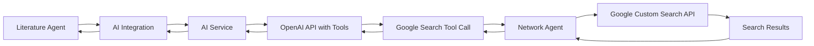

# 🔍 Google Search Tool Integration for Literature Agent

## Overview

The literature agent now supports **Google search tools** in its AI integration, allowing the OpenAI model to perform web searches when extracting search terms and reviewing literature. This integration enables the AI to:

- 🔍 **Validate scientific terminology** by searching recent publications
- 📚 **Find additional relevant papers** to complement existing literature
- 🆕 **Discover current research trends** and emerging topics
- ✅ **Verify research gaps** by searching for recent work

## Architecture



## Implementation Details

### 1. Tool Definition

The Google search tool is defined with the following OpenAI function schema:

```json
{
  "type": "function",
  "function": {
    "name": "google_search",
    "description": "Search the web using Google Custom Search to find recent research papers, validate scientific terminology, and discover current trends in research topics.",
    "parameters": {
      "type": "object",
      "properties": {
        "query": {
          "type": "string",
          "description": "The search query to find relevant research and information"
        },
        "num_results": {
          "type": "integer", 
          "description": "Number of search results to return (default: 10, max: 10)",
          "default": 10,
          "minimum": 1,
          "maximum": 10
        }
      },
      "required": ["query"]
    }
  }
}
```

### 2. Literature Agent Integration

In `agents/literature/src/literature_search/ai_integration.py`:

#### Search Term Extraction

```python
# Updated system prompt includes Google search capability
"content": "You are an expert research assistant specializing in academic literature search optimization. You have access to Google search to find recent research and validate terminology."

# Tools array added to OpenAI request
"tools": [google_search_tool],
"tool_choice": "auto"
```

#### Literature Review  

```python
# System prompt for literature review with search capability
"content": "You are an expert research assistant specializing in academic literature review and analysis. You can search the web to find additional relevant papers, validate research gaps, and discover recent publications."

# Same tools configuration
"tools": [google_search_tool],
"tool_choice": "auto"
```

### 3. AI Service Integration

In `services/ai-service/src/mcp_ai_service.py`:

#### Tool Call Execution

```python
async def _execute_tool_call(self, tool_call):
    """Execute a tool call and return the result"""
    function_name = tool_call.function.name
    arguments = json.loads(tool_call.function.arguments)
    
    if function_name == "google_search":
        return await self._execute_google_search(arguments)
```

#### Google Search Execution

```python
async def _execute_google_search(self, arguments):
    """Execute Google search via network agent"""
    search_request = {
        "type": "task_request",
        "data": {
            "task_id": f"google_search_{uuid.uuid4().hex[:8]}",
            "agent_type": "network",
            "action": "google_search",
            "payload": {
                "query": arguments.get("query", ""),
                "num_results": min(arguments.get("num_results", 10), 10)
            }
        }
    }
    # Send via MCP and wait for response...
```

## Usage Examples

### Example 1: Search Term Extraction with Tool Use

When the literature agent requests search term extraction:

1. **Input**: Research plan about neural organoids
2. **AI Request**: Includes Google search tool
3. **AI Behavior**: May call `google_search("neural organoid protocols 2024")` to validate current terminology
4. **Tool Response**: Returns recent search results
5. **AI Output**: More accurate, current search terms based on recent literature

### Example 2: Literature Review Enhancement  

When reviewing literature:

1. **Input**: Research plan + preliminary literature list
2. **AI Request**: Includes Google search tool  
3. **AI Behavior**: May search for `"recent advances neural organoids"` to find missing papers
4. **Tool Response**: Additional relevant papers discovered
5. **AI Output**: Expanded literature list with gap analysis

## Configuration

### Environment Variables

Ensure these are set in your `.env` file:

```bash
# Google Custom Search API (for network agent)
GOOGLE_API_KEY=your_google_api_key_here
GOOGLE_SEARCH_ENGINE_ID=your_search_engine_id_here

# OpenAI API (for AI service)
OPENAI_API_KEY=your_openai_api_key_here
```

### MCP Server Configuration

The AI service communicates with the network agent via MCP protocol:

- **AI Service**: `ws://mcp-server:9000` (sends tool call requests)
- **Network Agent**: `ws://mcp-server:9000` (executes Google searches)
- **MCP Server**: Routes requests between agents

## Message Flow

```
1. Literature Agent → AI Integration
   ├─ extract_search_terms_from_research_plan()
   └─ review_literature_results()

2. AI Integration → MCP Server → AI Service  
   ├─ research_action with tools=[google_search]
   └─ ai_chat_completion request

3. AI Service → OpenAI API
   ├─ Chat completion with tools
   └─ Potential tool_calls in response

4. AI Service → MCP Server → Network Agent
   ├─ task_request: google_search
   └─ Google Custom Search API call

5. Network Agent → MCP Server → AI Service
   ├─ task_result with search results
   └─ Tool call result

6. AI Service → OpenAI API  
   ├─ Continue conversation with tool results
   └─ Final response

7. AI Service → MCP Server → Literature Agent
   ├─ task_result with final answer
   └─ Search terms or literature analysis
```

## Benefits

### 🎯 **Enhanced Accuracy**

- AI can verify current scientific terminology
- Search terms are based on recent research trends
- Literature gaps are identified through real-time searching

### 🔍 **Dynamic Discovery**  

- AI discovers papers not in initial search results
- Identifies emerging research areas and methods
- Finds recent publications and preprints

### 📈 **Improved Coverage**

- Broader literature coverage through web search
- Better identification of methodological advances  
- More comprehensive gap analysis

### ⚡ **Real-time Intelligence**

- Access to most recent research developments
- Current terminology and trending topics
- Up-to-date methodological information

## Testing

Run the validation test to verify the integration:

```bash
cd agents/literature
python test_google_tool_validation.py
```

Expected output:

```
🎉 All Google search tool validations passed!

📝 Summary:
   ✅ Google search tool is properly defined
   ✅ Tool parameters include query and num_results  
   ✅ AI request structure includes tools array
   ✅ tool_choice is set to 'auto'
   ✅ OpenAI will be able to call google_search function
```

## Deployment

The Google search tool integration is automatically included when deploying with Docker Compose:

```bash
# Deploy with tool integration
docker compose -f docker-compose.secure.yml up -d

# Development mode with file watching
docker compose -f docker-compose.secure.yml -f docker-compose.dev.yml up
```

All agents (literature, ai-service, network) will be deployed and connected via MCP protocol.

## Monitoring

Monitor tool usage through:

1. **AI Service Logs**: Tool call execution and results
2. **Network Agent Logs**: Google search API calls and responses  
3. **Literature Agent Logs**: Search term extraction and literature review results
4. **MCP Server Logs**: Inter-agent communication

## Security

- 🔒 **API Keys**: Stored in environment variables only
- 🛡️ **Rate Limiting**: Google Custom Search limits (100/day, 10/minute)
- 🔐 **Tool Validation**: All tool calls validated before execution
- 🚫 **Sandboxing**: Tools can only call predefined functions

## Future Enhancements

Potential future improvements:

- 📚 **Academic Database Tools**: Direct PubMed, arXiv, and Semantic Scholar search
- 🧠 **Multi-step Reasoning**: Chain multiple search queries for complex research
- 📊 **Citation Analysis**: Tools for citation network analysis
- 🔍 **Full-text Search**: Integration with research paper repositories
