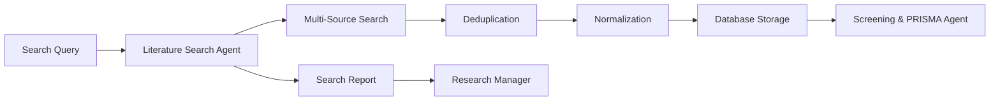

# Literature Search Agent (LSA) Documentation

## Overview

The **Literature Search Agent (LSA)** is the first stage in the literature review pipeline, responsible for discovering and collecting bibliographic records from multiple academic sources. It normalizes results and stores them for further screening by the Screening & PRISMA Agent.

**✅ Status**: Design Complete - Ready for Implementation  
**🔧 Architecture**: Specialized agent extracted from Literature Agent  
**🎯 Purpose**: Academic source discovery and data collection

## Core Responsibilities

### Primary Functions

- **Multi-Source Querying**: Search across PubMed, CrossRef, Semantic Scholar, arXiv, and other academic databases
- **Advanced Filtering**: Apply year ranges, publication types, keywords, and custom criteria
- **Deduplication**: Remove duplicates using DOI, PMID, or title/author/year heuristics
- **Data Normalization**: Convert diverse source formats into standardized schema
- **Storage Management**: Store both raw source data and normalized records in Literature Database

### Academic Data Sources

#### Primary Sources

- **PubMed**: Medical and life sciences literature
- **Semantic Scholar**: AI-powered academic search with rich metadata
- **CrossRef**: DOI-based academic publication metadata
- **arXiv**: Preprint server for physics, mathematics, computer science
- **Google Scholar**: Broad academic search (fallback/supplementary)

#### Specialized Sources

- **IEEE Xplore**: Engineering and technology papers
- **ACM Digital Library**: Computer science publications
- **PsycINFO**: Psychology and behavioral sciences
- **Web of Science**: Citation database across disciplines

## Task Execution Workflow

### 1. Search Query Processing

```python
class SearchQuery(BaseModel):
    lit_review_id: str
    query: str
    filters: dict[str, Any]
    sources: list[str]
    max_results: int
    date_range: Optional[tuple[str, str]]
    publication_types: Optional[list[str]]
    languages: Optional[list[str]]
```

### 2. Multi-Source Search Pipeline

**Step 1: Query Construction**

- Parse search query and filters
- Construct source-specific API calls
- Apply rate limiting and authentication

**Step 2: Parallel Data Retrieval**

- Execute searches across specified sources
- Handle pagination with appropriate delays
- Parse metadata into common schema

**Step 3: Result Processing**

- Combine results from all sources
- Apply deduplication algorithms
- Validate and clean metadata

**Step 4: Storage and Reporting**

- Store raw and normalized data
- Generate comprehensive search report
- Log errors and missing fields

### 3. Deduplication Strategy

#### Primary Deduplication (DOI-based)

```python
def deduplicate_by_doi(records: List[Dict]) -> List[Dict]:
    """Remove duplicates using DOI as primary key."""
    seen_dois = set()
    unique_records = []
    
    for record in records:
        doi = record.get('doi')
        if doi and doi not in seen_dois:
            seen_dois.add(doi)
            unique_records.append(record)
    
    return unique_records
```

#### Secondary Deduplication (Fuzzy Matching)

```python
def fuzzy_title_match(title1: str, title2: str, threshold: float = 0.85) -> bool:
    """Check if two titles are likely the same paper."""
    # Implementation using fuzzy string matching
    pass
```

#### Heuristic Deduplication

- Title + First Author + Year combination
- Abstract similarity scoring
- Journal + Volume + Page matching

## Data Models

### Input Models

```python
class SearchQuery(BaseModel):
    lit_review_id: str
    query: str
    filters: dict[str, Any]
    sources: list[str]
    max_results: int

class SearchFilters(BaseModel):
    date_range: Optional[tuple[datetime, datetime]]
    publication_types: Optional[list[str]]
    languages: Optional[list[str]]
    study_types: Optional[list[str]]
    min_citations: Optional[int]
    open_access_only: Optional[bool]
```

### Output Models

```python
class SearchReport(BaseModel):
    lit_review_id: str
    total_fetched: int
    total_unique: int
    per_source_counts: dict[str, int]
    duplicates_removed: int
    start_time: datetime
    end_time: datetime
    errors: list[str]
    
class NormalizedRecord(BaseModel):
    record_id: str
    title: str
    authors: list[str]
    abstract: Optional[str]
    doi: Optional[str]
    pmid: Optional[str]
    publication_date: Optional[datetime]
    journal: Optional[str]
    volume: Optional[str]
    issue: Optional[str]
    pages: Optional[str]
    keywords: list[str]
    mesh_terms: list[str]
    source: str
    url: str
    open_access: bool
    citation_count: Optional[int]
    raw_data: dict[str, Any]
```

## API Integration

### Source-Specific Implementations

#### PubMed Integration

```python
class PubMedConnector:
    async def search(self, query: str, filters: SearchFilters) -> List[Dict]:
        """Search PubMed using E-utilities API."""
        # Implementation details
        pass
    
    def parse_pubmed_record(self, xml_record) -> NormalizedRecord:
        """Parse PubMed XML into normalized format."""
        pass
```

#### Semantic Scholar Integration

```python
class SemanticScholarConnector:
    async def search(self, query: str, filters: SearchFilters) -> List[Dict]:
        """Search using Semantic Scholar API."""
        # Enhanced with API key support
        pass
    
    def parse_semantic_scholar_record(self, json_record) -> NormalizedRecord:
        """Parse Semantic Scholar JSON into normalized format."""
        pass
```

#### CrossRef Integration

```python
class CrossRefConnector:
    async def search(self, query: str, filters: SearchFilters) -> List[Dict]:
        """Search CrossRef metadata API."""
        pass
    
    def parse_crossref_record(self, json_record) -> NormalizedRecord:
        """Parse CrossRef JSON into normalized format."""
        pass
```

## Performance Metrics

### Search Quality Metrics

- **Recall**: Percentage of relevant papers found vs. benchmark queries
- **Precision**: Percentage of returned papers that are relevant
- **Coverage**: Number of unique sources providing results
- **Freshness**: Average age of returned publications

### Technical Metrics

- **API Success Rate**: Percentage of successful API calls per source
- **Deduplication Effectiveness**: Percentage of duplicates correctly identified
- **Processing Speed**: Records processed per minute
- **Error Rate**: Failed queries and parsing errors

### Example Metrics Dashboard

```python
class SearchMetrics(BaseModel):
    total_queries: int
    successful_queries: int
    total_records_found: int
    unique_records: int
    deduplication_rate: float
    average_query_time: float
    source_success_rates: dict[str, float]
    error_types: dict[str, int]
```

## Error Handling

### Common Error Types

1. **API Rate Limits**: Implement exponential backoff
2. **Network Timeouts**: Retry with longer timeouts
3. **Authentication Failures**: Refresh API keys/tokens
4. **Malformed Responses**: Graceful parsing with logging
5. **Quota Exceeded**: Switch to alternative sources

### Error Recovery Strategies

```python
async def search_with_retry(source: str, query: str, max_retries: int = 3):
    """Search with automatic retry and fallback."""
    for attempt in range(max_retries):
        try:
            return await source_connectors[source].search(query)
        except RateLimitError:
            await asyncio.sleep(2 ** attempt)  # Exponential backoff
        except AuthenticationError:
            await refresh_api_credentials(source)
        except Exception as e:
            logger.error(f"Search failed for {source}: {e}")
            if attempt == max_retries - 1:
                raise
```

## Configuration

### Agent Configuration

```python
class LSAConfig(BaseModel):
    default_sources: list[str] = ["semantic_scholar", "pubmed", "crossref"]
    max_results_per_source: int = 100
    deduplication_threshold: float = 0.85
    api_keys: dict[str, str]
    rate_limits: dict[str, int]  # requests per minute
    request_timeout: int = 30
    retry_attempts: int = 3
```

### Environment Variables

```bash
# API Keys
PUBMED_API_KEY=your_pubmed_key
SEMANTIC_SCHOLAR_API_KEY=your_semantic_scholar_key
CROSSREF_API_KEY=your_crossref_key

# Rate Limiting
LSA_MAX_CONCURRENT_REQUESTS=5
LSA_DEFAULT_TIMEOUT=30
LSA_RETRY_ATTEMPTS=3
```

## Integration with Other Agents

### Downstream Integration

- **Screening & PRISMA Agent**: Receives normalized records for screening
- **Database Agent**: Stores search results and metadata
- **Research Manager**: Receives search reports and metrics

### Data Flow



## Usage Examples

### Basic Literature Search

```python
# Via MCP action
search_action = ResearchAction(
    task_id="lit_search_001",
    context_id="systematic_review_001",
    agent_type="LiteratureSearch",
    action="search_literature",
    payload={
        "lit_review_id": "review_2024_001",
        "query": "machine learning healthcare diagnosis",
        "sources": ["semantic_scholar", "pubmed", "ieee"],
        "max_results": 500,
        "filters": {
            "date_range": ["2020-01-01", "2024-12-31"],
            "publication_types": ["journal_article", "conference_paper"],
            "languages": ["en"],
            "min_citations": 5
        }
    }
)
```

### Advanced Filtered Search

```python
# Systematic review with specific criteria
systematic_search = {
    "lit_review_id": "covid_treatment_review",
    "query": "(COVID-19 OR SARS-CoV-2) AND (treatment OR therapy) AND (clinical trial OR randomized)",
    "sources": ["pubmed", "crossref", "semantic_scholar"],
    "max_results": 1000,
    "filters": {
        "date_range": ["2020-01-01", "2024-07-01"],
        "publication_types": ["journal_article"],
        "study_types": ["clinical_trial", "systematic_review", "meta_analysis"],
        "languages": ["en", "es", "fr"],
        "open_access_only": True
    }
}
```

## Testing Strategy

### Unit Tests

- Search query parsing and validation
- Deduplication algorithm accuracy
- Data normalization correctness
- Error handling robustness

### Integration Tests

- API connectivity and authentication
- Multi-source search coordination
- Database storage integration
- End-to-end search workflows

### Performance Tests

- Large-scale search performance
- Concurrent request handling
- Memory usage optimization
- Rate limit compliance

### Quality Assurance

- Search result relevance validation
- Duplicate detection accuracy
- Metadata completeness assessment
- Cross-source consistency checks

## Future Enhancements

### Planned Features

- **Machine Learning Search Optimization**: AI-powered query expansion
- **Semantic Search**: Vector-based similarity search
- **Auto-Classification**: Automatic study type identification
- **Citation Network Analysis**: Reference chain exploration
- **Real-time Alerts**: New publication notifications

### Integration Opportunities

- **Zotero/Mendeley**: Reference manager integration
- **ORCID**: Author identification and disambiguation
- **Altmetrics**: Social media and news mention tracking
- **Full-text Mining**: PDF content extraction and analysis

---

**Implementation Priority**: High (Foundation for literature review pipeline)  
**Dependencies**: Database Agent, Research Manager  
**Estimated Development**: 3-4 weeks  
**Testing Requirements**: Comprehensive API integration testing

---

*This documentation serves as the implementation specification for the Literature Search Agent within the Eunice platform's literature review pipeline.*
