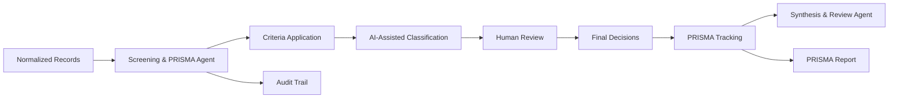

# Screening & PRISMA Agent (SPA) Documentation

## Overview

The **Screening & PRISMA Agent (SPA)** is the second stage in the literature review pipeline, responsible for systematic review screening and maintaining PRISMA-compliant audit trails. It applies inclusion/exclusion criteria and manages the screening workflow with human-in-the-loop capabilities.

**✅ Status**: Design Complete - Ready for Implementation  
**🔧 Architecture**: Specialized agent extracted from Literature Agent  
**🎯 Purpose**: Systematic review screening and PRISMA compliance

## Core Responsibilities

### Primary Functions

- **Systematic Screening**: Perform title/abstract and full-text screening stages
- **Criteria Application**: Apply predefined inclusion/exclusion rules with AI assistance
- **PRISMA Compliance**: Track all flowchart counts and maintain transparent audit trails
- **Human Integration**: Support manual overrides and decision validation
- **Quality Assurance**: Inter-rater reliability and consistency checking

### Screening Workflow Stages

#### Stage 1: Title/Abstract Screening

- Initial rapid screening based on titles and abstracts
- High-recall, moderate-precision approach
- AI-assisted classification with confidence scores
- Batch processing with parallel evaluation

#### Stage 2: Full-Text Screening

- Detailed evaluation of full paper content
- Strict application of inclusion/exclusion criteria
- Manual review integration for borderline cases
- Final inclusion decisions with rationale

## Task Execution Workflow

### 1. Screening Session Initialization

```python
class ScreeningSession(BaseModel):
    lit_review_id: str
    criteria: List[Criteria]
    screening_stage: Literal["title_abstract", "full_text"]
    reviewer_ids: List[str]
    consensus_threshold: float = 0.8
    ai_assistance_enabled: bool = True
```

### 2. Criteria Definition and Management

```python
class Criteria(BaseModel):
    name: str
    description: str
    type: Literal["include", "exclude"]
    priority: int  # 1=highest priority
    examples: List[str]
    keywords: List[str]
    
class InclusionCriteria(Criteria):
    type: Literal["include"] = "include"
    
class ExclusionCriteria(Criteria):
    type: Literal["exclude"] = "exclude"
```

### 3. Screening Decision Process

**Automated Screening Pipeline:**

1. **Criteria Evaluation**: Apply each criterion to record
2. **Confidence Scoring**: Generate confidence scores (0.0-1.0)
3. **Decision Logic**: Combine criteria results into final decision
4. **Uncertainty Handling**: Flag borderline cases for manual review
5. **Audit Trail**: Log all decisions with rationale

**Decision Algorithm:**

```python
def evaluate_record(record: NormalizedRecord, criteria: List[Criteria]) -> ScreeningDecision:
    """Evaluate a record against all screening criteria."""
    
    criterion_scores = []
    exclusion_triggered = False
    
    for criterion in criteria:
        score = evaluate_criterion(record, criterion)
        criterion_scores.append(score)
        
        if criterion.type == "exclude" and score.confidence > 0.8:
            exclusion_triggered = True
            break
    
    # Decision logic
    if exclusion_triggered:
        decision = "exclude"
        confidence = max(s.confidence for s in criterion_scores if s.criterion.type == "exclude")
    else:
        inclusion_scores = [s for s in criterion_scores if s.criterion.type == "include"]
        if inclusion_scores and min(s.confidence for s in inclusion_scores) > 0.6:
            decision = "include"
            confidence = min(s.confidence for s in inclusion_scores)
        else:
            decision = "unsure"
            confidence = 0.5
    
    return ScreeningDecision(
        record_id=record.record_id,
        decision=decision,
        confidence=confidence,
        criterion_scores=criterion_scores,
        timestamp=datetime.utcnow()
    )
```

## Data Models

### Core Models

```python
class ScreeningDecision(BaseModel):
    record_id: str
    stage: Literal["title_abstract", "full_text"]
    decision: Literal["include", "exclude", "unsure"]
    reason: str
    confidence: float
    reviewer_id: Optional[str]  # None for AI decisions
    criterion_scores: List[CriterionScore]
    timestamp: datetime
    is_final: bool = False

class CriterionScore(BaseModel):
    criterion_id: str
    criterion_name: str
    score: float  # 0.0-1.0
    confidence: float  # 0.0-1.0
    rationale: str
    matched_keywords: List[str]

class ScreeningBatch(BaseModel):
    batch_id: str
    lit_review_id: str
    record_ids: List[str]
    stage: Literal["title_abstract", "full_text"]
    status: Literal["pending", "processing", "completed", "failed"]
    assigned_reviewer: Optional[str]
    ai_assistance: bool
    created_at: datetime
    completed_at: Optional[datetime]
```

### PRISMA Tracking Models

```python
class PRISMAFlowchart(BaseModel):
    lit_review_id: str
    
    # Identification stage
    records_identified_database: int
    records_identified_registers: int
    records_removed_duplicates: int
    
    # Screening stage
    records_screened_title_abstract: int
    records_excluded_title_abstract: int
    reports_sought_retrieval: int
    reports_not_retrieved: int
    
    # Eligibility stage
    reports_assessed_eligibility: int
    reports_excluded_full_text: int
    exclusion_reasons: Dict[str, int]
    
    # Included stage
    studies_included_qualitative: int
    studies_included_quantitative: int
    
    # Metadata
    last_updated: datetime
    generated_by: str

class ExclusionReason(BaseModel):
    reason_code: str
    reason_description: str
    count: int
    examples: List[str]
```

## AI-Assisted Screening

### Natural Language Processing Pipeline

#### Text Analysis Components

- **Keyword Matching**: Exact and fuzzy keyword detection
- **Semantic Similarity**: Vector-based content similarity
- **Named Entity Recognition**: Identify study populations, interventions, outcomes
- **Sentiment Analysis**: Assess study conclusions and findings

#### AI Model Integration

```python
class ScreeningAI:
    def __init__(self, ai_client: AIClient):
        self.ai_client = ai_client
        self.embedding_cache = {}
    
    async def classify_record(self, record: NormalizedRecord, criteria: List[Criteria]) -> List[CriterionScore]:
        """AI-based record classification against criteria."""
        
        # Generate embeddings for record content
        record_embedding = await self.get_embedding(
            f"{record.title} {record.abstract or ''}"
        )
        
        scores = []
        for criterion in criteria:
            # Semantic similarity to criterion examples
            criterion_embedding = await self.get_criterion_embedding(criterion)
            similarity = cosine_similarity(record_embedding, criterion_embedding)
            
            # Keyword matching
            keyword_matches = self.find_keyword_matches(record, criterion.keywords)
            
            # Combined scoring
            score = self.combine_scores(similarity, keyword_matches, criterion)
            scores.append(score)
        
        return scores
    
    async def explain_decision(self, record: NormalizedRecord, decision: ScreeningDecision) -> str:
        """Generate human-readable explanation for screening decision."""
        
        prompt = f"""
        Explain why the following research paper was {decision.decision}d for a systematic review:
        
        Paper: {record.title}
        Abstract: {record.abstract}
        
        Decision: {decision.decision} (confidence: {decision.confidence:.2f})
        Criteria applied: {[cs.criterion_name for cs in decision.criterion_scores]}
        
        Provide a clear, concise explanation suitable for researchers.
        """
        
        explanation = await self.ai_client.generate_text(prompt)
        return explanation
```

### Human-in-the-Loop Integration

#### Manual Review Interface

- **Disagreement Resolution**: Handle AI-human decision conflicts
- **Borderline Case Review**: Manual evaluation of uncertain decisions
- **Batch Review**: Efficient review of multiple decisions
- **Training Feedback**: Improve AI performance with human corrections

#### Inter-Rater Reliability

```python
class ReliabilityAnalysis:
    def calculate_cohen_kappa(self, decisions1: List[ScreeningDecision], 
                            decisions2: List[ScreeningDecision]) -> float:
        """Calculate Cohen's kappa for inter-rater reliability."""
        # Implementation for agreement measurement
        pass
    
    def identify_disagreements(self, decisions: List[List[ScreeningDecision]]) -> List[str]:
        """Identify records with reviewer disagreements."""
        # Implementation for disagreement detection
        pass
```

## PRISMA Compliance

### Flowchart Generation

```python
class PRISMAGenerator:
    def __init__(self, database_agent: DatabaseAgent):
        self.db_agent = database_agent
    
    async def generate_flowchart(self, lit_review_id: str) -> PRISMAFlowchart:
        """Generate PRISMA flowchart from screening data."""
        
        # Collect screening statistics
        search_stats = await self.db_agent.get_search_statistics(lit_review_id)
        screening_stats = await self.db_agent.get_screening_statistics(lit_review_id)
        
        flowchart = PRISMAFlowchart(
            lit_review_id=lit_review_id,
            records_identified_database=search_stats.total_unique,
            records_removed_duplicates=search_stats.duplicates_removed,
            records_screened_title_abstract=screening_stats.title_abstract_screened,
            records_excluded_title_abstract=screening_stats.title_abstract_excluded,
            reports_assessed_eligibility=screening_stats.full_text_screened,
            reports_excluded_full_text=screening_stats.full_text_excluded,
            studies_included_qualitative=screening_stats.final_included,
            exclusion_reasons=screening_stats.exclusion_reasons,
            last_updated=datetime.utcnow(),
            generated_by="Screening_PRISMA_Agent"
        )
        
        return flowchart
    
    def export_flowchart_diagram(self, flowchart: PRISMAFlowchart, format: str = "svg") -> bytes:
        """Export PRISMA flowchart as visual diagram."""
        # Implementation for diagram generation
        pass
```

### Audit Trail Management

```python
class AuditTrail:
    def log_decision(self, decision: ScreeningDecision, context: Dict[str, Any]):
        """Log screening decision with full context."""
        
        audit_entry = {
            "timestamp": decision.timestamp.isoformat(),
            "record_id": decision.record_id,
            "decision": decision.decision,
            "confidence": decision.confidence,
            "reviewer": decision.reviewer_id or "AI_Assistant",
            "criteria_applied": [cs.criterion_name for cs in decision.criterion_scores],
            "rationale": decision.reason,
            "context": context
        }
        
        # Store in audit database
        pass
    
    def generate_audit_report(self, lit_review_id: str) -> Dict[str, Any]:
        """Generate comprehensive audit report."""
        # Implementation for audit reporting
        pass
```

## Performance Metrics

### Screening Quality Metrics

- **Precision**: Proportion of included papers that are truly relevant
- **Recall**: Proportion of relevant papers that were included
- **Inter-rater Reliability**: Agreement between reviewers (Cohen's kappa)
- **AI Accuracy**: Proportion of AI decisions that match human reviewers

### Efficiency Metrics

- **Screening Speed**: Records processed per hour
- **Time Savings**: Reduction in manual screening time
- **Decision Consistency**: Variation in decisions across reviewers
- **Quality Assurance**: Error detection and correction rates

### PRISMA Compliance Metrics

- **Completeness**: All required PRISMA elements documented
- **Transparency**: Audit trail coverage and detail
- **Reproducibility**: Ability to recreate screening decisions
- **Reporting Standards**: Adherence to PRISMA-P and PRISMA 2020

## Configuration

### Agent Configuration

```python
class SPAConfig(BaseModel):
    ai_assistance_default: bool = True
    batch_size: int = 50
    confidence_threshold_include: float = 0.7
    confidence_threshold_exclude: float = 0.8
    manual_review_threshold: float = 0.5  # Below this, requires manual review
    inter_rater_agreement_threshold: float = 0.8
    max_reviewers_per_record: int = 2
```

### Screening Templates

```yaml
# Example systematic review criteria template
systematic_review_template:
  inclusion_criteria:
    - name: "Population"
      description: "Studies involving adult patients (18+ years)"
      keywords: ["adult", "patients", "human", "18 years", "over 18"]
      
    - name: "Intervention"
      description: "Machine learning or AI-based diagnostic tools"
      keywords: ["machine learning", "artificial intelligence", "AI", "deep learning", "neural network"]
      
    - name: "Study Type"
      description: "Empirical studies with quantitative outcomes"
      keywords: ["randomized", "controlled", "trial", "cohort", "case-control", "cross-sectional"]
  
  exclusion_criteria:
    - name: "Language"
      description: "Non-English publications"
      keywords: ["non-English", "foreign language"]
      
    - name: "Publication Type"
      description: "Editorials, letters, commentaries"
      keywords: ["editorial", "letter", "commentary", "opinion"]
```

## Integration Points

### Upstream Integration

- **Literature Search Agent**: Receives normalized records for screening
- **Research Manager**: Receives screening progress and results

### Downstream Integration

- **Synthesis & Review Agent**: Provides included studies for analysis
- **Database Agent**: Stores screening decisions and PRISMA data

### Data Flow



## Usage Examples

### Basic Screening Setup

```python
# Initialize screening session
screening_session = {
    "lit_review_id": "systematic_review_2024_001",
    "criteria": [
        {
            "name": "Adult Population",
            "description": "Studies with adult participants (18+ years)",
            "type": "include",
            "keywords": ["adult", "18 years", "over 18", "grown-up"]
        },
        {
            "name": "Non-Human Studies",
            "description": "Animal or in-vitro studies",
            "type": "exclude",
            "keywords": ["animal", "rat", "mouse", "in vitro", "cell culture"]
        }
    ],
    "screening_stage": "title_abstract",
    "ai_assistance_enabled": True
}

# Start screening batch
screening_action = ResearchAction(
    task_id="screening_001",
    context_id="systematic_review_001",
    agent_type="ScreeningPRISMA",
    action="screen_batch",
    payload=screening_session
)
```

### Human Review Integration

```python
# Manual review of borderline cases
manual_review = {
    "lit_review_id": "systematic_review_2024_001",
    "record_ids": ["record_123", "record_456", "record_789"],
    "reviewer_id": "reviewer_001",
    "stage": "full_text",
    "review_mode": "disagreement_resolution"  # or "borderline_cases"
}
```

## Testing Strategy

### Automated Testing

- **Criteria Logic**: Validate inclusion/exclusion rule application
- **AI Classification**: Test classification accuracy against known datasets
- **PRISMA Generation**: Verify flowchart calculation correctness
- **Audit Trail**: Ensure complete decision logging

### Human Validation

- **Inter-rater Reliability**: Compare AI decisions with expert reviewers
- **Gold Standard Testing**: Validate against manually screened datasets
- **Bias Detection**: Check for systematic AI classification biases
- **Usability Testing**: Evaluate human-in-the-loop interface effectiveness

## Future Enhancements

### Advanced Features

- **Active Learning**: Improve AI performance with reviewer feedback
- **Predictive Screening**: Prioritize likely-relevant papers for review
- **Collaborative Screening**: Multi-reviewer coordination and consensus
- **Custom Criteria Templates**: Domain-specific screening templates

### Integration Expansions

- **External Tools**: Rayyan, Covidence, RevMan integration
- **Machine Learning**: Advanced NLP models for better classification
- **Visualization**: Interactive PRISMA flowchart editing
- **Reporting**: Automated PRISMA checklist compliance verification

---

**Implementation Priority**: High (Critical for systematic review workflow)  
**Dependencies**: Literature Search Agent, Database Agent, AI Agent  
**Estimated Development**: 4-5 weeks  
**Testing Requirements**: Extensive validation against systematic review standards

---

*This documentation serves as the implementation specification for the Screening & PRISMA Agent within the Eunice platform's literature review pipeline.*
