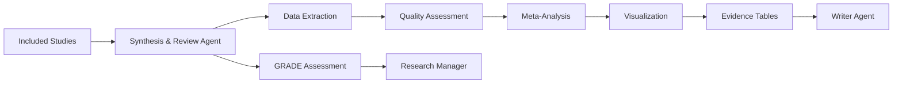

# Synthesis & Review Agent (SRA) Documentation

## Overview

The **Synthesis & Review Agent (SRA)** is the third stage in the literature review pipeline, responsible for analyzing included studies, extracting structured data, and synthesizing findings into meta-analyses and evidence summaries. It transforms screened papers into actionable research insights.

**✅ Status**: Design Complete - Ready for Implementation  
**🔧 Architecture**: Specialized agent extracted from Literature Agent  
**🎯 Purpose**: Data extraction, analysis, and evidence synthesis

## Core Responsibilities

### Primary Functions

- **Data Extraction**: Extract structured data from full-text documents and tables
- **Meta-Analysis**: Perform statistical synthesis with effect size calculations
- **Evidence Tables**: Generate comprehensive evidence summary tables
- **Quality Assessment**: Conduct GRADE quality evaluations and risk of bias assessment
- **Visual Synthesis**: Create forest plots, funnel plots, and summary visualizations

### Analysis Capabilities

#### Quantitative Synthesis

- Effect size calculation (standardized mean differences, odds ratios, risk ratios)
- Fixed and random effects meta-analysis
- Heterogeneity assessment (I², τ², Q-statistic)
- Subgroup analysis and meta-regression
- Publication bias detection (funnel plots, Egger's test)

#### Qualitative Synthesis

- Thematic analysis of study findings
- Narrative synthesis of heterogeneous studies
- Framework synthesis for complex interventions
- Content analysis of study characteristics

## Task Execution Workflow

### 1. Data Extraction Pipeline

```python
class ExtractionTask(BaseModel):
    lit_review_id: str
    record_ids: List[str]
    extraction_template: ExtractionTemplate
    extraction_method: Literal["automated", "manual", "hybrid"]
    target_outcomes: List[str]
    quality_criteria: List[str]

class ExtractionTemplate(BaseModel):
    template_id: str
    template_name: str
    study_characteristics: List[Field]
    participant_characteristics: List[Field]
    intervention_details: List[Field]
    outcome_measures: List[Field]
    methodological_quality: List[Field]
```

### 2. Automated Data Extraction

**PDF Processing Pipeline:**

1. **Document Parsing**: Extract text, tables, and figures from PDFs
2. **Structure Recognition**: Identify sections (methods, results, discussion)
3. **Table Extraction**: Parse data tables and statistical results
4. **Entity Recognition**: Identify study populations, interventions, outcomes
5. **Statistical Extraction**: Extract means, standard deviations, confidence intervals

```python
class DocumentProcessor:
    def __init__(self, ai_client: AIClient):
        self.ai_client = ai_client
        self.table_parser = TableParser()
        self.stat_extractor = StatisticalExtractor()
    
    async def extract_study_data(self, pdf_content: bytes, template: ExtractionTemplate) -> StudyData:
        """Extract structured data from a research paper PDF."""
        
        # Parse PDF structure
        document = await self.parse_pdf(pdf_content)
        
        # Extract by template sections
        study_data = StudyData()
        
        # Study characteristics
        study_data.characteristics = await self.extract_characteristics(
            document, template.study_characteristics
        )
        
        # Participant data
        study_data.participants = await self.extract_participants(
            document, template.participant_characteristics
        )
        
        # Intervention details
        study_data.interventions = await self.extract_interventions(
            document, template.intervention_details
        )
        
        # Outcome measures
        study_data.outcomes = await self.extract_outcomes(
            document, template.outcome_measures
        )
        
        # Statistical results
        study_data.statistics = await self.extract_statistics(document)
        
        return study_data
```

### 3. Meta-Analysis Engine

```python
class MetaAnalysisEngine:
    def __init__(self):
        self.effect_calculators = {
            'continuous': ContinuousEffectCalculator(),
            'dichotomous': DichotomousEffectCalculator(),
            'time_to_event': TimeToEventCalculator()
        }
    
    async def perform_meta_analysis(self, outcome_data: List[OutcomeDatum]) -> MetaAnalysisResult:
        """Perform meta-analysis on extracted outcome data."""
        
        # Determine outcome type
        outcome_type = self.determine_outcome_type(outcome_data)
        calculator = self.effect_calculators[outcome_type]
        
        # Calculate individual effect sizes
        effect_sizes = []
        for datum in outcome_data:
            effect = calculator.calculate_effect_size(datum)
            effect_sizes.append(effect)
        
        # Perform meta-analysis
        if len(effect_sizes) >= 2:
            # Fixed effects model
            fixed_effect = self.fixed_effects_analysis(effect_sizes)
            
            # Random effects model (if heterogeneity present)
            random_effect = self.random_effects_analysis(effect_sizes)
            
            # Heterogeneity assessment
            heterogeneity = self.assess_heterogeneity(effect_sizes)
            
            # Choose appropriate model
            final_result = random_effect if heterogeneity.i_squared > 50 else fixed_effect
            
        else:
            final_result = MetaAnalysisResult(
                error="Insufficient studies for meta-analysis",
                study_count=len(effect_sizes)
            )
        
        return final_result
```

## Data Models

### Extraction Models

```python
class StudyData(BaseModel):
    record_id: str
    extraction_date: datetime
    extractor_id: str  # Person or AI system
    
    # Study identification
    study_id: str
    citation: str
    doi: Optional[str]
    
    # Study characteristics
    characteristics: StudyCharacteristics
    participants: ParticipantData
    interventions: List[InterventionData]
    outcomes: List[OutcomeData]
    statistics: List[StatisticalResult]
    quality_assessment: QualityAssessment
    
    # Extraction metadata
    extraction_confidence: float
    manual_verification: bool
    notes: List[str]

class StudyCharacteristics(BaseModel):
    study_design: str
    study_setting: str
    country: str
    recruitment_period: Optional[str]
    follow_up_duration: Optional[str]
    funding_source: Optional[str]
    conflicts_of_interest: Optional[str]

class ParticipantData(BaseModel):
    total_participants: int
    inclusion_criteria: List[str]
    exclusion_criteria: List[str]
    age_mean: Optional[float]
    age_sd: Optional[float]
    gender_distribution: Optional[Dict[str, int]]
    baseline_characteristics: Dict[str, Any]

class OutcomeDatum(BaseModel):
    record_id: str
    outcome_name: str
    outcome_type: Literal["continuous", "dichotomous", "time_to_event"]
    measurement_timepoint: str
    
    # For continuous outcomes
    group_labels: Optional[List[str]]
    means: Optional[List[float]]
    sds: Optional[List[float]]
    ns: Optional[List[int]]
    
    # For dichotomous outcomes
    events: Optional[List[int]]
    totals: Optional[List[int]]
    
    # For time-to-event outcomes
    hazard_ratio: Optional[float]
    ci_lower: Optional[float]
    ci_upper: Optional[float]
    
    # Metadata
    extraction_method: Literal["automated", "manual"]
    confidence: float
    verified: bool = False
```

### Analysis Models

```python
class MetaAnalysisResult(BaseModel):
    outcome_name: str
    analysis_type: str
    
    # Effect size results
    pooled_effect: float
    ci_lower: float
    ci_upper: float
    p_value: float
    
    # Heterogeneity measures
    heterogeneity_i2: float
    heterogeneity_tau2: float
    heterogeneity_q: float
    heterogeneity_p: float
    
    # Study information
    study_count: int
    participant_count: int
    effect_sizes: List[EffectSize]
    
    # Model selection
    model_used: Literal["fixed", "random"]
    model_selection_reason: str
    
    # Quality indicators
    analysis_confidence: float
    limitations: List[str]

class EffectSize(BaseModel):
    record_id: str
    study_name: str
    effect_size: float
    variance: float
    weight: float
    ci_lower: float
    ci_upper: float

class EvidenceTable(BaseModel):
    table_id: str
    lit_review_id: str
    table_title: str
    outcome_name: str
    
    # Table structure
    columns: List[str]
    rows: List[Dict[str, Any]]
    
    # Summary statistics
    total_studies: int
    total_participants: int
    effect_summary: str
    quality_rating: str
    
    # GRADE assessment
    grade_certainty: Literal["very_low", "low", "moderate", "high"]
    grade_factors: GRADEFactors
```

## Statistical Analysis

### Effect Size Calculations

#### Continuous Outcomes

```python
class ContinuousEffectCalculator:
    def calculate_standardized_mean_difference(self, data: OutcomeDatum) -> EffectSize:
        """Calculate Cohen's d or Hedges' g for continuous outcomes."""
        
        if len(data.means) != 2 or len(data.sds) != 2 or len(data.ns) != 2:
            raise ValueError("Continuous outcome requires exactly 2 groups")
        
        mean1, mean2 = data.means
        sd1, sd2 = data.sds
        n1, n2 = data.ns
        
        # Pooled standard deviation
        pooled_sd = math.sqrt(((n1-1)*sd1**2 + (n2-1)*sd2**2) / (n1+n2-2))
        
        # Cohen's d
        cohens_d = (mean1 - mean2) / pooled_sd
        
        # Hedges' g (bias correction for small samples)
        j = 1 - (3 / (4*(n1+n2-2) - 1))
        hedges_g = cohens_d * j
        
        # Variance
        variance = ((n1+n2)/(n1*n2)) + (hedges_g**2 / (2*(n1+n2-2)))
        
        # Confidence interval
        se = math.sqrt(variance)
        ci_lower = hedges_g - 1.96 * se
        ci_upper = hedges_g + 1.96 * se
        
        return EffectSize(
            record_id=data.record_id,
            effect_size=hedges_g,
            variance=variance,
            ci_lower=ci_lower,
            ci_upper=ci_upper
        )
```

#### Dichotomous Outcomes

```python
class DichotomousEffectCalculator:
    def calculate_odds_ratio(self, data: OutcomeDatum) -> EffectSize:
        """Calculate odds ratio for dichotomous outcomes."""
        
        events1, events2 = data.events
        total1, total2 = data.totals
        
        # Non-events
        non_events1 = total1 - events1
        non_events2 = total2 - events2
        
        # Odds ratio
        or_value = (events1 * non_events2) / (non_events1 * events2)
        log_or = math.log(or_value)
        
        # Variance of log OR
        variance = (1/events1) + (1/non_events1) + (1/events2) + (1/non_events2)
        
        # Confidence interval
        se = math.sqrt(variance)
        ci_lower = math.exp(log_or - 1.96 * se)
        ci_upper = math.exp(log_or + 1.96 * se)
        
        return EffectSize(
            record_id=data.record_id,
            effect_size=or_value,
            variance=variance,
            ci_lower=ci_lower,
            ci_upper=ci_upper
        )
```

### Heterogeneity Assessment

```python
class HeterogeneityAnalyzer:
    def assess_heterogeneity(self, effect_sizes: List[EffectSize]) -> HeterogeneityResult:
        """Assess statistical heterogeneity using I², τ², and Q statistic."""
        
        # Calculate Q statistic
        weights = [1/es.variance for es in effect_sizes]
        weighted_effects = [es.effect_size * w for es, w in zip(effect_sizes, weights)]
        
        pooled_effect = sum(weighted_effects) / sum(weights)
        
        q_statistic = sum(w * (es.effect_size - pooled_effect)**2 
                         for es, w in zip(effect_sizes, weights))
        
        df = len(effect_sizes) - 1
        q_p_value = 1 - chi2.cdf(q_statistic, df)
        
        # Calculate I²
        i_squared = max(0, (q_statistic - df) / q_statistic) * 100
        
        # Calculate τ² (between-study variance)
        if q_statistic <= df:
            tau_squared = 0
        else:
            c = sum(weights) - sum(w**2 for w in weights) / sum(weights)
            tau_squared = (q_statistic - df) / c
        
        return HeterogeneityResult(
            i_squared=i_squared,
            tau_squared=tau_squared,
            q_statistic=q_statistic,
            q_p_value=q_p_value,
            interpretation=self.interpret_heterogeneity(i_squared)
        )
    
    def interpret_heterogeneity(self, i_squared: float) -> str:
        """Interpret I² values according to Cochrane guidelines."""
        if i_squared < 25:
            return "Low heterogeneity"
        elif i_squared < 50:
            return "Moderate heterogeneity"
        elif i_squared < 75:
            return "Substantial heterogeneity"
        else:
            return "Considerable heterogeneity"
```

## Visualization Generation

### Forest Plot Creation

```python
class ForestPlotGenerator:
    def create_forest_plot(self, meta_result: MetaAnalysisResult, 
                          title: str = None) -> bytes:
        """Generate forest plot visualization."""
        
        fig, ax = plt.subplots(figsize=(12, 8))
        
        # Plot individual study effects
        y_positions = range(len(meta_result.effect_sizes))
        
        for i, effect in enumerate(meta_result.effect_sizes):
            # Plot point estimate
            ax.plot(effect.effect_size, i, 'ks', markersize=8)
            
            # Plot confidence interval
            ax.plot([effect.ci_lower, effect.ci_upper], [i, i], 'k-', linewidth=2)
            
            # Add study label
            ax.text(-0.1, i, effect.study_name, ha='right', va='center')
            
            # Add effect size text
            ax.text(effect.ci_upper + 0.1, i, 
                   f"{effect.effect_size:.2f} [{effect.ci_lower:.2f}, {effect.ci_upper:.2f}]",
                   ha='left', va='center')
        
        # Plot pooled effect
        pooled_y = len(meta_result.effect_sizes) + 1
        ax.plot(meta_result.pooled_effect, pooled_y, 'Ds', 
                markersize=12, color='red')
        ax.plot([meta_result.ci_lower, meta_result.ci_upper], 
                [pooled_y, pooled_y], 'r-', linewidth=3)
        
        # Add pooled effect label
        ax.text(-0.1, pooled_y, 'Pooled Effect', ha='right', va='center', 
                fontweight='bold')
        ax.text(meta_result.ci_upper + 0.1, pooled_y,
               f"{meta_result.pooled_effect:.2f} [{meta_result.ci_lower:.2f}, {meta_result.ci_upper:.2f}]",
               ha='left', va='center', fontweight='bold')
        
        # Add vertical line at null effect
        ax.axvline(x=0, color='black', linestyle='--', alpha=0.5)
        
        # Formatting
        ax.set_xlabel('Effect Size')
        ax.set_title(title or f'Forest Plot: {meta_result.outcome_name}')
        ax.set_ylim(-1, len(meta_result.effect_sizes) + 2)
        ax.grid(True, alpha=0.3)
        
        # Save to bytes
        buf = io.BytesIO()
        plt.savefig(buf, format='png', dpi=300, bbox_inches='tight')
        buf.seek(0)
        
        return buf.getvalue()
```

### Evidence Table Generation

```python
class EvidenceTableGenerator:
    def create_evidence_table(self, studies: List[StudyData], 
                             outcome: str) -> EvidenceTable:
        """Generate comprehensive evidence table."""
        
        columns = [
            "Study", "Design", "Participants", "Intervention", 
            "Control", "Outcome", "Effect Size", "Quality"
        ]
        
        rows = []
        for study in studies:
            # Find relevant outcome data
            outcome_data = next(
                (od for od in study.outcomes if od.outcome_name == outcome), 
                None
            )
            
            if outcome_data:
                row = {
                    "Study": f"{study.citation}",
                    "Design": study.characteristics.study_design,
                    "Participants": f"n={study.participants.total_participants}",
                    "Intervention": self.format_interventions(study.interventions),
                    "Control": self.format_control(study.interventions),
                    "Outcome": self.format_outcome(outcome_data),
                    "Effect Size": self.format_effect_size(outcome_data),
                    "Quality": self.format_quality(study.quality_assessment)
                }
                rows.append(row)
        
        return EvidenceTable(
            table_id=f"evidence_{outcome}_{datetime.now().strftime('%Y%m%d')}",
            lit_review_id=studies[0].record_id.split('_')[0],  # Extract review ID
            table_title=f"Evidence Table: {outcome}",
            outcome_name=outcome,
            columns=columns,
            rows=rows,
            total_studies=len(rows),
            total_participants=sum(s.participants.total_participants for s in studies)
        )
```

## Quality Assessment

### GRADE Assessment

```python
class GRADEAssessment:
    def assess_certainty(self, meta_result: MetaAnalysisResult, 
                        studies: List[StudyData]) -> GRADEResult:
        """Assess certainty of evidence using GRADE approach."""
        
        # Start with high certainty for RCTs, low for observational
        initial_certainty = self.determine_initial_certainty(studies)
        
        # Assess factors that decrease certainty
        risk_of_bias = self.assess_risk_of_bias(studies)
        inconsistency = self.assess_inconsistency(meta_result)
        indirectness = self.assess_indirectness(studies)
        imprecision = self.assess_imprecision(meta_result)
        publication_bias = self.assess_publication_bias(meta_result)
        
        # Assess factors that increase certainty (for observational studies)
        large_effect = self.assess_large_effect(meta_result)
        dose_response = self.assess_dose_response(studies)
        confounders = self.assess_residual_confounding(studies)
        
        # Calculate final certainty
        certainty_score = initial_certainty
        certainty_score -= risk_of_bias + inconsistency + indirectness + imprecision + publication_bias
        certainty_score += large_effect + dose_response + confounders
        
        # Convert to GRADE categories
        if certainty_score >= 4:
            certainty = "high"
        elif certainty_score >= 3:
            certainty = "moderate"
        elif certainty_score >= 2:
            certainty = "low"
        else:
            certainty = "very_low"
        
        return GRADEResult(
            certainty=certainty,
            initial_certainty=initial_certainty,
            factors={
                "risk_of_bias": risk_of_bias,
                "inconsistency": inconsistency,
                "indirectness": indirectness,
                "imprecision": imprecision,
                "publication_bias": publication_bias,
                "large_effect": large_effect,
                "dose_response": dose_response,
                "residual_confounding": confounders
            }
        )
```

## Configuration

### Agent Configuration

```python
class SRAConfig(BaseModel):
    # Data extraction settings
    extraction_confidence_threshold: float = 0.7
    manual_verification_required: bool = True
    table_extraction_enabled: bool = True
    
    # Meta-analysis settings
    min_studies_for_meta_analysis: int = 2
    heterogeneity_threshold: float = 50.0  # I² threshold for random effects
    fixed_effects_default: bool = False
    
    # Visualization settings
    forest_plot_dpi: int = 300
    figure_width: int = 12
    figure_height: int = 8
    
    # Quality assessment
    grade_assessment_enabled: bool = True
    risk_of_bias_tools: List[str] = ["RoB2", "ROBINS-I", "Newcastle-Ottawa"]
```

## Integration Points

### Upstream Integration

- **Screening & PRISMA Agent**: Receives included studies for analysis
- **Database Agent**: Retrieves study data and stores analysis results

### Downstream Integration

- **Writer Agent**: Provides synthesized data for manuscript generation
- **Research Manager**: Receives analysis reports and visualizations

### Data Flow



## Usage Examples

### Basic Meta-Analysis

```python
# Extract data and perform meta-analysis
synthesis_action = ResearchAction(
    task_id="synthesis_001",
    context_id="systematic_review_001",
    agent_type="SynthesisReview",
    action="extract_and_synthesize",
    payload={
        "lit_review_id": "systematic_review_2024_001",
        "record_ids": ["study_001", "study_002", "study_003"],
        "target_outcomes": ["primary_outcome", "adverse_events"],
        "analysis_type": "meta_analysis",
        "extraction_method": "hybrid"  # AI + manual verification
    }
)
```

### Custom Analysis Pipeline

```python
# Advanced synthesis with subgroup analysis
advanced_synthesis = {
    "lit_review_id": "rct_meta_analysis_2024",
    "analysis_plan": {
        "primary_analysis": {
            "outcome": "treatment_efficacy",
            "effect_measure": "standardized_mean_difference",
            "model": "random_effects"
        },
        "subgroup_analyses": [
            {"variable": "age_group", "levels": ["<65", ">=65"]},
            {"variable": "intervention_duration", "levels": ["<12_weeks", ">=12_weeks"]}
        ],
        "sensitivity_analyses": [
            {"exclude": "high_risk_of_bias"},
            {"exclude": "outlier_studies"}
        ]
    },
    "visualization_options": {
        "forest_plot": True,
        "funnel_plot": True,
        "subgroup_plots": True
    }
}
```

---

**Implementation Priority**: High (Core analysis engine)  
**Dependencies**: Screening & PRISMA Agent, Database Agent, AI Agent  
**Estimated Development**: 5-6 weeks  
**Testing Requirements**: Statistical accuracy validation, visualization testing

---

*This documentation serves as the implementation specification for the Synthesis & Review Agent within the Eunice platform's literature review pipeline.*
