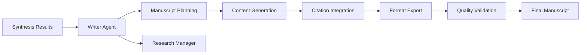

# Writer Agent (WA) Documentation

## Overview

The **Writer Agent (WA)** is the final stage in the literature review pipeline, responsible for transforming synthesized data into structured, scholarly manuscripts. It generates PRISMA-compliant reports and PhD-level literature reviews with proper formatting, citations, and visualizations.

**✅ Status**: Design Complete - Ready for Implementation  
**🔧 Architecture**: Specialized agent extracted from Literature Agent  
**🎯 Purpose**: Manuscript generation and scholarly writing

## Core Responsibilities

### Primary Functions

- **Manuscript Generation**: Create structured academic manuscripts (Introduction, Methods, Results, Discussion)
- **PRISMA Integration**: Embed flowcharts, evidence tables, and meta-analysis visualizations
- **Citation Management**: Ensure proper citation formatting and validation
- **Format Support**: Export to multiple formats (Markdown, LaTeX, Word, PDF)
- **Version Control**: Support iterative refinement and collaborative editing

### Writing Capabilities

#### Document Types

- Systematic review manuscripts (PRISMA-compliant)
- Meta-analysis reports with statistical synthesis
- Narrative review articles
- Evidence synthesis reports
- Grant proposal literature sections
- Thesis chapters and dissertations

#### Citation Styles

- APA (American Psychological Association)
- Vancouver (ICMJE)
- Harvard referencing
- Chicago/Turabian
- Custom institutional styles

## Task Execution Workflow

### 1. Manuscript Planning

```python
class ManuscriptPlan(BaseModel):
    lit_review_id: str
    manuscript_type: Literal["systematic_review", "meta_analysis", "narrative_review"]
    target_journal: Optional[str]
    word_limit: Optional[int]
    citation_style: str
    include_sections: List[str]
    visualization_requirements: List[str]
    
class SectionPlan(BaseModel):
    section_name: str
    subsections: List[str]
    content_sources: List[str]  # Which data sources to use
    target_word_count: int
    key_points: List[str]
```

### 2. Content Generation Pipeline

**Automated Writing Process:**

1. **Data Integration**: Combine results from all previous agents
2. **Section Planning**: Structure manuscript according to guidelines
3. **Content Generation**: AI-assisted writing with scholarly tone
4. **Citation Integration**: Embed and format references
5. **Visualization Placement**: Insert figures, tables, and flowcharts
6. **Quality Review**: Check completeness and consistency

```python
class ManuscriptGenerator:
    def __init__(self, ai_client: AIClient, citation_manager: CitationManager):
        self.ai_client = ai_client
        self.citation_manager = citation_manager
        self.templates = self.load_manuscript_templates()
    
    async def generate_manuscript(self, plan: ManuscriptPlan, 
                                synthesis_data: SynthesisData) -> Manuscript:
        """Generate complete manuscript from synthesis data."""
        
        manuscript = Manuscript(
            title=await self.generate_title(synthesis_data),
            abstract=await self.generate_abstract(synthesis_data),
            sections=[]
        )
        
        # Generate each section
        for section_name in plan.include_sections:
            section_content = await self.generate_section(
                section_name, synthesis_data, plan
            )
            manuscript.sections.append(section_content)
        
        # Add references
        manuscript.references = await self.compile_references(
            synthesis_data.included_studies
        )
        
        # Add figures and tables
        manuscript.figures = self.prepare_figures(synthesis_data.visualizations)
        manuscript.tables = self.prepare_tables(synthesis_data.evidence_tables)
        
        return manuscript
```

### 3. Section-Specific Generation

#### Introduction Section

```python
async def generate_introduction(self, synthesis_data: SynthesisData) -> Section:
    """Generate introduction section with background and objectives."""
    
    # Background and rationale
    background_prompt = f"""
    Write a scholarly introduction for a systematic review on {synthesis_data.topic}.
    Include:
    1. Background and context of the research problem
    2. Rationale for the systematic review
    3. Previous reviews and knowledge gaps
    4. Research objectives and questions
    
    Base the content on these key findings: {synthesis_data.key_themes}
    Use academic tone appropriate for {synthesis_data.target_journal or 'peer-reviewed journal'}.
    """
    
    background_content = await self.ai_client.generate_text(
        background_prompt, max_tokens=1000
    )
    
    # Objectives
    objectives = self.format_objectives(synthesis_data.research_questions)
    
    return Section(
        name="Introduction",
        content=background_content,
        subsections=[
            Subsection(name="Objectives", content=objectives)
        ]
    )
```

#### Methods Section

```python
async def generate_methods(self, synthesis_data: SynthesisData) -> Section:
    """Generate methods section with search strategy and analysis plan."""
    
    methods_subsections = []
    
    # Search strategy
    search_strategy = self.format_search_strategy(synthesis_data.search_data)
    methods_subsections.append(
        Subsection(name="Search Strategy", content=search_strategy)
    )
    
    # Selection criteria
    selection_criteria = self.format_selection_criteria(synthesis_data.screening_criteria)
    methods_subsections.append(
        Subsection(name="Selection Criteria", content=selection_criteria)
    )
    
    # Data extraction
    extraction_methods = self.format_extraction_methods(synthesis_data.extraction_template)
    methods_subsections.append(
        Subsection(name="Data Extraction", content=extraction_methods)
    )
    
    # Statistical analysis
    if synthesis_data.meta_analysis_results:
        statistical_methods = self.format_statistical_methods(synthesis_data.analysis_plan)
        methods_subsections.append(
            Subsection(name="Statistical Analysis", content=statistical_methods)
        )
    
    return Section(
        name="Methods",
        subsections=methods_subsections
    )
```

#### Results Section

```python
async def generate_results(self, synthesis_data: SynthesisData) -> Section:
    """Generate results section with findings and visualizations."""
    
    results_content = []
    
    # Study selection (PRISMA flow)
    prisma_text = self.format_prisma_results(synthesis_data.prisma_data)
    results_content.append(prisma_text)
    
    # Study characteristics
    characteristics_text = self.format_study_characteristics(synthesis_data.included_studies)
    results_content.append(characteristics_text)
    
    # Meta-analysis results
    if synthesis_data.meta_analysis_results:
        for outcome, result in synthesis_data.meta_analysis_results.items():
            outcome_text = self.format_meta_analysis_result(outcome, result)
            results_content.append(outcome_text)
    
    # Quality assessment
    quality_text = self.format_quality_assessment(synthesis_data.grade_assessments)
    results_content.append(quality_text)
    
    return Section(
        name="Results",
        content="\n\n".join(results_content),
        figures=self.extract_result_figures(synthesis_data),
        tables=self.extract_result_tables(synthesis_data)
    )
```

## Data Models

### Manuscript Models

```python
class Manuscript(BaseModel):
    manuscript_id: str
    lit_review_id: str
    title: str
    abstract: Abstract
    sections: List[Section]
    references: List[Reference]
    figures: List[Figure]
    tables: List[Table]
    
    # Metadata
    word_count: int
    citation_style: str
    format_version: str
    generated_date: datetime
    last_modified: datetime
    authors: List[Author]

class Abstract(BaseModel):
    structured: bool
    background: str
    methods: str
    results: str
    conclusions: str
    keywords: List[str]
    word_count: int

class Section(BaseModel):
    name: str
    content: str
    subsections: List[Subsection]
    figures: List[str] = []  # Figure references
    tables: List[str] = []   # Table references
    citations: List[str] = [] # Citation keys
    word_count: int

class Subsection(BaseModel):
    name: str
    content: str
    level: int = 2  # Heading level
    
class Figure(BaseModel):
    figure_id: str
    caption: str
    image_data: bytes
    format: str  # 'png', 'svg', 'pdf'
    width: int
    height: int
    placement: str  # 'here', 'top', 'bottom'

class Table(BaseModel):
    table_id: str
    caption: str
    headers: List[str]
    rows: List[List[str]]
    format: str  # 'simple', 'grid', 'latex'
    placement: str
```

### Citation Models

```python
class Reference(BaseModel):
    citation_key: str
    reference_type: Literal["journal_article", "book", "conference", "thesis", "report"]
    title: str
    authors: List[str]
    year: int
    
    # Journal article fields
    journal: Optional[str]
    volume: Optional[str]
    issue: Optional[str]
    pages: Optional[str]
    doi: Optional[str]
    pmid: Optional[str]
    
    # Book fields
    publisher: Optional[str]
    isbn: Optional[str]
    
    # URL and access date
    url: Optional[str]
    accessed_date: Optional[datetime]

class CitationStyle(BaseModel):
    style_name: str
    in_text_format: str  # e.g., "(Author, Year)" or "[1]"
    reference_format: str
    sort_order: Literal["alphabetical", "chronological", "citation_order"]
    hanging_indent: bool
```

## Citation Management

### Citation Integration

```python
class CitationManager:
    def __init__(self, style: CitationStyle):
        self.style = style
        self.reference_database = {}
        self.citation_counts = {}
    
    def add_reference(self, reference: Reference) -> str:
        """Add reference and return citation key."""
        
        citation_key = self.generate_citation_key(reference)
        self.reference_database[citation_key] = reference
        self.citation_counts[citation_key] = 0
        
        return citation_key
    
    def format_in_text_citation(self, citation_keys: List[str]) -> str:
        """Format in-text citation according to style."""
        
        if self.style.style_name == "apa":
            return self.format_apa_citation(citation_keys)
        elif self.style.style_name == "vancouver":
            return self.format_vancouver_citation(citation_keys)
        else:
            return self.format_generic_citation(citation_keys)
    
    def format_apa_citation(self, citation_keys: List[str]) -> str:
        """Format APA-style in-text citation."""
        
        citations = []
        for key in citation_keys:
            ref = self.reference_database[key]
            if len(ref.authors) == 1:
                citations.append(f"{ref.authors[0].split()[-1]}, {ref.year}")
            elif len(ref.authors) == 2:
                surnames = [author.split()[-1] for author in ref.authors]
                citations.append(f"{surnames[0]} & {surnames[1]}, {ref.year}")
            else:
                citations.append(f"{ref.authors[0].split()[-1]} et al., {ref.year}")
        
        if len(citations) == 1:
            return f"({citations[0]})"
        else:
            return f"({'; '.join(citations)})"
    
    def generate_reference_list(self) -> List[str]:
        """Generate formatted reference list."""
        
        references = []
        for key, ref in self.reference_database.items():
            if self.citation_counts[key] > 0:  # Only include cited references
                formatted_ref = self.format_reference(ref)
                references.append(formatted_ref)
        
        # Sort according to style
        if self.style.sort_order == "alphabetical":
            references.sort()
        elif self.style.sort_order == "chronological":
            references.sort(key=lambda x: self.extract_year(x))
        
        return references
```

### Reference Validation

```python
class ReferenceValidator:
    def __init__(self, database_agent: DatabaseAgent):
        self.db_agent = database_agent
    
    async def validate_references(self, references: List[Reference]) -> ValidationReport:
        """Validate references against literature database."""
        
        validation_results = []
        
        for ref in references:
            validation_result = await self.validate_single_reference(ref)
            validation_results.append(validation_result)
        
        return ValidationReport(
            total_references=len(references),
            valid_references=sum(1 for r in validation_results if r.is_valid),
            validation_results=validation_results
        )
    
    async def validate_single_reference(self, reference: Reference) -> ReferenceValidation:
        """Validate a single reference."""
        
        # Check if reference exists in literature database
        db_match = await self.db_agent.find_reference_by_doi(reference.doi)
        
        if db_match:
            # Compare details
            matches = self.compare_reference_details(reference, db_match)
            return ReferenceValidation(
                citation_key=reference.citation_key,
                is_valid=True,
                confidence=matches['confidence'],
                issues=matches['issues']
            )
        else:
            # Try to find by title/author
            possible_matches = await self.db_agent.find_similar_references(
                reference.title, reference.authors
            )
            
            if possible_matches:
                return ReferenceValidation(
                    citation_key=reference.citation_key,
                    is_valid=False,
                    confidence=0.5,
                    issues=["Possible duplicate or variant found"],
                    suggestions=possible_matches[:3]
                )
            else:
                return ReferenceValidation(
                    citation_key=reference.citation_key,
                    is_valid=False,
                    confidence=0.0,
                    issues=["Reference not found in literature database"]
                )
```

## Format Export

### Multi-Format Export

```python
class FormatExporter:
    def __init__(self):
        self.exporters = {
            'markdown': MarkdownExporter(),
            'latex': LaTeXExporter(),
            'docx': WordExporter(),
            'pdf': PDFExporter()
        }
    
    async def export_manuscript(self, manuscript: Manuscript, 
                              format: str, options: dict = None) -> bytes:
        """Export manuscript to specified format."""
        
        if format not in self.exporters:
            raise ValueError(f"Unsupported format: {format}")
        
        exporter = self.exporters[format]
        return await exporter.export(manuscript, options or {})

class LaTeXExporter:
    def __init__(self):
        self.template_loader = TemplateLoader('latex_templates')
    
    async def export(self, manuscript: Manuscript, options: dict) -> bytes:
        """Export manuscript to LaTeX format."""
        
        template = self.template_loader.get_template('systematic_review.tex')
        
        # Prepare template variables
        template_vars = {
            'title': manuscript.title,
            'abstract': self.format_abstract_latex(manuscript.abstract),
            'sections': [self.format_section_latex(s) for s in manuscript.sections],
            'references': self.format_references_latex(manuscript.references),
            'figures': [self.format_figure_latex(f) for f in manuscript.figures],
            'tables': [self.format_table_latex(t) for t in manuscript.tables],
            'citation_style': manuscript.citation_style
        }
        
        # Render template
        latex_content = template.render(**template_vars)
        
        return latex_content.encode('utf-8')
```

### Template System

```latex
% systematic_review.tex template
\documentclass[12pt]{article}
\usepackage[utf8]{inputenc}
\usepackage{graphicx}
\usepackage{booktabs}
\usepackage{natbib}
\usepackage{url}

\title{ {{ title }} }
\author{ {{ authors | join(', ') }} }
\date{\today}

\begin{document}

\maketitle

\begin{abstract}
{{ abstract.content }}

\textbf{Keywords:} {{ abstract.keywords | join(', ') }}
\end{abstract}


\section{ {{ section.name }} }
{{ section.content }}


\subsection{ {{ subsection.name }} }
{{ subsection.content }}




\bibliographystyle{apalike}
\bibliography{references}

\end{document}
```

## Quality Assurance

### Manuscript Validation

```python
class ManuscriptValidator:
    def __init__(self, journal_guidelines: dict = None):
        self.guidelines = journal_guidelines or {}
        self.checkers = [
            PRISMAComplianceChecker(),
            CitationChecker(),
            WordCountChecker(),
            FigureTableChecker(),
            LanguageChecker()
        ]
    
    async def validate_manuscript(self, manuscript: Manuscript) -> ValidationReport:
        """Comprehensive manuscript validation."""
        
        validation_results = []
        
        for checker in self.checkers:
            result = await checker.check(manuscript, self.guidelines)
            validation_results.append(result)
        
        # Overall validation score
        overall_score = sum(r.score for r in validation_results) / len(validation_results)
        
        return ValidationReport(
            overall_score=overall_score,
            is_publication_ready=overall_score >= 0.8,
            individual_results=validation_results,
            recommendations=self.generate_recommendations(validation_results)
        )

class PRISMAComplianceChecker:
    def __init__(self):
        self.required_elements = [
            "title_systematic_review",
            "structured_abstract",
            "prisma_flowchart",
            "search_strategy",
            "selection_criteria",
            "data_extraction",
            "quality_assessment",
            "statistical_analysis",
            "results_synthesis",
            "discussion_limitations"
        ]
    
    async def check(self, manuscript: Manuscript, guidelines: dict) -> CheckResult:
        """Check PRISMA compliance."""
        
        present_elements = []
        missing_elements = []
        
        for element in self.required_elements:
            if self.is_element_present(manuscript, element):
                present_elements.append(element)
            else:
                missing_elements.append(element)
        
        compliance_score = len(present_elements) / len(self.required_elements)
        
        return CheckResult(
            checker_name="PRISMA Compliance",
            score=compliance_score,
            passed=compliance_score >= 0.9,
            details={
                "present_elements": present_elements,
                "missing_elements": missing_elements,
                "total_required": len(self.required_elements)
            }
        )
```

## Configuration

### Agent Configuration

```python
class WAConfig(BaseModel):
    # Generation settings
    default_citation_style: str = "apa"
    default_format: str = "markdown"
    ai_assistance_level: Literal["high", "medium", "low"] = "high"
    
    # Quality settings
    enable_citation_validation: bool = True
    enable_prisma_checking: bool = True
    minimum_word_count: int = 3000
    maximum_word_count: int = 12000
    
    # Export settings
    supported_formats: List[str] = ["markdown", "latex", "docx", "pdf"]
    figure_resolution: int = 300
    table_format_preference: str = "professional"
    
    # Templates
    template_directory: str = "manuscript_templates"
    custom_templates: Dict[str, str] = {}
```

### Journal Templates

```python
# Example journal configuration
nature_config = {
    "word_limit": 5000,
    "citation_style": "nature",
    "abstract_limit": 200,
    "reference_limit": 50,
    "figure_limit": 6,
    "required_sections": [
        "abstract", "introduction", "methods", 
        "results", "discussion", "references"
    ],
    "formatting_requirements": {
        "line_spacing": "double",
        "font": "Times New Roman",
        "font_size": 12,
        "margins": "1 inch"
    }
}
```

## Integration Points

### Upstream Integration

- **Synthesis & Review Agent**: Receives analysis results and visualizations
- **Database Agent**: Retrieves reference data for citation validation

### Downstream Integration

- **Research Manager**: Provides completed manuscripts and reports
- **Export Services**: Generates final formatted documents

### Data Flow



## Usage Examples

### Basic Manuscript Generation

```python
# Generate systematic review manuscript
writing_action = ResearchAction(
    task_id="writing_001",
    context_id="systematic_review_001",
    agent_type="Writer",
    action="generate_manuscript",
    payload={
        "lit_review_id": "systematic_review_2024_001",
        "manuscript_type": "systematic_review",
        "citation_style": "apa",
        "target_format": "latex",
        "include_sections": [
            "abstract", "introduction", "methods", 
            "results", "discussion", "conclusion"
        ],
        "word_limit": 8000,
        "target_journal": "JAMA"
    }
)
```

### Custom Section Generation

```python
# Generate specific sections with custom requirements
section_generation = {
    "section_requests": [
        {
            "section": "discussion",
            "focus_areas": ["clinical_implications", "limitations", "future_research"],
            "word_limit": 1500,
            "tone": "balanced_critical"
        },
        {
            "section": "conclusion",
            "format": "structured_summary",
            "include_recommendations": True,
            "word_limit": 300
        }
    ],
    "citation_requirements": {
        "style": "vancouver",
        "validate_all": True,
        "include_pmid": True
    }
}
```

## Testing and Validation

### Automated Testing

- **Template Rendering**: Validate all export formats
- **Citation Formatting**: Test all supported citation styles
- **PRISMA Compliance**: Check against PRISMA 2020 guidelines
- **Language Quality**: Grammar and style checking

### Human Review Process

- **Expert Review**: Academic review of generated content
- **Journal Compliance**: Validation against specific journal requirements
- **Readability Assessment**: Clarity and coherence evaluation
- **Factual Accuracy**: Verification of claims and statistics

## Future Enhancements

### Advanced Features

- **AI-Powered Editing**: Advanced language improvement suggestions
- **Collaborative Writing**: Multi-author coordination and version control
- **Journal Matching**: Automatic journal recommendation based on content
- **Plagiarism Detection**: Content originality verification

### Integration Expansions

- **Reference Managers**: Zotero, Mendeley, EndNote integration
- **Collaboration Tools**: Google Docs, Overleaf integration
- **Version Control**: Git-based manuscript versioning
- **Publication Platforms**: Direct submission to preprint servers

---

**Implementation Priority**: High (Final pipeline component)  
**Dependencies**: Synthesis & Review Agent, Database Agent, AI Agent  
**Estimated Development**: 4-5 weeks  
**Testing Requirements**: Comprehensive format validation, citation accuracy testing

---

*This documentation serves as the implementation specification for the Writer Agent within the Eunice platform's literature review pipeline.*
