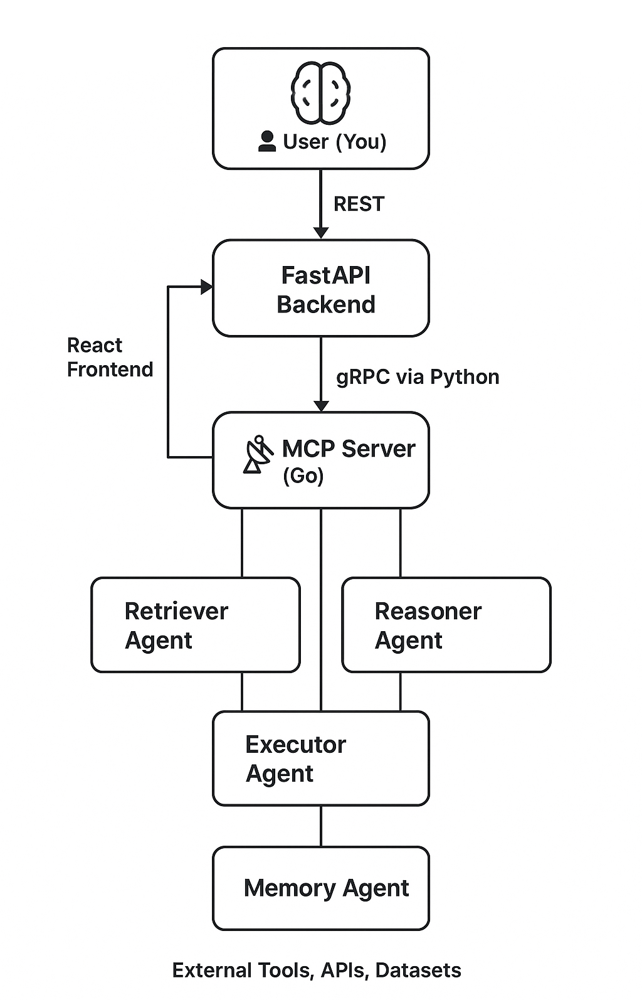

# Collaborate Project - Architecture Documentation

# Architecture Overview

This document outlines the architecture of the Collaborate project, detailing the components, their interactions, and the overall design principles.

## System Architecture

The Collaborate system is designed to facilitate collaborative research and data analysis through a modular architecture. It leverages microservices, APIs, and a robust frontend to provide a seamless user experience while maintaining high performance and reliability.

- **Frontend**: User interface for interaction with the system.
- **Backend**: Core logic and processing engine.
- **Database**: Persistent storage for user data, research workflows, and system logs.
- **Agents**: Specialized components that perform specific tasks such as data retrieval, analysis, and reporting.
- **Monitoring & Logging**: Tools for tracking system performance and debugging issues.
- **APIs**: Interfaces for communication between frontend, backend, and external services.

## Key Components

- **Frontend**: Built with React, providing a responsive and user-friendly interface.
- **Backend**: Developed using Python with FastAPI, handling requests and orchestrating agent interactions.
- **Database**: Utilizes PostgreSQL for structured data storage, with Redis for caching and session management.
- **Agents**: Implemented as microservices, allowing for independent scaling and deployment.
- **Monitoring & Logging**: Integrated with tools like Prometheus and Grafana for real-time monitoring, and ELK stack for logging and analysis.
- **APIs**: RESTful APIs for communication, with GraphQL support for flexible queries.

## Development Roadmap

The development roadmap outlines the phases of the project, including completed tasks and future priorities.

## Completed Phases

- **Phase 1: Foundation Hardening**

  - Focused on reliability and performance improvements.
  - Completed tasks include:
    - ✅ MCP reliability & logging
    - ✅ RM Prompt Planning Upgrade

- **Phase 2: Intelligence Scaling**

  - Introduced parallelism for enhanced processing capabilities.
  - Completed tasks include:
    - ✅ Parallelism

- **Phase 3: Memory Persistence**

  - Implemented memory management and cost optimization strategies.
  - Completed tasks include:
    - ✅ Memory Agent

- **Phase 4: Frontend Integration**

  - Integrated frontend tools for better user experience.
  - Completed tasks include:
    - ✅ Frontend tools integration

- **Phase 5: Testing Framework Implementation**
  - Built comprehensive testing infrastructure for quality assurance.
  - Completed tasks include:
    - ✅ Complete pytest-based testing framework with 60+ test cases
    - ✅ Unit testing for AI clients, MCP protocols, and storage components
    - ✅ Integration testing for cross-component workflows
    - ✅ Performance and load testing with established benchmarks
    - ✅ End-to-end workflow testing and validation
    - ✅ Comprehensive documentation and testing guides
    - ✅ CI/CD ready configuration with proper test categorization

## Testing Architecture

The Collaborate system now includes enterprise-grade testing infrastructure:

- **Test Framework**: pytest-based framework with async support and comprehensive fixtures
- **Test Categories**: Unit, Integration, Performance, and End-to-End testing suites
- **Coverage Areas**: AI clients, database operations, MCP protocols, configuration management
- **Performance Monitoring**: Established benchmarks for response times, memory usage, and throughput
- **Quality Assurance**: Automated validation of functionality and performance standards
- **Documentation**: Complete testing guides, best practices, and troubleshooting resources

## Quality Metrics

- **Test Coverage**: 60+ test cases across all major components
- **Performance Standards**: Database operations benchmarked at <5s for 100 conversations
- **Error Detection**: Comprehensive error handling and recovery testing
- **Reliability**: Multi-threaded and concurrent operation validation
- **Maintainability**: Clear test structure and documentation for ongoing development
