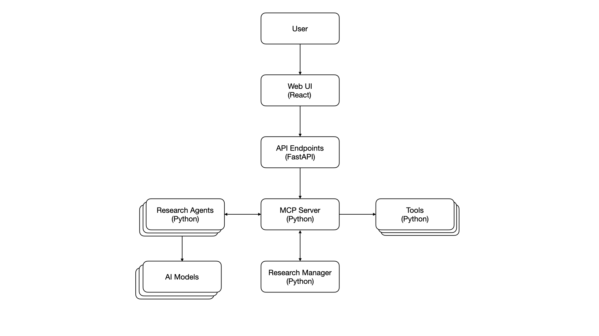

# Eunice Research Platform - Solution Architecture Documentation

## Architecture Overview

The Eunice research platform, named after the AI from the William Gibson novel [Agency](<https://en.wikipedia.org/wiki/Agency_(novel)>), is designed to facilitate advanced research workflows by integrating various tools and services. Its architecture is based on a microservices approach, allowing for flexibility, scalability, and ease of maintenance.

## Key Components

## Web Interface

The web interface serves as the primary user interface for researchers, providing access to the platform's features and functionalities. It is built using React and provides a user-friendly experience for managing research projects, accessing data, and collaborating with the team.

## API Gateway

The API Gateway acts as a single entry point for all client requests, routing them to the appropriate microservices and handling authentication, authorization, and rate limiting.
It also implements security measures such as encryption, authentication, and authorization to protect sensitive data and ensure secure communication between services.

## MCP Server

The MCP (Microservices Control Plane) server is the core component of the Eunice platform, responsible for managing the microservices architecture. It provides the following functionalities:

- **Service Discovery**: Automatically detects and registers microservices, allowing them to communicate with each other seamlessly.

- **Load Balancing**: Distributes incoming requests across multiple instances of microservices to ensure optimal performance and reliability.

- **Monitoring and Logging**: Collects metrics, logs, and traces from microservices to provide insights into system performance, health, and usage patterns.

- **Configuration Management**: Centralizes configuration settings for microservices, allowing for dynamic updates without requiring service restarts.

## Researcher Manager

The Researcher Manager oversees the operational aspects of the research projects, including agent coordination, resource management and usage costs. It also supports the user in strategic planning, project management, and ensuring a project's efficient execution while fostering interdisciplinary collaboration.

## Agent Personas

The platform features several agent personas, each with distinct roles and capabilities:

- **Neurobiologist**: Lead the biological aspects of neuron interfacing, including brain mapping, neuron extraction/isolation, and viability assessments. Collaborate on experiment design to ensure ethical and effective interfacing with computer systems.

- **Computational Neuroscientist**: Bridges biology and computing by modeling neural activity and designing protocols to interface neurons with digital systems, while comparing to ANN benchmarks.

- **AI/ML Engineer & Data Scientist**: Build and train artificial neural networks as benchmarks for comparison, integrate them with biological interfaces, and analyze experimental data using statistical methods to validate performance outcomes.

- **Animal Biologist & Bioethics Specialist**: Oversee animal welfare for subjects while advising on ethical implications of bio-digital interfacing, securing regulatory approvals, and ensuring compliance with biosafety and data privacy standards.

- **Technical/Scientific Writer**: Document research methodologies, findings, and comparisons between neurons and ANNs; prepare manuscripts for publication, grant proposals, and reports; ensure clear, accurate communication of complex technical concepts to diverse audiences.

_Refer to the [Research Team Roles](Research_team.md) for more details._

## Tooling and Services

The Eunice platform integrates various tools and services to support its research activities:

- **Memory**: Utilises a local knowledge base for storing research data, documents, and findings.

- **Retriever**: Leverages the Internet for gathering information, literature reviews, research papers and staying updated with the latest research in neuroscience and AI.

- **Executor**: Handles code execution, API calls, data processing, and file operations for the research system.

- **Reasoner**: Handles analysis, reasoning, and synthesis tasks for the research system.

## AI Models

The Eunice platform leverages various AI models to enhance its research capabilities including models from OpenAI, xAI, Anthopic, and other locally hosted models. These models are used for natural language processing, data analysis, and other AI-driven tasks to support the research process. LLMs (Large Language Models) are accessed by API calls to ensure scalability and flexibility in model version and cost.
