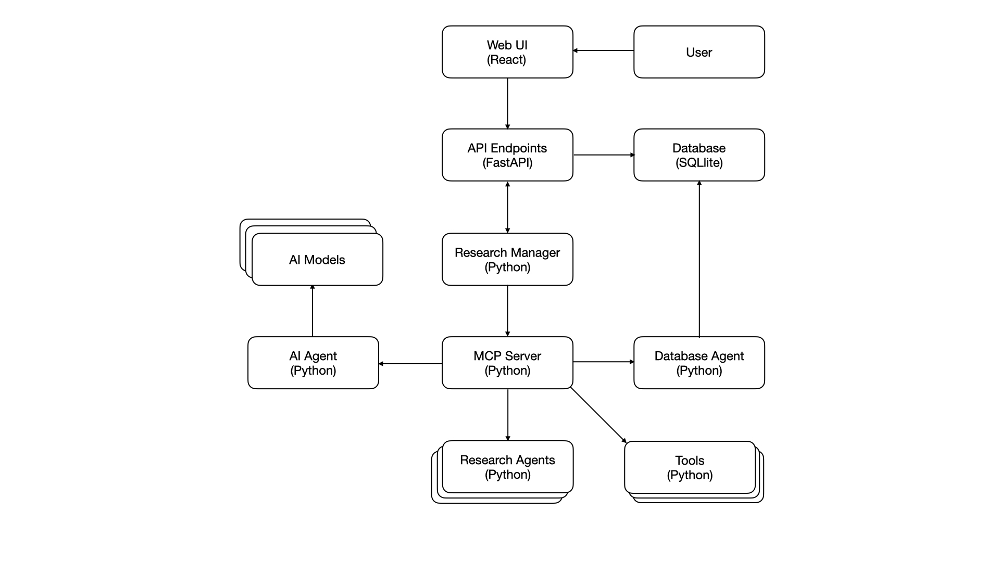

# Eunice Research Platform - Extended Solution Architecture and Development Guidelines

## Architecture Overview

The Eunice rese## Implementation Roadmap

### Version 0.1: Foundation (✅ COMPLETE)

- ✅ Modular monolith with MCP coordination
- ✅ Basic agent system in `src/agents/`
- ✅ SQLite-based data storage
- ✅ React-based web interface
- ✅ Core MCP protocol implementation

### Version 0.2: Service Extraction (✅ COMPLETE)

- ✅ Extract Database Agent from `src/database/`
- ✅ Implement AI Agent service abstraction
- ✅ Enhanced MCP server capabilities with load balancing
- ✅ API Gateway separation and enhancement
- ✅ Task queue implementation (Celery/RQ)

### Version 0.3

Microservices Transition (🎯 READY TO START)signed as a distributed, modular system that integrates user-facing interfaces, research agents, AI models, personas, and data storage systems through a **microservices and agent-oriented architecture**. At its core, the platform leverages the **Model Context Protocol (MCP)** to coordinate communication and workflows between agents and tools



The platform organises research work hierarchically:

**Project → Research Topic → Plan → Tasks**

This structure enables intuitive navigation and clear separation of concerns.

### Updated System Flow

1. **User Interaction**

   - Users interact via the **Web UI (React)**.
   - UI requests go through **FastAPI endpoints**, acting as the gateway for all system calls.

2. **API Gateway (FastAPI)**

   - Single entry point for UI requests and external integrations.
   - Routes read-only queries for high-frequency UI tasks directly to the database (with caching) for performance.
   - Routes complex, write, or orchestration requests directly to the **MCP Server**.

3. **Research Manager**

   - Orchestrates workflows, plans, and task delegation as a specialized agent within the MCP ecosystem.
   - Coordinates multi-agent workflows and manages task execution lifecycles.
   - Logs and monitors task execution and ensures system consistency.
   - Operates as an abstracted service, invoked by the MCP Server when orchestration is needed.

4. **MCP Server**

   - Core control plane for agent registration, service discovery, and routing.
   - Offers load balancing, monitoring, configuration management, and real-time WebSocket-based communication.
   - Enforces structured message formats, error handling, and secure communication.

#### MCP Protocol Specifications

**Core Communication Principle:**

🚨 **CRITICAL ARCHITECTURAL RULE**: All agents must communicate with AI providers EXCLUSIVELY through the MCP Server. Direct AI provider access by agents is strictly prohibited. This ensures centralized AI usage monitoring, cost control, security, and consistent error handling.

**Message Types:**

- `research_request`: Task initiation from Research Manager
- `agent_response`: Results from specialized agents
- `ai_request`: AI provider requests routed through MCP Server only
- `ai_response`: AI provider responses delivered via MCP Server
- `persona_consultation`: Expert domain queries
- `resource_allocation`: Cost and usage tracking
- `agent_registration`: New agent joining the system
- `health_check`: Agent availability monitoring

**Communication Patterns:**

- Request-Response: Synchronous task execution
- AI Communication: All AI requests flow through MCP Server → AI Service → AI Provider
- Publish-Subscribe: Real-time updates and notifications
- Event Streaming: Audit logging and monitoring

**AI Communication Restrictions:**

- ❌ **FORBIDDEN**: Direct API calls from agents to OpenAI, Anthropic, or any AI provider
- ❌ **FORBIDDEN**: Agent-level API key configuration or storage
- ❌ **FORBIDDEN**: Fallback mechanisms that bypass MCP for AI access
- ❌ **FORBIDDEN**: Mock data or hardcoded responses in agent capabilities
- ❌ **FORBIDDEN**: Direct HTTP endpoints that bypass MCP protocol (except health check API)
- ✅ **REQUIRED**: All AI requests via MCP `ai_request` message type
- ✅ **REQUIRED**: Centralized AI service handles all provider communication
- ✅ **REQUIRED**: MCP Server routes and monitors all AI traffic
- ✅ **REQUIRED**: Real AI-generated responses for all agent capabilities

**Agent API Restrictions:**

- ❌ **FORBIDDEN**: Direct REST/HTTP API endpoints for business logic operations
- ❌ **FORBIDDEN**: Public API endpoints that bypass MCP protocol
- ❌ **FORBIDDEN**: External API exposure for data manipulation or processing
- ✅ **REQUIRED**: Health check API endpoint ONLY (`/health` or `/status`)
- ✅ **REQUIRED**: All business operations via MCP protocol exclusively
- ✅ **REQUIRED**: Health check endpoint must return agent status and readiness

**Mock Data and Testing Restrictions:**

- ❌ **FORBIDDEN**: Production agents returning mock, placeholder, or hardcoded data
- ❌ **FORBIDDEN**: Fallback to mock responses when AI services are unavailable
- ❌ **FORBIDDEN**: Cost estimation using static hardcoded values
- ❌ **FORBIDDEN**: Information analysis with predetermined responses
- ✅ **REQUIRED**: All agent responses must be AI-generated via MCP
- ✅ **REQUIRED**: Graceful error handling when AI services unavailable (return errors, not mock data)
- ✅ **REQUIRED**: Mock data only permitted in dedicated test environments with clear labeling

**Error Handling:**

- Circuit breaker patterns for agent failures
- Retry mechanisms with exponential backoff
- Graceful degradation when agents are unavailable
- Dead letter queues for failed messages

**Security Features:**

- Message encryption and authentication
- Capability-based authorization
- Rate limiting and abuse prevention
- Audit logging for compliance

5. **Database Agent**

   - Encapsulates all database **write** operations.
   - Exposes an API that shields other components from schema changes.

6. **AI Agent**

   - Abstracts access to AI models (OpenAI, Anthropic, xAI, local LLMs).
   - Supports NLP, reasoning, and data analysis with retry logic and model fallback.

7. **Tools and Research Agents**

   - Tools are deterministic functions (e.g., data extraction, scraping).
   - Research Agents handle domain-specific reasoning, planning, and execution.

8. **Data Storage**

   - **SQLite** for structured project and task data.
   - **Memory Cache** for high-speed data access.
   - **File Storage** for unstructured research artefacts.
   - **Literature Database** for metadata and content of academic articles.

### Example Data Flows

#### Literature Search Flow

1. **User Query** → Web UI (React)
2. **Web UI** → API Gateway (FastAPI endpoint)
3. **API Gateway** → MCP Server (task routing)
4. **MCP Server** → Research Manager (orchestration) → Literature Search Agent (LSA)
5. **Literature Search Agent** → External APIs (Semantic Scholar, Google Scholar, PubMed, arXiv)
6. **Literature Search Agent** → Database Agent (persist normalized results)
7. **Results** flow back through the chain with real-time updates
8. **UI Updates** via WebSocket for live progress indication

#### Systematic Review Flow

1. **Review Request** → API Gateway → MCP Server → Research Manager
2. **Research Manager** → Literature Search Agent (discovery stage)
3. **Literature Search Agent** → Multiple databases → Database Agent (store results)
4. **Research Manager** → Screening & PRISMA Agent (screening stage)
5. **Screening & PRISMA Agent** → AI Agent (classification) → Database Agent (store decisions)
6. **Research Manager** → Synthesis & Review Agent (analysis stage)
7. **Synthesis & Review Agent** → AI Agent (data extraction) → Database Agent (store outcomes)
8. **Research Manager** → Writer Agent (manuscript generation)
9. **Writer Agent** → Database Agent (retrieve all data) → Generate manuscript
10. **Final PRISMA Report** → User via API Gateway

#### Persona Consultation Flow

1. **User Question** → Web UI consultation interface
2. **API Gateway** → MCP Server (consultation routing)
3. **MCP Server** → Appropriate Persona Agent (expert matching)
4. **Persona Agent** → AI Agent (domain-specific reasoning)
5. **Response** → Database Agent (consultation history)
6. **Expert Advice** → User via real-time WebSocket connection

#### Research Task Execution Flow

1. **Research Plan** → API Gateway → MCP Server
2. **MCP Server** → Research Manager (task breakdown and orchestration)
3. **Research Manager** → MCP Server (multi-agent coordination)
4. **MCP Server** → Planning Agent (task analysis)
5. **Planning Agent** → Literature Search Agent (information gathering)
6. **Planning Agent** → Executor Agent (data processing)
7. **Planning Agent** → Memory Agent (knowledge synthesis)
8. **Consolidated Results** → Database Agent (persistence)
9. **Final Report** → User via API Gateway

---

## Implementation Roadmap

### Version 0.1: Foundation (Current)

- Modular monolith with MCP coordination
- Basic agent system in `src/agents/`
- SQLite-based data storage
- React-based web interface
- Core MCP protocol implementation

### Version 0.2: Service Extraction (✅ COMPLETE)

- ✅ Extract Database Agent from `src/database/`
- ✅ Implement AI Agent service abstraction
- ✅ Enhanced MCP server capabilities with load balancing
- ✅ API Gateway separation and enhancement
- ✅ Task queue implementation (Celery/RQ)

### Version 0.3: Microservices Transition (🎯 READY TO START)

- Research Manager as separate orchestrator service
- Distributed agent deployment
- Enhanced security and authentication
- Performance optimization and caching layers
- Real-time collaboration features

**📚 Comprehensive Version 0.3 Documentation Available:**

- **[Version 0.3 Overview](../VERSION03_OVERVIEW.md)**: Complete documentation suite overview
- **[Microservices Transition Plan](../VERSION03_MICROSERVICES_TRANSITION.md)**: Architectural strategy and roadmap
- **[Implementation Checklist](../VERSION03_IMPLEMENTATION_CHECKLIST.md)**: Day-by-day implementation tasks
- **[Service Architecture](../VERSION03_SERVICE_ARCHITECTURE.md)**: Technical specifications and deployment configs

### Version 0.4: Advanced Features

- Vector database integration for semantic search
- Event-driven architecture implementation
- Multi-cloud deployment capabilities
- Advanced monitoring and analytics
- Edge AI integration

---

## Code Organization

### Current Structure → Target Components

The current `src/` directory structure maps to target architectural components as follows:

- **`src/database/`** → **Database Agent Service**
  - Centralized data access layer
  - Schema abstraction and migration management
  - Caching and performance optimization

- **`src/mcp/`** → **MCP Server** (enhanced)
  - Agent registration and service discovery
  - Load balancing and failover
  - Message routing and protocol enforcement
  - Direct API Gateway integration and request handling

- **`src/agents/research_manager/`** → **Research Manager Service**
  - Workflow orchestration as a specialized MCP agent
  - Task delegation and monitoring
  - Resource allocation and cost tracking
  - Abstracted service invoked by MCP Server for complex workflows

- **`src/api/`** → **API Gateway** (expanded)
  - Request routing directly to MCP Server
  - Authentication and rate limiting
  - API versioning and documentation
  - Direct database access for read-only queries

- **`src/core/ai_client_manager.py`** → **AI Agent Service**
  - Multi-provider AI model abstraction
  - Fallback and retry mechanisms
  - Cost optimization and usage tracking

- **`src/personas/`** → **Persona Consultation System**
  - Expert domain routing
  - Context-aware consultations
  - Consultation history and analytics

---

## Agents

### 🚨 Mandatory Agent Health Check API

**ALL AGENTS MUST IMPLEMENT:**

- **Single Endpoint**: Health check API only (`/health`, `/status`, or `/healthz`)
- **Standard Response**: JSON format with agent status, version, uptime, and readiness
- **No Business Logic**: Agents must NOT expose any business operation endpoints
- **MCP-Only Operations**: All business functionality exclusively via MCP protocol
- **Monitoring Integration**: Health endpoint used by load balancers and monitoring systems

**Example Health Check Response:**

```json
{
  "status": "healthy",
  "agent": "literature-search-agent",
  "version": "1.0.0",
  "uptime": "72h34m12s",
  "ready": true,
  "mcp_connected": true,
  "last_heartbeat": "2025-07-28T10:30:00Z"
}
```

### Researcher Manager

Oversees project management, agent coordination, and resource usage. Supports strategic planning, cost tracking, and interdisciplinary collaboration.

### Memory Agent

Maintains a local knowledge base containing research documents, artefacts, and summaries.

### Literature Review Agents

The literature review functionality has been restructured into four specialized agents that work together to produce high-quality PRISMA reports and PhD-level literature reviews:

#### Literature Search Agent (LSA)

Discovers and collects bibliographic records from multiple academic sources. Capabilities include:

- Query multiple data sources (PubMed, CrossRef, Semantic Scholar, arXiv)
- Apply advanced filters (year, publication type, keywords)
- Deduplicate results using DOI, PMID, or heuristics
- Store normalized records in the Literature Database

#### Screening & PRISMA Agent (SPA)

Manages systematic review screening with PRISMA compliance. Capabilities include:

- Perform title/abstract and full-text screening
- Apply inclusion/exclusion criteria with AI assistance
- Track PRISMA flowchart counts and audit trails
- Support human-in-the-loop decision overrides

#### Synthesis & Review Agent (SRA)

Analyzes included studies and synthesizes findings. Capabilities include:

- Extract structured data from full-text documents
- Perform meta-analysis with statistical computations
- Generate evidence tables and GRADE quality assessments
- Create visual outputs (forest plots, summary tables)

#### Writer Agent (WA)

Transforms synthesized data into scholarly manuscripts. Capabilities include:

- Draft PRISMA-compliant manuscript sections
- Integrate flowcharts, tables, and visualizations
- Ensure proper citation formatting (APA, Vancouver, etc.)
- Support iterative revision and export to multiple formats

### Executor Agent

Executes code, API calls, data processing, and file operations.

### Planning Agent

Handles high-level reasoning, task synthesis, and research planning.

### AI Agent

Interfaces with AI models and ensures scalable access to LLMs for data analysis, summarisation, and inference.

---

## Personas

### Overview

Personas represent expert domains for consultation, providing context-aware advice during research workflows.

- **Neurobiologist**: Leads biological aspects of neuron interfacing, including brain mapping, neuron extraction/isolation, viability assessments, and culture maintenance. Provides expert guidance on experimental design to ensure ethical and effective biological system integration. Refer to the [Neurobiologist Persona](Personas/01_Neurobiologist.md) for more details.

- **Computational Neuroscientist**: Bridges biology and computing by modeling neural activity and designing protocols to interface neurons with digital systems. Specialises in bio-digital communication protocols and neural signal processing. Refer to the [Computational Neuroscientist Persona](Personas/02_Computational_Neuroscientist.md) for more details.

- **AI/ML Engineer & Data Scientist**: Builds and trains artificial neural networks as benchmarks for comparison, integrates them with biological interfaces, and analyzes experimental data using statistical methods to validate performance outcomes. Refer to the [AI/ML Engineer & Data Scientist Persona](Personas/05_AI_ML_Engineer_Data_Scientist.md) for more details.

- **Biomedical Systems Engineer**: Develops hardware/software interfaces between biological and digital systems, ensuring proper signal acquisition, processing, and system integration. Specialises in bio-digital hybrid systems, including sensor integration and data acquisition. Refer to the [Biomedical Systems Engineer Persona](Personas/03_Biomedical_Systems_Engineer.md) for more details.

- **Animal Biologist & Bioethics Specialist**: Oversees animal welfare for research subjects while advising on ethical implications of bio-digital interfacing, securing regulatory approvals, and ensuring compliance with biosafety and data privacy standards. Refer to the [Animal Biologist & Bioethics Specialist Persona](Personas/04_Animal_Biologist_Bioethics_Specialist.md) for more details.

- **Microbiologist**: Focuses on microbial aspects of neuron culturing and interfacing experiments, ensuring sterility, preventing contamination, and optimizing culture conditions to maintain neuron viability in bio-digital systems. Refer to the [Microbiologist Persona](Personas/06_Microbiologist.md) for more details.

- **Technical/Scientific Writer**: Documents research methodologies, findings, and comparisons between biological neurons and ANNs; prepares manuscripts for publication, grant proposals, and reports; ensures clear, accurate communication of complex technical concepts to diverse audiences. Refer to the [Technical/Scientific Writer Persona](Personas/07_Technical_Scientific_Writer.md) for more details.

The **Persona Consultation System** provides:

- Expert routing to the correct persona.
- Multi-modal queries.
- AI-generated confidence scoring.
- Persistent consultation history.

---

## Security Architecture

### Authentication Flow

- **JWT Tokens**: User session management with configurable expiration
- **Service Authentication**: MCP-based secure inter-service communication
- **API Key Management**: Secure storage and rotation for external services
- **Multi-Factor Authentication**: Optional 2FA for enhanced security

### Authorization Levels

- **User Permissions**: Role-based access to research projects and data
- **Agent Capabilities**: Restricted access to system resources and external APIs
- **Data Classification**: Sensitive research data protection and access controls
- **Audit Trail**: Comprehensive logging of all security-relevant actions

### Security Controls

- **Input Validation**: Sanitization of all user inputs and API requests
- **Rate Limiting**: Protection against abuse and DDoS attacks
- **Encryption**: TLS for all communications, AES-256 for data at rest
- **Network Security**: Firewall rules and network segmentation
- **Secrets Management**: Secure vault for API keys and credentials

---

## Performance Requirements

### Response Time Targets

- **UI Interactions**: < 200ms for navigation and simple queries
- **Database Queries**: < 500ms for complex research data retrieval
- **Literature Searches**: < 10s for comprehensive academic searches
- **Research Tasks**: < 30s for planning and initial execution
- **Persona Consultations**: < 5s for expert domain advice

### Throughput Specifications

- **Concurrent Users**: Support 50+ simultaneous active users
- **Research Tasks**: Handle 20+ concurrent complex research operations
- **MCP Messages**: Process 1000+ messages per second
- **API Requests**: Handle 500+ requests per second per endpoint
- **WebSocket Connections**: Maintain 200+ real-time connections

### Resource Utilization

- **Memory Usage**: Efficient caching with configurable limits
- **CPU Optimization**: Multi-threading for I/O-bound operations  
- **Storage Efficiency**: Compressed data storage and archival policies
- **Network Bandwidth**: Optimized payload sizes and compression

---

## Error Handling Strategy

### Agent Failure Management

- **Automatic Retry**: Exponential backoff for transient failures
- **Circuit Breaker**: Fast-fail mechanism for consistently failing agents
- **Fallback Agents**: Alternative agents for critical functionality
- **Graceful Degradation**: Reduced functionality when agents are unavailable
- **Health Monitoring**: Continuous agent health checks via mandatory health check API only
- **Load Balancer Integration**: Health endpoints used for routing decisions and failover

### External Service Resilience

- **API Failure Handling**: Retry logic with multiple provider fallbacks
- **Cache Fallbacks**: Serve stale data when external services are unavailable
- **Timeout Management**: Configurable timeouts with escalation policies
- **Rate Limit Handling**: Adaptive throttling and queue management
- **Service Discovery**: Automatic failover to alternative service endpoints

### Data Consistency and Recovery

- **Transaction Management**: ACID compliance for critical operations
- **Backup and Recovery**: Automated backups with point-in-time recovery
- **Data Validation**: Input sanitization and schema validation
- **Conflict Resolution**: Merge strategies for concurrent data modifications
- **Audit Logging**: Complete transaction history for debugging and compliance

### User Experience Protection

- **Progressive Loading**: Incremental data presentation during slow operations
- **Offline Capabilities**: Local caching for basic functionality
- **Error Messaging**: User-friendly error descriptions with suggested actions
- **Recovery Guidance**: Clear instructions for resolving common issues
- **Status Transparency**: Real-time system status and maintenance notifications

---

## Development Guidelines

### 🚨 1. CRITICAL: AI Communication Policy

**MANDATORY RULE FOR ALL AGENTS:**

- **❌ FORBIDDEN**: Direct API calls to AI providers (OpenAI, Anthropic, xAI, etc.)
- **❌ FORBIDDEN**: Agent-level API key storage or configuration  
- **❌ FORBIDDEN**: Any fallback mechanisms that bypass MCP for AI access
- **✅ REQUIRED**: All AI requests must use MCP `ai_request` message type
- **✅ REQUIRED**: Only the dedicated AI Service may communicate with AI providers
- **✅ REQUIRED**: All agents must fail gracefully if MCP AI service is unavailable
- **✅ REQUIRED**: No exceptions - this rule applies to ALL agents without exception

### 🚨 2. CRITICAL: Agent API Policy

**MANDATORY RULE FOR ALL AGENTS:**

- **❌ FORBIDDEN**: Direct REST/HTTP API endpoints for business operations
- **❌ FORBIDDEN**: Public API endpoints that bypass MCP protocol
- **❌ FORBIDDEN**: External API exposure for data processing or manipulation
- **❌ FORBIDDEN**: Custom API endpoints beyond the mandated health check
- **✅ REQUIRED**: Health check API endpoint ONLY (`/health`, `/status`, or `/healthz`)
- **✅ REQUIRED**: All business operations exclusively via MCP protocol
- **✅ REQUIRED**: Health check must return JSON with agent status, version, and readiness
- **✅ REQUIRED**: Health check endpoint must be accessible for monitoring and load balancing
- **✅ REQUIRED**: No exceptions - agents may ONLY expose health check API

### 3. Separation of Concerns

- **Web UI** is presentation-only.
- **FastAPI** acts as a thin routing layer.
- **Research Manager** handles orchestration.
- **Agents** perform specialised tasks.

### 4. Database Access

- All writes via the **Database Agent**.
- Use read replicas and caching for performance.

### 5. Caching & Performance

- Use Redis or in-memory caching.
- WebSocket/SSE for real-time UI updates.

### 6. Orchestration & Task Queues

- Use **Celery/RQ** for long-running tasks.
- **Research Manager** coordinates all workflows.

### 7. MCP Communication Contracts

- Pydantic schemas for requests/responses.
- API versioning (`tool@v1`).
- Capability tokens for security.

### 8. AI Model Integration

- **ONLY** access AI providers through MCP Server → AI Service
- **NEVER** implement direct API calls to AI providers in agents
- Implement response validation and error handling for MCP AI requests
- Use structured prompts and consistent message formats
- Handle AI service unavailability gracefully with proper error messages

### 9. Error Handling & Resilience

- Implement circuit breakers for external dependencies.
- Use correlation IDs for distributed tracing.
- Implement comprehensive logging with structured formats.
- Design for graceful degradation and recovery.

### 10. Monitoring & Observability

- Use human-readable text logs with structured JSON for machine processing.
- Implement health checks for all services and agents.
- Track performance metrics and usage patterns.
- Set up alerting for critical system failures.

### 11. Documentation & Testing

- Swagger/OpenAPI for all API endpoints.
- Integration tests for MCP workflows.
- Unit tests with >80% code coverage.
- End-to-end testing for critical user journeys.

### 12. Code Quality Standards

- Follow PEP 8 for Python code formatting.
- Use type hints and Pydantic for data validation.
- Implement automated code quality checks.
- Maintain comprehensive inline documentation.

---

## Architecture Guidelines for Developers

- Each agent/microservice must expose a stable API.
- Follow interface-driven design with Pydantic.
- Implement retries, timeouts, and circuit breakers.
- Trace tasks with correlation IDs.
- **MANDATORY**: All agents must implement ONLY a health check API endpoint (`/health`, `/status`, or `/healthz`)
- **MANDATORY**: No business logic APIs - all operations via MCP protocol exclusively
- **MANDATORY**: Health check must return agent status, version, uptime, and readiness information

---

## Future Enhancements

- Migration  to Postgres.
- Event-driven architecture using Kafka/NATS.
- Integration of vector databases for semantic search.
- Edge AI for low-latency inference.
- **Knowledge Base** for research documents, literature results, and findings.
- Introduction of a dedicated **Data Agent Service** with replication and failover.
- Adoption of a **message bus/event streaming platform** (e.g., Apache Kafka or NATS JetStream).
- Automated scaling with **Kubernetes Horizontal Pod Autoscaler (HPA)** for agents and services.
- Integration of **vector embeddings search engines** for advanced semantic search (e.g., Weaviate, Milvus).
- Deployment of **edge AI models** closer to the user interface for reduced latency.
- Use Prometheus + Grafana for monitoring and reporting.
- Structured JSON logging.
- Implements **JWT-based authentication, authorisation, and rate limiting**.
- Role-based access control (RBAC) with fine-grained permissions for user access.
- Role-based access control (RBAC) with fine-grained permissions at the MCP server and API gateway levels.
- Multi-cloud or hybrid-cloud support for improved resilience.

---

This extended documentation now includes all key components (agents, personas, MCP server) along with developer guidelines and future enhancements for building and maintaining the Eunice research platform.

---

## Version 0.2 Implementation Summary (July 2025)

### � Overview

**Version 0.2: Service Extraction** has been successfully completed, transforming the Eunice Research Platform into a modern, scalable microservices architecture. All three major components have been implemented and tested:

#### ✅ Enhanced MCP Server Capabilities with Load Balancing

**Implementation**: `/src/mcp/server.py`, `/src/mcp/load_balancer.py`

- **5 Load Balancing Strategies**: Round-robin, weighted round-robin, least connections, IP hash, random selection
- **Circuit Breaker Patterns**: Automatic failover and recovery for agent failures  
- **Performance Monitoring**: Real-time metrics collection and agent health tracking
- **Structured Logging**: Dual logging system (`mcp_server.log`, `mcp_tasks.log`) with proper log separation
- **Enterprise Features**: Connection pooling, request timeout handling, graceful shutdown

#### ✅ API Gateway Separation and Enhancement

**Implementation**: `/src/api/gateway.py`, `/start_api_gateway.py`

- **Unified REST Interface**: 13+ endpoints for literature search, research tasks, data analysis
- **Type-Safe Operations**: Pydantic models for request/response validation
- **MCP Integration**: Seamless communication with MCP server via ResearchAction objects
- **Auto-Generated Documentation**: OpenAPI/Swagger docs at `http://localhost:8001/docs`
- **Error Handling**: Graceful degradation when MCP server unavailable
- **Queue Integration**: Enhanced with 8 additional queue-specific endpoints

#### ✅ Task Queue Implementation (Redis Queue)

**Implementation**: `/src/queue/`, `/start_worker.py`

- **Redis Queue Infrastructure**: 6 specialized queues (high_priority, literature, analysis, planning, memory, default)
- **Asynchronous Task Processing**: Background processing for literature search, research planning, data analysis
- **Progress Tracking**: Real-time job status updates with metadata and progress indicators
- **Worker Scaling**: Horizontal scaling support for processing capacity
- **Job Management**: Cancel, retry, cleanup operations with comprehensive monitoring
- **API Integration**: Queue endpoints integrated into API Gateway for non-blocking operations

### 🚀 Production-Ready Architecture

The enhanced system now supports:

```bash
📋 Redis:       localhost:6379 (message broker)
⚙️  Workers:     Scalable task queue workers
🌐 API Gateway: http://localhost:8001 (unified REST interface)  
🔧 MCP Server:  http://localhost:9000 (enhanced with load balancing)
🤖 Agents:      4 research agents with load balancing
🖥️  Backend:    http://localhost:8000
🌐 Frontend:    http://localhost:3000
📚 API Docs:    http://localhost:8001/docs
📊 Monitoring:  http://localhost:8001/queue/statistics
```

### 🧪 Validation Results

- **✅ Import Tests**: All core systems import successfully
- **✅ MCP Server**: Load balancing and structured logging verified  
- **✅ API Gateway**: REST endpoints and MCP integration working
- **✅ Task Queue**: Redis connection, job submission, and monitoring functional
- **✅ Service Orchestration**: Complete service stack ready via `start_eunice.sh`

### 🎯 Benefits Delivered

- **Performance**: Non-blocking operations, background task processing
- **Scalability**: Horizontal worker scaling, load-balanced agent routing
- **Reliability**: Task persistence, circuit breaker patterns, error recovery
- **Maintainability**: Clean separation of concerns, type-safe interfaces
- **Operational Excellence**: Comprehensive monitoring, logging, and management tools

**Platform Status**: Production-ready microservices architecture implemented. Ready for Version 0.3: Microservices Transition.
