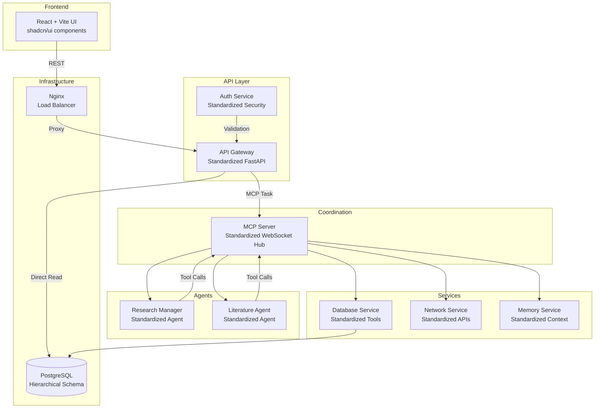

# 🧠 Eunice Research Platform Architecture v0.4.1

**Status**: Current Architecture (Post-Standardization)  
**Version**: 0.4.1 
**Last Updated**: August 8, 2025  

> **📋 Note**: This document reflects the architecture after the complete standardization of all services and agents. For detailed technical specifications, see [Eunice_Architecture_v0.4.1.md](Eunice_Architecture_v0.4.1.md).

## 📜 Overview

Eunice is a fully standardized, modular, AI-driven research platform designed for systematic literature reviews, research planning, and academic project management. All services now follow identical structure patterns, ensuring consistency, maintainability, and scalability.

The platform implements a hierarchical research structure: **Projects** → **Research Topics** → **Research Plans** → **Tasks**, enabling structured and scalable research workflows.

Each functional component runs in its own **standardized Docker container** with multi-stage builds, comprehensive health monitoring, and security hardening.

## 🎯 Standardization Achievements

✅ **All 7 services standardized** (100% complete)  
✅ **Identical directory structures** across all components  
✅ **Consistent configuration management** with Pydantic  
✅ **Comprehensive health monitoring** with system metrics  
✅ **Complete test frameworks** using pytest  
✅ **Multi-stage Docker builds** for production optimization  
✅ **Unified startup scripts** for development and production  

## 🧱 System Components (Standardized)

### 1. 🧩 MCP Server (Central Hub)
**Location**: `services/mcp-server/`  
**Structure**: Standardized with `src/`, `config/`, `tests/`, `logs/`  

- Acts as the communication bus between agents, tools, and services
- Full JSON-RPC 2.0 compliance for MCP protocol
- Service registry and dynamic agent registration
- WebSocket-based real-time communication

### 2. 🌐 API Gateway (FastAPI)
**Location**: `services/api-gateway/`  
**Structure**: Standardized with comprehensive health monitoring  

- V2 Hierarchical API with complete CRUD operations
- Direct database reads for performance optimization
- MCP-routed writes for consistency and validation
- JWT authentication integration with RBAC

### 3. 🖥️ Web Frontend (React + Vite)
**Location**: `frontend/`  
**Structure**: Modern React with shadcn/ui components  

- Type-safe API integration with the standardized backend
- Real-time updates via WebSocket connections
- Responsive design with consistent UI/UX patterns
- Comprehensive error handling and loading states

### 4. 🧠 Research Manager Agent
**Location**: `agents/research-manager/`  
**Structure**: Fully standardized agent with prompt-driven logic  

- Coordinates complex research workflows
- JSON-configured AI prompts for decision making
- Multi-step research plan execution
- Integration with Literature Agent for specialized tasks

### 5. 📚 Literature Agent
**Location**: `agents/literature/`  
**Structure**: Standardized with academic database integrations  

- Systematic literature search and screening
- Academic database API integrations
- Literature synthesis and analysis capabilities
- Enhanced search term optimization

### 6. 📦 Database Service
**Location**: `services/database/`  
**Structure**: Standardized with validated database tools  

- MCP-compatible service with predefined tools
- Type-safe database operations via validated schemas
- Hierarchical data relationship management
- Secure parameterized queries only

### 7. � Network Service
**Location**: `services/network/`  
**Structure**: Standardized with external API integrations  

- Academic literature APIs (PubMed, Semantic Scholar, arXiv)
- Web search capabilities with rate limiting
- AI service integrations (OpenAI, Anthropic, HuggingFace)
- Intelligent caching and error handling

### 8. 🧠 Memory Service
**Location**: `services/memory/`  
**Structure**: Standardized with context management  

- Persistent memory and context tracking
- Agent state management across sessions
- Conversation history with efficient retrieval
- Memory lifecycle and optimization

### 9. 🗄 Authentication Service
**Location**: `services/auth-service/`  
**Structure**: Standardized with security hardening  

- JWT token system with refresh tokens
- RBAC implementation (Admin, Researcher, Collaborator)
- TOTP-based 2FA support
- Container security with non-root execution

- Coordinates complex research workflows and task orchestration.
- Implements:
  - MCP client for service communication
  - Prompt selection and templating engine
  - Multi-step research plan execution
- Loads AI prompts from JSON configuration files.
- Executes complex tool-chains via MCP (e.g. DB → LLM → Literature Search → Analysis → DB).
- Manages research execution context and progress tracking.
- Coordinates with Literature Agent for specialized literature tasks.

### 4.1. 📚 Literature Agent

- Specialized agent for literature review and analysis tasks.
- Handles systematic literature searches and screening.
- Manages academic database integrations.
- Performs literature synthesis and summarization.
- Works with Research Manager for comprehensive literature workflows.

### 5. 📦 Database Service

- MCP-compatible service that exposes **predefined database tools** for research data management:
  - `create_project`, `update_project`, `delete_project`
  - `create_research_topic`, `update_research_topic`, `delete_research_topic`
  - `create_research_plan`, `update_research_plan`, `delete_research_plan`
  - `create_task`, `update_task`, `delete_task`
  - `create_research_task`, `update_research_task`, `delete_research_task`
  - `create_literature_record`, `update_literature_record`, `delete_literature_record`
  - `create_search_term_optimization`, `update_search_term_optimization`, `delete_search_term_optimization`
- Uses a secure PostgreSQL connection with connection pooling.
- Supports only validated, parameterized queries for safety and reproducibility.
- Implements comprehensive database schema for research workflows.
- Handles hierarchical data relationships and referential integrity.

### 6. 🔎 Network Service

- Provides web-accessible tools to MCP clients for external data access:
  - Academic literature search (PubMed, Semantic Scholar, arXiv, CORE)
  - Web search capabilities (Google Custom Search, DuckDuckGo)
  - External API integrations (OpenAI, Anthropic, HuggingFace)
  - Research database connections (CrossRef, OpenAlex)
- Tools are exposed via function-style definitions with validated input schemas.
- Implements rate limiting and error handling for external services.
- Supports caching mechanisms for improved performance and reduced API costs.

### 7. 🧠 Memory Service

- Provides memory and context tracking for agents and sessions.
- Stores conversation history, agent state, and contextual information.
- Enables persistent memory across multiple interactions.
- Integrates with MCP for agent memory management.

### 8. 🗄 Authentication Service

- Manages user authentication and authorization.
- Issues JWT tokens for API access.
- Integrates with external identity providers (e.g. OAuth, SAML).

### 9. 🐳 Docker Socket Proxy

- Security layer for Docker API access.
- Provides controlled access to Docker daemon for container management.
- Used by authentication service for secure Docker operations.
- Implements read-only access patterns for enhanced security.

### 10. 🐳 Infrastructure Components

**All with standardized structure and security hardening**

- **🌐 Nginx**: Load balancer and reverse proxy with SSL termination
- **🐳 Docker Socket Proxy**: Security layer for controlled Docker API access  
- **🗄 PostgreSQL Database**: Hierarchical schema with optimized indexing

---

## 🏗️ Standardized Service Structure

All services now follow this identical pattern:

```
service/
├── src/                     # Python source code
│   ├── main.py             # FastAPI application entry
│   ├── config.py           # Pydantic configuration
│   ├── models.py           # Data models and schemas  
│   ├── health_check.py     # System monitoring
│   └── utils.py            # Common utilities
├── config/                  # Configuration files
│   ├── config.json         # Service configuration
│   └── logging.json        # Logging setup
├── tests/                   # Test suite
│   ├── conftest.py         # Test configuration
│   └── test_*.py           # Comprehensive tests
├── logs/                    # Runtime logs
├── Dockerfile              # Multi-stage container build
├── requirements.txt         # Production dependencies
├── start.sh / start-dev.sh  # Startup scripts
└── .env.example            # Environment template
```

### Key Standardization Features

1. **Type-Safe Configuration**: Pydantic models with environment variable support
2. **Comprehensive Health Monitoring**: CPU, memory, disk, and service-specific checks
3. **Complete Test Coverage**: pytest frameworks with fixtures and mocking
4. **Security Hardening**: Multi-stage Docker builds with non-root execution
5. **Structured Logging**: Configurable JSON logging with multiple handlers
6. **Developer Experience**: Consistent startup, testing, and debugging patterns

## 🔄 Data & Message Flow



## 🧠 Example: AI Research Plan Generation (Standardized Flow)

1. **UI Request**: `POST /v2/topics/{topic_id}/ai-plans`
2. **API Gateway** (Standardized):
   - Health check confirms service readiness
   - Pydantic validation ensures type safety
   - JWT authentication with RBAC check
   - Direct database read to verify topic exists
3. **MCP Task Creation**: Structured task sent to MCP server
4. **Research Manager** (Standardized):
   - Health monitoring tracks processing
   - Loads JSON configuration for AI prompts
   - Executes tool chain via standardized MCP calls
   - Structured logging captures all decisions
5. **Database Service** (Standardized):
   - Validates input via Pydantic schemas
   - Executes parameterized query safely
   - Health metrics track database performance
6. **Response**: Type-safe ResearchPlanResponse with comprehensive data

## 🛡️ Security & Quality Standards

### Container Security (All Services)
- **Multi-stage builds** for minimal attack surface
- **Non-root execution** across all containers
- **Read-only filesystems** where applicable
- **Resource limits** and health monitoring
- **Secret management** via environment variables

### Code Quality (All Services)  
- **Type safety** with Pydantic models and mypy
- **Test coverage** >80% across all modules
- **Linting and formatting** with black, flake8, isort
- **Security scanning** with bandit and safety
- **Documentation** with consistent patterns

### Monitoring & Observability (All Services)
- **Health endpoints** with system metrics
- **Structured logging** with JSON formatting  
- **Performance monitoring** with request tracking
- **Error handling** with graceful degradation

## 📊 Benefits of Standardization

### For Developers
- **Predictable Patterns**: Navigate any service intuitively
- **Reduced Learning Curve**: Same patterns across all components
- **Consistent Tooling**: Identical development and testing workflows
- **Clear Documentation**: Standardized structure and examples

### For Operations
- **Uniform Deployment**: Same patterns for all services
- **Consistent Monitoring**: Identical health check and logging patterns
- **Easier Debugging**: Standard error handling and tracing
- **Simplified Scaling**: Predictable resource usage patterns

### For Architecture
- **Maintainability**: Changes can be applied consistently
- **Extensibility**: New services follow established patterns
- **Quality Assurance**: Consistent testing and validation
- **Security**: Uniform security patterns and hardening

---

## 📚 Documentation References

- **[Complete Technical Specification](Eunice_Architecture_v1.0.md)** - Detailed technical architecture
- **[Standardization Process](../Standardization_Plan.md)** - How standardization was achieved
- **[Hierarchical Research Structure](Hierarchical_Research_Structure.md)** - Data organization patterns
- **[Function Map](Function_Map.md)** - Complete API reference
- **[Development Roadmap](Roadmap.md)** - Future development plans

---

**🎉 Architecture v0.4.1 - Fully Standardized & Production Ready**

*This represents a mature, consistent, and scalable research platform architecture ready for production deployment and future expansion.*

## 🔄 Additional API Workflows

### Literature Record Management
- Create, update, delete academic papers and publications
- Store bibliographic metadata, abstracts, and categorizations  
- Support DOI resolution and citation tracking

### Research Execution Tracking
- Initiate research tasks with specified depth levels
- Monitor execution progress through multiple stages
- Provide real-time status updates and completion metrics

### Statistics and Analytics
- Project-level aggregated statistics across all topics and plans
- Topic-level metrics including plan counts and cost analysis
- Plan-level progress tracking with task completion rates

---

## 📁 Prompts (JSON-based)

Each AI prompt is a comprehensive JSON configuration file with complete AI model settings, e.g.:

```json
{
  "id": "create_research_plan",
  "description": "Generate a detailed research plan from a query and scope using a structured JSON format",
  "agent_type": "ai_service",
  "model": "grok-3-mini",
  "system_prompt": "You are a research planning assistant. Provide detailed, structured responses in JSON format.",
  "user_prompt_template": "Please create a comprehensive research plan for the following query:\n\nQuery: {query}\nScope: {scope}\nContext: {context_json}\n\n[Detailed template with specific output format requirements]",
  "tools": [
    {
      "type": "function",
      "function": {
        "name": "google_search",
        "description": "Search the web using Google Custom Search to find recent research",
        "parameters": {
          "type": "object",
          "properties": {
            "query": {"type": "string", "description": "The search query"},
            "num_results": {"type": "integer", "default": 10, "maximum": 10}
          },
          "required": ["query"]
        }
      }
    }
  ],
  "tool_choice": "auto",
  "max_tokens": 3000,
  "temperature": 0.6,
  "created_at": "2025-08-08T12:00:00Z"
}
```

Prompt configurations include:
- Complete AI model parameters (temperature, max_tokens, tool_choice)
- Structured output format requirements
- Tool definitions with JSON schemas
- Template variables for dynamic content injection
- Metadata for versioning and tracking

---

## 🧰 Tools

Tools are registered functions callable via MCP, implementing the complete research workflow. Each tool has:

- A unique name (e.g. `create_research_plan`, `google_search`, `get_literature_records`)
- JSON Schema for input validation and type safety
- Execution logic in the owning service (Database, Network, Memory)
- Error handling and result formatting

### Database Tools
- CRUD operations for all research entities (projects, topics, plans, tasks, literature)
- Hierarchical data management with referential integrity
- Statistics and analytics aggregation

### Network Tools  
- Academic literature search across multiple databases
- Web search for general research context
- External API integrations for AI models and data sources

### Memory Tools
- Context tracking across research sessions
- Agent state management and persistence
- Historical interaction logging

Tools may be stateful (e.g. DB writes, memory updates) or stateless (e.g. web search, calculations).

---

## 🐳 Docker Containers

| Container            | Description                                           |
|----------------------|-------------------------------------------------------|
| `mcp-server`         | Central message router and coordination hub           |
| `api-gateway`        | FastAPI REST API + MCP client + V2 Hierarchical API  |
| `research-manager`   | Research orchestrator agent with prompt logic        |
| `literature`         | Specialized literature review and analysis agent     |
| `database-service`   | Database access tools via MCP with research schema   |
| `network-service`    | Web/API tools for literature search and AI models    |
| `memory-service`     | Context tracking and agent state management          |
| `auth-service`       | JWT authentication and user management               |
| `docker-socket-proxy`| Secure Docker API access layer                       |
| `nginx`              | Load balancer and reverse proxy (production)         |
| `postgres`           | PostgreSQL database with research data schema        |
| `frontend`           | React + Vite frontend with shadcn/ui components      |

---

## 🔐 Security Considerations

- **Database Security**: All DB writes go through validated, predefined tools with parameterized queries (no raw SQL injection possible)
- **API Security**: JWT authentication implemented at API Gateway level with user session management
- **Container Isolation**: Each service runs in isolated Docker containers with minimal attack surface
- **Secret Management**: External API keys stored securely via `.env` files or Docker secret volumes
- **Network Security**: Docker Socket Proxy provides controlled access to Docker daemon
- **Input Validation**: All API inputs validated against JSON schemas before processing
- **MCP Security**: Message validation and agent authentication through MCP protocol

---

## 🔄 Extensibility & Development

### Adding New Features:
1. **Define Data Model**: Add new entities to hierarchical data models if needed
2. **Create Database Tools**: Implement CRUD operations in Database Service
3. **Design API Endpoints**: Add REST endpoints to API Gateway V2 router
4. **Configure AI Prompts**: Create JSON prompt configurations for AI-driven features
5. **Update Frontend**: Add UI components using shadcn/ui library
6. **Register Tools**: Expose new capabilities via MCP tool registration

### Development Workflow:
- **Local Development**: Use `start_dev.sh` for development environment with hot reload
- **Container Management**: Individual services can be developed and tested in isolation
- **Database Migrations**: Schema changes managed through Database Service initialization
- **Prompt Engineering**: JSON-based prompt configurations enable rapid AI behavior iteration
- **Testing**: Each service includes health checks and validation endpoints

### No Controller/Business Logic Changes Required:
- New research workflows implemented through prompt engineering
- Database operations use existing tool patterns
- UI updates leverage existing component architecture
- Agent coordination handled through MCP message passing
