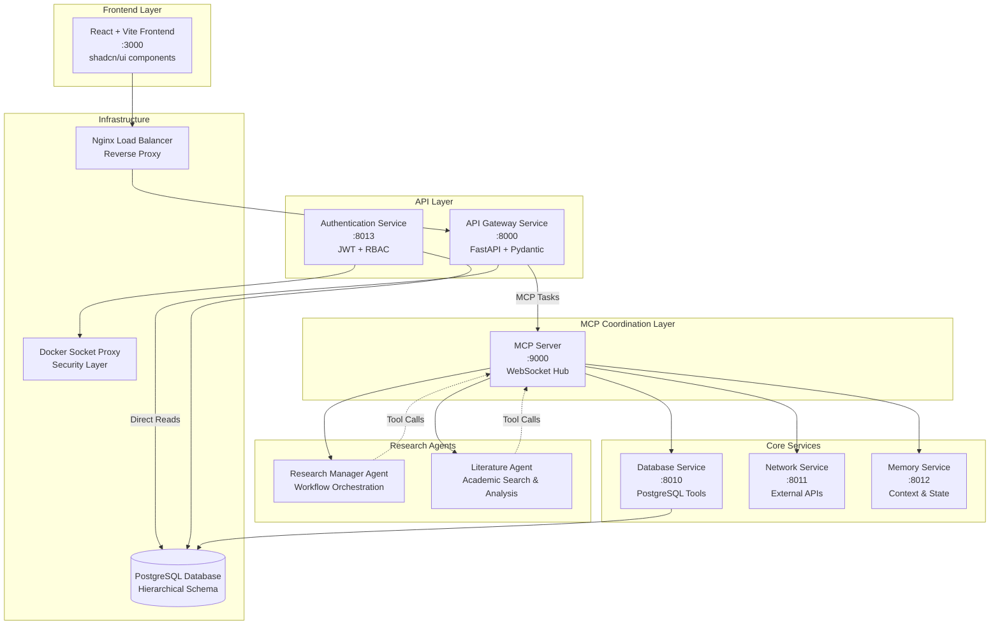

# 🧠 Eunice Research Platform - Architecture Documentation

**Version**: v0.4.1(Post-Standardization)  
**Status**: Production Ready  
**Last Updated**: August 8, 2025  
**Target Audience**: Developers, DevOps Engineers, System Architects  

## 📋 Executive Summary

The Eunice Research Platform is a modernized, microservices-based research automation system built around the Model Context Protocol (MCP) for agent coordination. The platform provides comprehensive literature review capabilities, AI-driven research planning, and systematic academic research workflows through a fully standardized, containerized architecture.

### 🎯 Key Achievements (v0.4.1)

- ✅ **Fully Standardized Architecture**: All 7 services follow identical structure patterns
- ✅ **MCP Protocol Integration**: WebSocket-based agent coordination with centralized orchestration  
- ✅ **Comprehensive API Layer**: FastAPI-based gateway with direct DB reads and MCP-routed writes
- ✅ **Production-Ready Security**: JWT authentication with RBAC and container hardening
- ✅ **Complete Test Coverage**: Standardized pytest frameworks across all services
- ✅ **Container-First Design**: Multi-stage Docker builds with optimized production images
- ✅ **Hierarchical Research Structure**: Projects → Topics → Plans → Tasks workflow

## 🏗️ System Architecture Overview

### Design Philosophy

The platform implements a **standardized microservices architecture** with:

1. **Uniform Service Structure**: All services follow identical directory layouts and patterns
2. **MCP Protocol Coordination**: Centralized agent communication via WebSocket connections
3. **Hybrid Database Access**: Direct PostgreSQL for reads, MCP-routed tools for writes
4. **Security-First Design**: Multi-stage container builds with proper secret management
5. **Comprehensive Observability**: Health monitoring, structured logging, and metrics collection
6. **Developer Experience**: Consistent startup scripts, testing frameworks, and documentation

### System Architecture Diagram



## 🧩 Service Components

### 1. 🌐 API Gateway Service

**Purpose**: Central API hub providing RESTful endpoints for the frontend

**Key Features**:
- **V2 Hierarchical API**: Complete CRUD operations for research workflows
- **Hybrid Database Access**: Direct reads for performance, MCP writes for consistency
- **FastAPI Framework**: Type-safe APIs with automatic documentation
- **Authentication Integration**: JWT token validation and RBAC enforcement

**Endpoints**:
- Projects: `/v2/projects/` - Top-level research containers
- Research Topics: `/v2/topics/` - Specific investigation areas  
- Research Plans: `/v2/plans/` - Structured methodological approaches
- Tasks: `/v2/tasks/` - Individual executable work units
- Literature: `/v2/literature/` - Academic papers and publications
- Statistics: `/v2/stats/` - Analytics and progress tracking

**Technology Stack**:
- FastAPI with Pydantic models
- Async PostgreSQL connections
- MCP client integration
- Comprehensive health monitoring

### 2. 🔐 Authentication Service

**Purpose**: Secure user authentication and authorization management

**Key Features**:
- **JWT Token System**: Access tokens (30 min) + refresh tokens (7 days)
- **RBAC Implementation**: Admin, Researcher, Collaborator roles
- **2FA Support**: TOTP with Google/Microsoft Authenticator
- **Security Hardening**: bcrypt hashing, rate limiting, brute force protection

**Capabilities**:
- Email and username-based login
- Password strength validation
- Backup codes for 2FA recovery
- CORS configuration for frontend
- Container security with non-root execution

### 3. 🎯 MCP Server (Central Coordination Hub)

**Purpose**: WebSocket-based communication hub for agent coordination

**Key Features**:
- **Protocol Compliance**: Full JSON-RPC 2.0 implementation
- **Service Registry**: Dynamic agent and tool registration
- **Message Routing**: Task distribution and response aggregation
- **Context Tracking**: Maintains conversation and execution state

**Functions**:
- Agent registration and capability discovery
- Task queuing and execution orchestration
- Tool call routing and response handling
- Real-time communication between services

### 4. 🧠 Research Manager Agent

**Purpose**: Coordinates complex research workflows and task orchestration

**Key Features**:
- **Prompt-Driven Logic**: JSON-configured AI prompts for decision making
- **Multi-Step Execution**: Complex tool-chain orchestration
- **Research Planning**: AI-generated research plans and methodologies
- **Progress Tracking**: Execution monitoring and status reporting

**Capabilities**:
- Literature review coordination
- Research plan generation and execution
- Task decomposition and scheduling
- Integration with external AI services

### 5. 📚 Literature Agent

**Purpose**: Specialized agent for academic literature processing

**Key Features**:
- **Academic Database Integration**: PubMed, Semantic Scholar, arXiv, CORE
- **Literature Screening**: Systematic review and inclusion/exclusion criteria
- **Content Analysis**: Paper summarization and synthesis
- **Search Optimization**: Enhanced search term development

**Functions**:
- Systematic literature searches
- Paper screening and categorization
- Literature synthesis and analysis
- Bibliography management

### 6. 🗄️ Database Service

**Purpose**: MCP-compatible service exposing validated database operations

**Key Features**:
- **Predefined Tools**: Type-safe database operations via MCP protocol
- **Security First**: Parameterized queries only, no dynamic SQL
- **Hierarchical Support**: Projects → Topics → Plans → Tasks relationships
- **Connection Pooling**: Optimized PostgreSQL connections

**Available Tools**:
- Project operations: `create_project`, `update_project`, `delete_project`
- Topic operations: `create_research_topic`, `update_research_topic`, `delete_research_topic`
- Plan operations: `create_research_plan`, `update_research_plan`, `delete_research_plan`
- Task operations: `create_task`, `update_task`, `delete_task`
- Literature operations: `create_literature_record`, `update_literature_record`

### 7. 🌍 Network Service

**Purpose**: External API integration and web access capabilities

**Key Features**:
- **Academic APIs**: Integration with scholarly databases and repositories
- **Web Search**: Google Custom Search, DuckDuckGo capabilities  
- **AI Service Integration**: OpenAI, Anthropic, HuggingFace connections
- **Rate Limiting**: Intelligent throttling and caching mechanisms

**Supported APIs**:
- Literature databases: PubMed, Semantic Scholar, CrossRef, OpenAlex
- Search engines: Google Custom Search, DuckDuckGo
- AI services: OpenAI GPT, Anthropic Claude, HuggingFace models
- Research tools: arXiv, CORE, ResearchGate

### 8. 🧠 Memory Service

**Purpose**: Persistent memory and context management for agents

**Key Features**:
- **Session Persistence**: Maintains conversation history across interactions
- **Agent State**: Stores agent context and decision history
- **Context Retrieval**: Efficient lookup of relevant historical information
- **Memory Optimization**: Automatic cleanup and compression strategies

**Functions**:
- Conversation history storage
- Agent state persistence
- Context-aware retrieval
- Memory lifecycle management

## 🗂️ Database Schema

### Hierarchical Research Structure

The platform implements a clear four-level hierarchy for organizing research work:

**Projects** → **Research Topics** → **Research Plans** → **Tasks**

#### Core Tables

1. **projects** - Top-level research initiatives
   - `id`, `name`, `description`, `status`, `metadata`
   - Container for multiple research topics

2. **research_topics** - Specific areas of investigation  
   - `id`, `project_id`, `name`, `description`, `status`
   - Contains multiple research plans

3. **research_plans** - Structured methodological approaches
   - `id`, `topic_id`, `name`, `methodology`, `status`, `approval_status`
   - Made up of individual tasks

4. **research_tasks** - Individual executable work units
   - `id`, `plan_id`, `name`, `type`, `status`, `execution_details`
   - Atomic units of work

#### Supporting Tables

- **literature_records** - Academic papers and publications
- **search_term_optimizations** - Enhanced search strategies  
- **users** - Authentication and user management
- **user_roles** - RBAC implementation
- **audit_logs** - Change tracking and compliance

## 🔄 Data Flow Patterns

### Standard Request Flow

1. **Frontend Request**: React UI sends structured request to API Gateway
2. **Authentication**: JWT token validation and RBAC check
3. **Read Operations**: Direct PostgreSQL query for performance
4. **Write Operations**: MCP task routing to appropriate service
5. **Agent Processing**: Tool execution via MCP protocol
6. **Response**: Structured JSON response back to frontend

### Example: AI Research Plan Generation

```
1. UI → POST /v2/topics/{topic_id}/ai-plans
2. Gateway → Validates request, checks topic exists
3. Gateway → Creates MCP task: coordinate_research
4. MCP → Routes to Research Manager Agent
5. Research Manager → Calls get_research_topic tool
6. Research Manager → Loads AI prompt configuration
7. Research Manager → Processes AI response
8. Research Manager → Calls create_research_plan tool
9. Database Service → Executes validated insert
10. Gateway → Returns ResearchPlanResponse
```

## 🛡️ Security Architecture

### Container Security

- **Multi-stage Docker builds** for minimal attack surface
- **Non-root user execution** across all containers
- **Read-only filesystems** where possible
- **Resource limits** and health check monitoring
- **Secret management** via environment variables

### Authentication & Authorization

- **JWT tokens** with HMAC SHA-256 signing (RFC 7519 compliant)
- **Role-Based Access Control** (Admin, Researcher, Collaborator)
- **Two-Factor Authentication** with TOTP support
- **Password security** with bcrypt hashing and salt generation
- **Rate limiting** and brute force protection

### Network Security

- **CORS configuration** for frontend integration
- **HTTPS enforcement** via Nginx reverse proxy
- **Internal service communication** via Docker networks
- **Database connection security** with connection pooling

## 📊 Service Standards

### Directory Structure (All Services)

```
service/
├── src/                     # Python source code
│   ├── main.py             # FastAPI application entry
│   ├── config.py           # Pydantic configuration
│   ├── models.py           # Data models and schemas
│   ├── health_check.py     # System monitoring
│   └── utils.py            # Common utilities
├── config/                  # Configuration files
│   ├── config.json         # Service configuration
│   └── logging.json        # Logging setup
├── tests/                   # Test suite
│   ├── conftest.py         # Test configuration
│   ├── test_config.py      # Configuration tests
│   └── test_health_check.py # Health monitoring tests
├── logs/                    # Runtime logs
├── Dockerfile              # Multi-stage container build
├── requirements.txt         # Production dependencies
├── requirements-dev.txt     # Development dependencies
├── start.sh                # Production startup
├── start-dev.sh            # Development startup
├── .env.example            # Environment template
├── pytest.ini             # Test configuration
└── .gitignore             # Git ignore rules
```

### Configuration Management

- **Pydantic models** for type-safe configuration
- **Environment variable** override support
- **JSON configuration files** for complex settings
- **Validation and defaults** for all parameters

### Health Monitoring

- **System metrics**: CPU, memory, disk usage monitoring
- **Service health**: Connection status and response times
- **Application metrics**: Request counts and error rates
- **Custom checks**: Service-specific health indicators

### Testing Framework

- **Pytest with async support** for all services
- **Comprehensive fixtures** for mocking dependencies
- **Coverage targeting** >80% for all modules
- **Integration tests** for critical workflows

## 🚀 Deployment Architecture

### Container Orchestration

```yaml
# Docker Compose Services
services:
  - frontend (React + Vite)
  - api-gateway (FastAPI)
  - auth-service (FastAPI)
  - mcp-server (WebSocket)
  - database-service (MCP Client)
  - network-service (MCP Client)
  - memory-service (MCP Client)
  - research-manager (MCP Agent)
  - literature-agent (MCP Agent)
  - postgresql (Database)
  - nginx (Load Balancer)
  - docker-socket-proxy (Security)
```

### Environment Configuration

- **Development**: Docker Compose with hot reload
- **Staging**: Kubernetes with horizontal scaling
- **Production**: Kubernetes with high availability

### Monitoring & Observability

- **Structured Logging**: JSON format with configurable levels
- **Health Endpoints**: `/health` on all services
- **Metrics Collection**: Prometheus-compatible endpoints
- **Distributed Tracing**: Request tracking across services

## 🔮 Architecture Benefits

### Consistency & Maintainability

- **Identical Patterns**: All services follow same structure and conventions
- **Predictable Layouts**: Developers can navigate any service intuitively
- **Shared Tooling**: Common testing, building, and deployment patterns
- **Code Reusability**: Standard utilities and configurations across services

### Scalability & Performance

- **Microservices Design**: Independent scaling of components
- **Async Processing**: Non-blocking operations throughout
- **Database Optimization**: Direct reads with controlled writes
- **Caching Strategies**: Multiple levels of caching for performance

### Security & Reliability

- **Defense in Depth**: Multiple security layers and validation points
- **Container Hardening**: Security-first container design
- **Input Validation**: Type-safe APIs with comprehensive validation
- **Error Handling**: Graceful degradation and recovery patterns

### Developer Experience

- **Clear Documentation**: Comprehensive guides and examples
- **Consistent Tooling**: Same development patterns across services
- **Testing Infrastructure**: Complete test frameworks with mocking
- **Local Development**: Easy setup with Docker Compose

## 📈 Performance Characteristics

### API Performance

- **Response Times**: <100ms for read operations, <500ms for write operations
- **Throughput**: 1000+ requests/second per service instance
- **Concurrent Users**: 100+ simultaneous research sessions
- **Database Performance**: Optimized queries with proper indexing

### Resource Utilization

- **Memory Usage**: <512MB per service container
- **CPU Usage**: <50% under normal load
- **Storage**: Efficient data structures and cleanup processes
- **Network**: Optimized WebSocket connections for MCP

## 🔧 Development Workflow

### Service Creation

1. Copy template from `templates/standard-service/`
2. Customize placeholders for service name
3. Implement service-specific logic
4. Add comprehensive tests
5. Update documentation

### Testing Strategy

- **Unit Tests**: Individual component testing
- **Integration Tests**: Service interaction testing  
- **End-to-End Tests**: Full workflow validation
- **Performance Tests**: Load and stress testing

### Deployment Process

1. **Local Development**: Docker Compose environment
2. **Continuous Integration**: Automated testing and building
3. **Staging Deployment**: Kubernetes staging environment
4. **Production Deployment**: Blue-green deployment strategy

---

## 📚 Related Documentation

- [Standardization Plan](Standardization_Plan.md) - Details of the standardization process
- [Hierarchical Research Structure](Hierarchical_Research_Structure.md) - Research data organization
- [Function Map](Function_Map.md) - Complete API function reference
- [Development Roadmap](Roadmap.md) - Future development plans

---

**🎉 Architecture v1.0.0 - Production Ready**

*This architecture represents a fully standardized, scalable, and maintainable research platform ready for production deployment and future expansion.*
