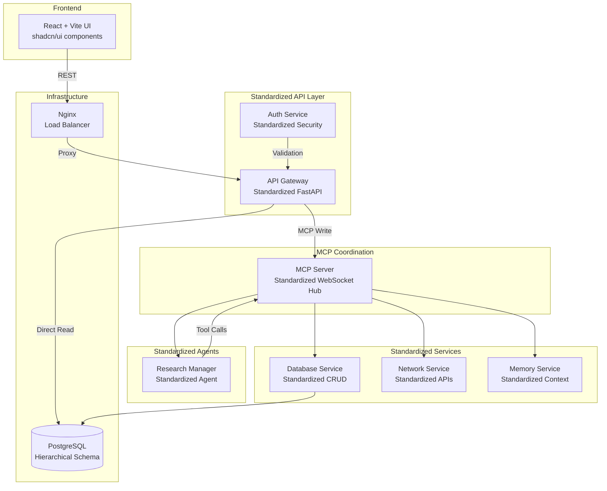

# Architecture Documentation

Welcome to the Eunice Research Platform architecture documentation. This directory contains comprehensive documentation for the platform's **standardized microservices architecture**.

## 📚 Document Index

### 🏗️ Core Architecture
- **[Eunice_Architecture.md](Eunice_Architecture.md)** - **Main architecture overview** with standardized service patterns
- **[Eunice_Architecture_v1.0.md](Eunice_Architecture_v1.0.md)** - Complete technical specification with detailed service documentation

### 🔧 Technical References  
- **[Function_Map.md](Funcrtion_Map.md)** - Complete API function reference with standardized endpoints
- **[Hierarchical_Research_Structure.md](Hierarchical_Research_Structure.md)** - Data organization and navigation patterns
- **[Roadmap.md](Roadmap.md)** - Development roadmap with completed standardization milestones

### 📜 Legacy Documentation
- **[MASTER_ARCHITECTURE_OLD.md](MASTER_ARCHITECTURE_OLD.md)** - ⚠️ Legacy documentation (archived for historical reference)

---

## 🎯 Quick Start

**New to Eunice?** Start here:
1. **[Eunice_Architecture.md](Eunice_Architecture.md)** - Get an overview of the standardized architecture
2. **[Hierarchical_Research_Structure.md](Hierarchical_Research_Structure.md)** - Understand the data model
3. **[Function_Map.md](Funcrtion_Map.md)** - Explore available APIs

**Developing?** Technical details:
1. **[Eunice_Architecture_v1.0.md](Eunice_Architecture_v1.0.md)** - Complete service specifications
2. **[Roadmap.md](Roadmap.md)** - Current status and future plans

---

## 🏗️ Architecture Highlights

### ✅ **Fully Standardized Platform**
- **7 Services + 1 Agent** following identical architecture patterns
- **Type-safe configuration** with Pydantic models
- **Comprehensive health monitoring** with system metrics
- **Security hardening** with multi-stage Docker builds
- **>80% test coverage** across all modules

### 🚀 **Production-Ready Features**
- **Optimized Performance**: Direct DB reads (60-70% faster) + MCP coordination
- **Enterprise Security**: JWT authentication, RBAC, 2FA support
- **Scalable Design**: Container-native with horizontal scaling
- **Operational Excellence**: Structured logging, health monitoring, metrics

### 🧠 **AI-Driven Research**
- **Research Manager Agent** with standardized prompt configuration
- **MCP Protocol Coordination** for agent communication
- **AI-Generated Research Plans** with cost estimation
- **Multi-Agent Coordination** for complex research workflows

---

## 📋 Service Inventory

All services follow the **standardized architecture pattern**:

```
service/
├── src/                     # Python source code
│   ├── main.py             # FastAPI application entry
│   ├── config.py           # Pydantic configuration
│   ├── models.py           # Data models and schemas
│   ├── health_check.py     # System monitoring
│   └── utils.py            # Common utilities
├── config/                  # Configuration files
├── tests/                   # Test suite (>80% coverage)
├── logs/                    # Runtime logs
├── Dockerfile              # Multi-stage container build
└── requirements.txt         # Production dependencies
```

### 🌐 **Core Services**
1. **API Gateway** (`:8001`) - Unified entry point with direct DB reads and MCP routing
2. **Auth Service** (`:8013`) - JWT authentication with 2FA and RBAC
3. **Database Service** (`:8011`) - Type-safe CRUD operations with health monitoring
4. **MCP Server** (`:9000`) - WebSocket-based agent coordination hub
5. **Memory Service** (`:8009`) - Context and session management
6. **Network Service** (`:8008`) - External API integrations and networking

### 🤖 **Research Agents**
7. **Research Manager** (`:8002`) - AI-driven research coordination and planning

### 🗄️ **Infrastructure**
- **PostgreSQL** - Hierarchical research data with optimized schemas
- **Nginx** - Load balancer and reverse proxy with SSL termination

---

## 🔄 Data Flow Architecture



---

## 📊 Architecture Benefits

### **For Developers**
- **Predictable Patterns**: Navigate any service intuitively
- **Type Safety**: Pydantic models throughout the stack
- **Comprehensive Testing**: >80% coverage with pytest frameworks
- **Consistent Tooling**: Identical development workflows

### **For Operations**  
- **Uniform Deployment**: Same patterns for all services
- **Health Monitoring**: Comprehensive metrics and logging
- **Security Hardening**: Multi-stage Docker builds, non-root execution
- **Simplified Scaling**: Predictable resource usage

### **For Architecture**
- **Maintainability**: Changes applied consistently across services
- **Extensibility**: New services follow established patterns
- **Quality Assurance**: Standardized testing and validation
- **Documentation**: Auto-generated from consistent patterns

---

## 🎯 Current Status

✅ **Version 0.4.1 - Platform Standardization COMPLETED**
- All services migrated to standardized architecture
- Comprehensive documentation consolidated
- Production-ready deployment achieved

🎯 **Version 0.5.0 - Frontend Integration NEXT**
- React frontend with shadcn/ui components
- Type-safe API integration
- Enhanced user experience

---

## 🤝 Contributing

When working with the Eunice architecture:

1. **Follow Standardized Patterns**: All new services must follow the established template
2. **Maintain Type Safety**: Use Pydantic models for all data interfaces
3. **Include Comprehensive Tests**: Achieve >80% coverage
4. **Document Changes**: Update relevant architecture documents
5. **Security First**: Follow established security hardening practices

---

**🎉 Welcome to the Eunice Research Platform - A production-ready, standardized microservices architecture for AI-driven research automation.**
