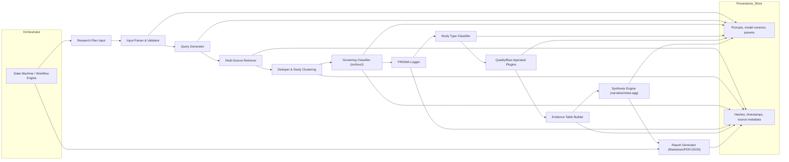

# Automated Literature Review System – Requirements (v2, 23-07-2025)

**Author:** Paul Zanna (updated with recommendations by Sky)  
**Status:** Draft v2 (supersedes v1)  
**Purpose:** Specify functional and non‑functional requirements for an automated, PRISMA‑aligned literature review application driven by LLMs and traditional IR components.

---

## 0. Change Log

| Version | Date       | Author | Summary of Changes                                                                                                                                                                                                                                                                                                        |
| ------- | ---------- | ------ | ------------------------------------------------------------------------------------------------------------------------------------------------------------------------------------------------------------------------------------------------------------------------------------------------------------------------- |
| v2      | 23-07-2025 | Sky    | Added provenance/auditability, deterministic modes, PRISMA logging schema, de‑duplication, security/threat model, quality appraisal plugin interface, evaluation automation, scalability/job orchestration, config schema, and expanded NFRs. Reorganised FRs, inserted mermaid diagrams, and clarified testing strategy. |
| v1      | —          | Paul   | Original document.                                                                                                                                                                                                                                                                                                        |

---

## 1. Scope & Goals

The system automates end‑to‑end systematic (or scoping/rapid) literature reviews: from parsing a research plan to producing a PRISMA‑compliant report with transparent provenance and reproducibility. It supports human checkpoints and operates under constrained budgets and API rate limits.

### In Scope

- Protocol ingestion, query formulation, multi‑source retrieval, screening, quality appraisal, synthesis, and report generation.
- LLM‑assisted reasoning with deterministic re‑runs.
- Audit trails, security, and licensing compliance.

### Out of Scope

- In vivo research assistance.
- Closed, proprietary databases that forbid automated access (unless explicit licence is obtained).

---

## 2. High‑Level Architecture



---

## 3. Functional Requirements (FR)

> Numbering keeps prior FR identifiers where possible and adds new sections (8–11). Cross‑refs to old FRs noted in parentheses.

### FR‑1 Input Acquisition & Parsing (was FR‑1)

1.1 The system shall accept a **Research Plan** in Markdown or structured JSON.  
1.2 A **JSON Schema** (`research_plan.schema.json`) shall validate required fields (objectives, PICO/PECO, population, outcomes, timeframe).  
1.3 Missing or ambiguous fields trigger an interactive clarification prompt (human‑in‑the‑loop option).  
1.4 Input versions shall be stored immutably with a SHA‑256 hash.

### FR‑2 Information Retrieval (was FR‑2)

2.1 Generate search queries using templates + LLM assistance; persist all prompts and outputs.  
2.2 Query parameters: keywords, synonyms, Boolean logic, date ranges, language, study type filters.  
2.3 Retrieve from configurable sources (e.g., PubMed, CrossRef, OpenAlex, arXiv, bioRxiv); each source is a plugin with graceful degradation and retry policies.  
2.4 Implement **rate limiting, caching and backoff**.  
2.5 Collect raw records (metadata + PDFs/HTML) and normalise into a unified schema.  
2.6 **De‑duplication:** Automatically detect and merge duplicates by DOI, title+authors+year similarity, or text hash (FR‑3.1).  
2.7 **Study clustering:** Group multiple reports/updates of the same study.

### FR‑3 Screening & Eligibility (expanded from FR‑3)

3.1 **Deduper** runs before screening to eliminate duplicates.  
3.2 **Two‑stage screening:** title/abstract, then full text; LLM classifier assists but human can override.  
3.3 Exclusion reasons shall follow a controlled vocabulary (e.g., wrong population, design, language).  
3.4 All screening decisions are logged with timestamp, actor (human/AI), model version, and rationale snippet.  
3.5 Configurable thresholds for AI confidence; below threshold requires human review.

### FR‑4 Quality / Risk-of-Bias Appraisal (was FR‑4)

4.1 Provide a **plugin interface** for bias/quality tools (e.g., ROBINS‑I, RoB 2, CASP, GRADE).  
4.2 Each plugin defines: input fields, questions, scoring rubric, output schema.  
4.3 LLMs can draft answers; human reviewers confirm.  
4.4 Scores and justifications are stored per study and surfaced in the evidence table.

### FR‑5 Synthesis & Analysis (was FR‑5)

5.1 Select synthesis method (narrative, thematic, meta‑aggregation) based on research plan and study types.  
5.2 Evidence tables are produced in machine‑readable (CSV/JSON) and human‑readable Markdown.  
5.3 Contradiction detection: flag conflicting findings across studies on the same outcome.  
5.4 Confidence grading per claim (weak/moderate/strong), with rule‑based + LLM heuristic combination.  
5.5 Deterministic mode available: fixed random seeds, temperature=0, and cached embeddings to ensure repeatability.

### FR‑6 Output Generation (was FR‑6)

6.1 Generate:

- PRISMA 2020 flow diagram (SVG/PNG) from JSON counters.
- Full report (Markdown) + PDF export.
- Appendices: search strategies, evidence tables, risk‑of‑bias tables, audit log.  
  6.2 Support CSL citation styles (e.g., Vancouver, APA) via `citeproc`.  
  6.3 All figures shall include alt-text for accessibility.

### FR‑7 User Interaction & Configuration (was FR‑7)

7.1 Provide a **config file** (`config.yml/json`) with schema validation; allow CLI flags to override.  
7.2 UI/API shall expose review checkpoints (queries, screening decisions, synthesis draft).  
7.3 Exportable **audit log** (JSONL) with every decision & parameter.  
7.4 Secrets (API keys) stored encrypted at rest.

### FR‑8 Provenance, Reproducibility & Audit Trail (**new**)

8.1 Persist all LLM prompts, model IDs, parameters (temperature, top‑p, seed), and outputs.  
8.2 Store cryptographic hashes (SHA‑256) of all source PDFs/HTML to ensure integrity.  
8.3 Record software versions (git commit, Docker image digest) for each run.  
8.4 Provide a “Reproduce Run” command which replays a job using stored artefacts.  
8.5 Provide structured **diff reports** between runs (model updates, prompt changes).

### FR‑9 Security, Compliance & Licensing (**expanded**)

9.1 Implement a **threat model** addressing: prompt injection, malicious PDFs, API abuse, PII leakage.  
9.2 Sandbox document parsing; strip/escape active content (JS in PDFs).  
9.3 Honour database terms of use; maintain a licence registry per source.  
9.4 GDPR/APP compliance: ability to delete user data on request; minimise personal data retention.  
9.5 Role‑based access control for multi‑user deployments; logs are tamper‑evident.

### FR‑10 Evaluation & Testing Automation (**new**)

10.1 Success metrics (precision/recall of screening, hallucination rate, time/cost per review) shall be automatically computed on benchmark tasks.  
10.2 Continuous integration (CI) runs unit & integration tests, including mocked API failures.  
10.3 Regression tests compare generated reports (Markdown diffs) to detect drift after model updates.  
10.4 Random fact‑check sampling: extract claims and verify citation support.

### FR‑11 Scalability & Job Orchestration (**new**)

11.1 Long‑running tasks executed by queued workers (e.g., Celery/RQ) rather than AWS Lambda only.  
11.2 Jobs are resumable and checkpointed.  
11.3 Caching layers for embeddings, PDFs, and intermediate LLM outputs.  
11.4 Observability: metrics (Prometheus), tracing, and centralised logs.

---

## 4. Non‑Functional Requirements (NFR)

| ID    | Requirement                         | Target / Detail                                                                                            |
| ----- | ----------------------------------- | ---------------------------------------------------------------------------------------------------------- |
| NFR‑1 | **Performance**                     | 95th percentile end‑to‑end review ≤ X hours on corpus of 5k records; single query roundtrip ≤ 5 s (cached) |
| NFR‑2 | **Determinism Mode**                | Option to run with fully deterministic settings; diffable outputs                                          |
| NFR‑3 | **Security & Compliance**           | Threat model maintained; OWASP top 10 mitigated; GDPR/APP compliance                                       |
| NFR‑4 | **Reliability & Fault Tolerance**   | Auto‑retry with exponential backoff; orchestrator restarts failed tasks                                    |
| NFR‑5 | **Maintainability & Extensibility** | Plugin interfaces for sources and appraisal tools; 80% unit test coverage                                  |
| NFR‑6 | **Accessibility**                   | WCAG 2.1 AA for UI and generated docs (alt-text, headings)                                                 |
| NFR‑7 | **Cost Efficiency**                 | Track cost per run; configurable model/source tiers                                                        |
| NFR‑8 | **Usability**                       | CLI + minimal web UI with guided wizard; clear error messages                                              |

---

## 5. Data & Metadata Models

### 5.1 Core Entities

- **StudyRecord:** `id`, `title`, `authors[]`, `year`, `doi`, `source`, `abstract`, `full_text_path`, `hash`, `license`.
- **ScreeningDecision:** `record_id`, `stage` (title/abstract/fulltext), `decision` (include/exclude), `reason_code`, `actor`, `timestamp`, `model_id`, `prompt_hash`.
- **BiasAssessment:** `record_id`, `tool_id`, `scores{{}}`, `justification`, `assessor`, `timestamp`.
- **EvidenceRow:** `record_id`, `outcome`, `effect_size`, `units`, `direction`, `confidence`.
- **ProvenanceEvent:** `event_type`, `payload`, `timestamp`, `hashes`, `software_versions`.

### 5.2 Example JSON Schema Snippets

```json
{
  "type": "object",
  "required": ["objective", "population", "outcomes"],
  "properties": {
    "objective": { "type": "string" },
    "population": { "type": "string" },
    "intervention": { "type": "string" },
    "comparison": { "type": "string" },
    "outcomes": { "type": "array", "items": { "type": "string" } },
    "timeframe": { "type": "string" }
  }
}
```

### 5.3 PRISMA Logging Spec

Counters stored in `prisma_log.json`:

```json
{
  "identified": 5321,
  "duplicates_removed": 812,
  "screened_title_abstract": 4510,
  "excluded_title_abstract": 3000,
  "screened_full_text": 1510,
  "excluded_full_text": 1400,
  "included": 110,
  "reasons": [
    { "code": "WRONG_POP", "count": 420 },
    { "code": "NOT_PEER_REVIEWED", "count": 210 }
  ]
}
```

---

## 6. Quality/Bias Appraisal Plugin Interface

```yaml
id: robins-i
name: ROBINS-I
input_fields:
  - confounding_bias
  - selection_bias
  - classification_bias
scoring:
  levels: [low, moderate, serious, critical]
output_schema:
  type: object
  properties:
    overall_risk: { "type": "string" }
    domain_scores: { "type": "object" }
```

Plugins register via entry points; orchestrator selects based on study design metadata.

---

## 7. Testing & QA Strategy

- **Unit Tests:** schema validation, deduper correctness, prompt templates.
- **Integration Tests:** full pipeline on a toy corpus; simulate API failures, malformed PDFs.
- **Regression Tests:** snapshot outputs from “golden” reviews.
- **Security Tests:** prompt injection test set, malicious PDF suite.
- **Monitoring:** metrics dashboard for recall/precision on curated benchmarks.

---

## 8. Threat Model (Summary)

- **Assets:** API keys, user data, unpublished manuscripts, generated reports.
- **Attack Vectors:** prompt injection via scraped text; malicious PDFs; supply‑chain (model update), API credential leakage.
- **Mitigations:** content sanitisation, least‑privilege tokens, signed container images, dependency scanning, model output filters.

---

## 9. Operational Considerations

- **Deployment:** Docker Compose for local; optional K8s.
- **Job Orchestration:** Celery/RQ + Redis or AWS SQS.
- **Observability Stack:** Prometheus, Grafana, Sentry.
- **Backups:** daily DB snapshot; artefact store in S3/minio with versioning.

---

## 10. Appendices

### 10.1 Example `config.yml`

```yaml
sources:
  - name: pubmed
    enabled: true
    max_results: 5000
  - name: crossref
    enabled: true
llm:
  model: gpt-4o
  temperature: 0.0
  seed: 42
  max_tokens: 4096
workflow:
  checkpoints:
    - after_query_generation
    - after_screening
    - before_publication
security:
  sanitize_pdfs: true
  redact_pii: true
output:
  citation_style: vancouver
  produce_pdf: true
```

### 10.2 Evidence Table Columns (Minimum)

| Study ID | Year | Design | Population | Intervention | Comparator | Outcome | Effect Size | Units | Direction | Bias Score | Confidence | Notes |

---
