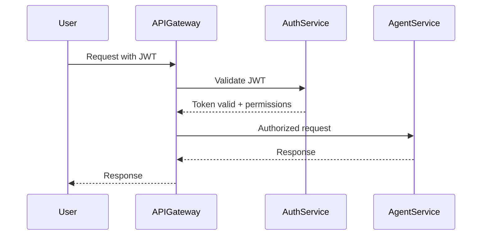

# Eunice Architecture Phase 3 - Microservices Transition

## 🎯 Phase 3 Overview

**Phase 3: Microservices Transition** transforms the Eunice Research Platform from the current enhanced modular architecture (completed in Phase 2) into a fully distributed microservices ecosystem. This phase focuses on containerization, service independence, enhanced security, and enterprise-grade scalability.

## 📋 Current Foundation (Phase 2 Complete)

### ✅ Phase 2 Achievements

- **Enhanced MCP Server**: Load balancing, circuit breakers, structured logging
- **API Gateway**: Unified REST interface with 21+ endpoints
- **Task Queue System**: Redis/RQ with asynchronous processing
- **Service Orchestration**: Complete stack via `start_eunice.sh`
- **Production-Ready**: Validated architecture with comprehensive testing

### 🏗️ Current Architecture

```
📋 Redis:       localhost:6379 (message broker)
⚙️  Workers:     Scalable task queue workers
🌐 API Gateway: http://localhost:8001 (unified REST interface)  
🔧 MCP Server:  http://localhost:9000 (enhanced with load balancing)
🤖 Agents:      4 research agents with load balancing
🖥️  Backend:    http://localhost:8000
🌐 Frontend:    http://localhost:3000
```

## 🚀 Phase 3 Objectives

### 1. MCP Server as Distributed Orchestrator Service

**Goal**: Containerize and scale the existing MCP Server as the central coordinator

**Implementation Plan**:

- Containerize existing MCP Server with enhanced capabilities
- Maintain Research Manager as an agent within MCP ecosystem
- Add service discovery and health monitoring to MCP Server
- Enable independent scaling of MCP Server and connected agents

**Technical Requirements**:

- Enhanced MCP Server with WebSocket clustering support
- Maintain existing MCP protocol for agent communication
- Add REST API endpoints to MCP Server for external access
- Keep Research Manager as specialized orchestration agent

### 2. Containerized Agent Deployment  

**Goal**: Deploy each agent as independent, containerized service while maintaining MCP communication

**Implementation Plan**:

- Container-based architecture (Docker) for all agents
- Agents maintain MCP Client connections to central MCP Server
- Independent agent scaling and deployment
- Preserve existing agent communication patterns

**Agent Services to Containerize**:

- **Literature Agent Service**: Academic search and verification (MCP Client)
- **Planning Agent Service**: Research planning and task synthesis (MCP Client)
- **Executor Agent Service**: Code execution and data processing (MCP Client)
- **Memory Agent Service**: Knowledge base and document management (MCP Client)
- **Research Manager Agent**: Workflow orchestration (MCP Client)

### 3. Enhanced Security and Authentication

**Goal**: Enterprise-grade security with comprehensive access control

**Implementation Plan**:

- JWT-based authentication system
- Role-based access control (RBAC)
- Service-to-service authentication
- API key management and rotation

**Security Features**:

- Multi-factor authentication (MFA)
- OAuth 2.0 / OpenID Connect integration
- Encrypted service communication (mTLS)
- Audit logging and compliance tracking

### 4. Performance Optimization and Caching Layers

**Goal**: High-performance distributed caching and optimization

**Implementation Plan**:

- Distributed Redis cluster for caching
- Database read replicas and connection pooling
- CDN integration for static assets
- Query optimization and result caching

**Performance Targets**:

- API response times < 100ms (90th percentile)
- Support 100+ concurrent users
- Literature search results < 5s
- Real-time collaboration latency < 200ms

### 5. Real-time Collaboration Features

**Goal**: Multi-user research collaboration capabilities

**Implementation Plan**:

- Real-time document collaboration
- Live research session sharing
- Team notification systems
- Conflict resolution for concurrent edits

**Collaboration Features**:

- Shared research workspaces
- Live cursor tracking and editing
- Comment and annotation systems
- Version control for research documents

## 🏗️ Target MCP-Based Microservices Architecture

### Core Services

#### 1. API Gateway Service

```yaml
Service: api-gateway
Port: 8001
Responsibilities:
  - Request routing and load balancing
  - Authentication and authorization
  - Rate limiting and security enforcement
  - Direct communication with MCP Server
Dependencies: [auth-service, mcp-server]
```

#### 2. Enhanced MCP Server Service

```yaml
Service: mcp-server
Port: 9000
Responsibilities:
  - Agent registration and service discovery
  - WebSocket-based agent communication
  - Task delegation and load balancing
  - Research workflow coordination
  - Real-time status updates and monitoring
Dependencies: [database-service, redis-cluster]
```

#### 3. Research Manager Agent (MCP Client)

```yaml
Service: research-manager-agent
Port: 8002
Responsibilities:
  - Complex workflow orchestration via MCP
  - Multi-agent task coordination
  - Cost tracking and approval workflows
  - Research plan generation and execution
Dependencies: [mcp-server]
MCP_Connection: WebSocket to mcp-server:9000
```

#### 4. Literature Agent Services (4 Specialized MCP Clients)

```yaml
Service: literature-search-agent
Port: 8003
Responsibilities:
  - Academic literature search and discovery
  - Multi-source bibliographic data collection
  - Search result deduplication and normalization
Dependencies: [mcp-server, database-service]
MCP_Connection: WebSocket to mcp-server:9000
```

```yaml
Service: screening-prisma-agent
Port: 8004
Responsibilities:
  - Systematic review screening workflows
  - PRISMA-compliant audit trails and documentation
  - Inclusion/exclusion criteria application
Dependencies: [mcp-server, ai-service, database-service]
MCP_Connection: WebSocket to mcp-server:9000
```

```yaml
Service: synthesis-review-agent
Port: 8005
Responsibilities:
  - Data extraction and evidence synthesis
  - Meta-analysis and statistical aggregation
  - Evidence table generation and management
Dependencies: [mcp-server, ai-service, memory-agent]
MCP_Connection: WebSocket to mcp-server:9000
```

```yaml
Service: writer-agent
Port: 8006
Responsibilities:
  - Manuscript generation and academic writing
  - Citation formatting and bibliography management
  - Document template processing and export
Dependencies: [mcp-server, database-service, storage-service]
MCP_Connection: WebSocket to mcp-server:9000
```

#### 5. Planning Agent Service (MCP Client)

```yaml
Service: planning-agent
Port: 8007
Responsibilities:
  - Research planning and strategy
  - Task breakdown and synthesis
  - Resource requirement analysis
Dependencies: [mcp-server, ai-service, memory-agent]
MCP_Connection: WebSocket to mcp-server:9000
```

#### 6. Executor Agent Service (MCP Client)

```yaml
Service: executor-agent
Port: 8008
Responsibilities:
  - Code execution and automation
  - Data processing and analysis
  - File operations and transformations
Dependencies: [mcp-server, security-service, storage-service]
MCP_Connection: WebSocket to mcp-server:9000
```

#### 7. Memory Agent Service (MCP Client)

```yaml
Service: memory-agent
Port: 8009
Responsibilities:
  - Knowledge base management
  - Document storage and retrieval
  - Research artifact organization
  - Semantic search capabilities
Dependencies: [mcp-server, vector-database, storage-service]
MCP_Connection: WebSocket to mcp-server:9000
```

### Supporting Services

#### 7. Authentication Service

```yaml
Service: auth-service
Port: 8007
Responsibilities:
  - User authentication and authorization
  - JWT token management
  - RBAC policy enforcement
  - Session management
Dependencies: [database-service]
```

#### 8. Database Service

```yaml
Service: database-service
Port: 8011
Responsibilities:
  - Centralized data access layer
  - Transaction management
  - Schema abstraction
  - Data consistency enforcement
Dependencies: [postgres-cluster]
```

#### 9. AI Service

```yaml
Service: ai-service
Port: 8010
Responsibilities:
  - Multi-provider AI model access
  - Request routing and load balancing
  - Cost optimization and tracking
  - Response caching and optimization
Dependencies: [external-ai-providers]
```

#### 10. Notification Service

```yaml
Service: notification-service
Port: 8012
Responsibilities:
  - Real-time notifications
  - WebSocket connection management
  - Event broadcasting
  - Collaboration updates
Dependencies: [message-broker, auth-service]
```

## 🐳 Containerization Strategy

### Docker Architecture

#### Base Images

```dockerfile
# Python base image for all services
FROM python:3.11-slim as python-base

# Node.js base image for frontend
FROM node:18-alpine as node-base

# Redis image for caching/messaging
FROM redis:7-alpine as redis-base

# PostgreSQL image for database
FROM postgres:15-alpine as postgres-base
```

#### Service Container Structure

```
eunice-microservices/
├── docker-compose.yml
├── docker-compose.override.yml
├── services/
│   ├── api-gateway/
│   │   ├── Dockerfile
│   │   ├── requirements.txt
│   │   └── src/
│   ├── research-orchestrator/
│   │   ├── Dockerfile
│   │   ├── requirements.txt
│   │   └── src/
│   ├── literature-agent/
│   │   ├── Dockerfile
│   │   ├── requirements.txt
│   │   └── src/
│   └── [other services...]
├── infrastructure/
│   ├── postgres/
│   ├── redis/
│   └── monitoring/
└── deployment/
    ├── k8s/
    └── helm/
```

### Container Orchestration Options

#### Option 1: Docker Compose (Development/Testing)

```yaml
version: '3.8'
services:
  # API Gateway
  api-gateway:
    build: ./services/api-gateway
    ports: ["8001:8001"]
    depends_on: [auth-service, mcp-server]
    environment:
      - MCP_SERVER_URL=ws://mcp-server:9000
    
  # Enhanced MCP Server (Central Coordinator)
  mcp-server:
    build: ./services/mcp-server
    ports: ["9000:9000"]
    depends_on: [database-service, redis]
    environment:
      - DATABASE_URL=postgresql://postgres:5432/eunice
      - REDIS_URL=redis://redis:6379
      
  # Research Manager Agent (MCP Client)
  research-manager-agent:
    build: ./services/research-manager-agent
    ports: ["8002:8002"]
    depends_on: [mcp-server]
    environment:
      - MCP_SERVER_URL=ws://mcp-server:9000
      - AGENT_TYPE=research_manager
    
  # Literature Agents (MCP Clients)
  literature-search-agent:
    build: ./services/literature-search-agent
    ports: ["8003:8003"]
    depends_on: [mcp-server, database-service]
    environment:
      - MCP_SERVER_URL=ws://mcp-server:9000
      - AGENT_TYPE=literature_search

  screening-prisma-agent:
    build: ./services/screening-prisma-agent
    ports: ["8004:8004"]
    depends_on: [mcp-server, ai-service, database-service]
    environment:
      - MCP_SERVER_URL=ws://mcp-server:9000
      - AGENT_TYPE=screening_prisma

  synthesis-review-agent:
    build: ./services/synthesis-review-agent
    ports: ["8005:8005"]
    depends_on: [mcp-server, ai-service, memory-agent]
    environment:
      - MCP_SERVER_URL=ws://mcp-server:9000
      - AGENT_TYPE=synthesis_review

  writer-agent:
    build: ./services/writer-agent
    ports: ["8006:8006"]
    depends_on: [mcp-server, database-service, storage-service]
    environment:
      - MCP_SERVER_URL=ws://mcp-server:9000
      - AGENT_TYPE=writer
      
  # Core Agents (MCP Clients)
  planning-agent:
    build: ./services/planning-agent
    ports: ["8007:8007"]
    depends_on: [mcp-server, ai-service, memory-agent]
    environment:
      - MCP_SERVER_URL=ws://mcp-server:9000
      - AGENT_TYPE=planning

  executor-agent:
    build: ./services/executor-agent
    ports: ["8008:8008"]
    depends_on: [mcp-server, storage-service]
    environment:
      - MCP_SERVER_URL=ws://mcp-server:9000
      - AGENT_TYPE=executor

  memory-agent:
    build: ./services/memory-agent
    ports: ["8009:8009"]
    depends_on: [mcp-server, vector-database, storage-service]
    environment:
      - MCP_SERVER_URL=ws://mcp-server:9000
      - AGENT_TYPE=memory
```

#### Option 2: Kubernetes (Production)

```yaml
apiVersion: apps/v1
kind: Deployment
metadata:
  name: api-gateway
spec:
  replicas: 3
  selector:
    matchLabels:
      app: api-gateway
  template:
    spec:
      containers:
      - name: api-gateway
        image: eunice/api-gateway:latest
        ports:
        - containerPort: 8001
```

## 🔐 Security Architecture

### Authentication Flow



### Role-Based Access Control (RBAC)

```yaml
Roles:
  - name: researcher
    permissions:
      - literature:read
      - literature:search  
      - research:create
      - research:read
      
  - name: admin
    permissions:
      - "*:*"  # Full access
      
  - name: collaborator
    permissions:
      - research:read
      - research:comment
      - literature:read
```

## 📊 Monitoring and Observability

### Metrics Collection

- **Prometheus**: Service metrics and health monitoring
- **Grafana**: Dashboards and alerting
- **Jaeger**: Distributed tracing across services
- **ELK Stack**: Centralized logging and analysis

### Health Checks

```python
@app.get("/health")
async def health_check():
    return {
        "status": "healthy",
        "timestamp": datetime.utcnow(),
        "version": "1.0.0",
        "dependencies": {
            "database": check_database_health(),
            "redis": check_redis_health(),
            "external_apis": check_external_apis()
        }
    }
```

## 🚧 Implementation Roadmap

### Phase 3.1: MCP Server Enhancement and Agent Containerization

#### Enhanced MCP Server Service

##### MCP Server Containerization

- [ ] Create `services/mcp-server/` directory structure
- [ ] Containerize existing MCP server with enhanced capabilities
- [ ] Add Docker configuration for WebSocket clustering support
- [ ] Implement REST API endpoints for external access alongside WebSocket

##### Database Integration and Performance

- [ ] Enhance MCP server database connection pooling
- [ ] Implement distributed agent registry with Redis backing
- [ ] Add comprehensive health check endpoints for MCP server
- [ ] Test MCP server connectivity and load balancing

##### Agent Discovery and Health Monitoring

- [ ] Implement enhanced agent registration with health monitoring
- [ ] Add agent failover and circuit breaker patterns
- [ ] Create service discovery mechanism for containerized agents
- [ ] Test MCP server with multiple agent connections

#### Literature Agent Containerization (Maintain MCP Communication)

##### Agent Container Setup

- [ ] Create `services/literature-search-agent/Dockerfile`
- [ ] Extract literature search logic while preserving MCP Client integration
- [ ] Implement agent startup with MCP server connection
- [ ] Test basic agent registration and MCP communication

##### Four Literature Agent Services (MCP Clients)

- [ ] Container Literature Search Agent (port 8003, MCP Client)
- [ ] Container Screening & PRISMA Agent (port 8004, MCP Client)
- [ ] Container Synthesis & Review Agent (port 8005, MCP Client)
- [ ] Container Writer Agent (port 8006, MCP Client)

##### MCP Communication Validation

- [ ] Verify all agents connect to MCP server via WebSocket
- [ ] Test task delegation through MCP protocol
- [ ] Validate agent response handling and error recovery
- [ ] End-to-end literature pipeline testing via MCP

#### Core Agent Services (MCP Clients)

##### Planning Agent Service

- [ ] Container Planning Agent (port 8007, MCP Client)
- [ ] Preserve task synthesis and planning workflows via MCP
- [ ] Test resource requirement analysis through MCP communication
- [ ] Validate planning workflows and agent dependencies

##### Executor Agent Service

- [ ] Container Executor Agent (port 8008, MCP Client)
- [ ] Implement secure code execution with MCP integration
- [ ] Add file operations and data processing via MCP protocol
- [ ] Test sandbox security and resource limits

##### Memory Agent Service

- [ ] Container Memory Agent (port 8009, MCP Client)
- [ ] Implement knowledge base management via MCP
- [ ] Preserve semantic search capabilities with MCP communication
- [ ] Test document storage, retrieval, and MCP integration

### Phase 3.2: Security Enhancement (Weeks 4-5)

#### Authentication Infrastructure

**JWT Authentication Service**

- [ ] Implement JWT authentication service (port 8007)
- [ ] Create user registration and login endpoints
- [ ] Add token validation and refresh mechanisms
- [ ] Implement multi-factor authentication support

**RBAC Authorization System**

- [ ] Design role-based access control schema
- [ ] Implement permission management system
- [ ] Create role assignment and policy enforcement
- [ ] Test fine-grained access controls

**Service-to-Service Authentication**

- [ ] Implement service identity and credentials
- [ ] Add inter-service token validation
- [ ] Create API key management system
- [ ] Test secure service communication

#### Security Hardening

**Encryption and Security**

- [ ] Implement mTLS for service communication
- [ ] Add data encryption at rest and in transit
- [ ] Create audit logging and compliance tracking
- [ ] Test security controls and penetration testing

**Security Validation**

- [ ] Conduct security assessment and vulnerability scanning
- [ ] Implement security monitoring and alerting
- [ ] Create incident response procedures
- [ ] Document security architecture and procedures

### Phase 3.3: Performance Optimization (Weeks 6-7)

#### Caching and Database Optimization

**Distributed Caching**

- [ ] Set up distributed Redis cluster
- [ ] Implement multi-layer caching strategy
- [ ] Add cache invalidation and consistency mechanisms
- [ ] Test caching performance and reliability

**Database Optimization**

- [ ] Implement database read replicas
- [ ] Add connection pooling and query optimization
- [ ] Create database monitoring and performance tuning
- [ ] Test database scalability and failover

#### WPerformance Testing and Tuning

**Load Testing**

- [ ] Set up load testing infrastructure
- [ ] Create performance test scenarios
- [ ] Execute load tests and identify bottlenecks
- [ ] Optimize service performance based on results

**Performance Validation**

- [ ] Validate API response time targets (< 100ms)
- [ ] Test concurrent user capacity (100+ users)
- [ ] Verify literature search performance (< 5s)
- [ ] Document performance characteristics and limits

### Phase 3.4: Collaboration Features (Weeks 8-9)

#### Real-time Infrastructure

**WebSocket Service**

- [ ] Implement real-time notification service (port 8012)
- [ ] Create WebSocket connection management
- [ ] Add event broadcasting and message routing
- [ ] Test real-time communication reliability

**Collaboration Features**

- [ ] Implement document collaboration capabilities
- [ ] Add live cursor tracking and editing
- [ ] Create comment and annotation systems
- [ ] Test multi-user collaboration workflows

#### Team Management

**Team Coordination**

- [ ] Create shared research workspace management
- [ ] Implement team notification systems
- [ ] Add conflict resolution for concurrent edits
- [ ] Test collaborative research scenarios

**Collaboration Testing**

- [ ] Validate real-time latency (< 200ms)
- [ ] Test collaborative editing reliability
- [ ] Verify notification delivery and accuracy
- [ ] Document collaboration features and limitations

### Phase 3.5: Production Deployment (Weeks 10-11)

#### Infrastructure and DevOps

**Kubernetes Setup**

- [ ] Set up Kubernetes cluster infrastructure
- [ ] Create service deployment manifests
- [ ] Implement auto-scaling and resource management
- [ ] Test cluster operations and management

**CI/CD Pipeline**

- [ ] Implement continuous integration pipelines
- [ ] Create automated testing and deployment
- [ ] Add rollback and blue-green deployment
- [ ] Test end-to-end deployment automation

#### Production Validation

**Monitoring and Alerting**

- [ ] Set up Prometheus metrics collection
- [ ] Create Grafana dashboards and visualizations
- [ ] Implement alerting rules and escalation
- [ ] Test monitoring coverage and accuracy

**Final Validation**

- [ ] Execute comprehensive end-to-end testing
- [ ] Perform final security and performance validation
- [ ] Create production runbooks and documentation
- [ ] Complete production readiness assessment

## 🎯 Success Metrics

### Performance Targets

- **API Response Time**: < 100ms (90th percentile)
- **Service Availability**: 99.9% uptime
- **Concurrent Users**: Support 100+ active users
- **Database Queries**: < 50ms average response time

### Scalability Targets

- **Horizontal Scaling**: Auto-scale based on load
- **Service Independence**: Zero-downtime deployments
- **Resource Efficiency**: < 2GB memory per service
- **Cost Optimization**: 30% reduction in infrastructure costs

### Security Targets

- **Authentication**: Multi-factor authentication support
- **Authorization**: Fine-grained permission system
- **Audit Compliance**: Complete audit trail
- **Data Protection**: Encryption at rest and in transit

## 🔄 Migration Strategy

### Gradual Migration Approach

1. **Phase 2 → Phase 3 Compatibility Layer**
   - Maintain existing API Gateway during transition
   - Implement service adapters for backward compatibility
   - Gradual service extraction with feature parity

2. **Service-by-Service Migration**
   - Start with Literature Agent (least dependencies)
   - Progress to Planning and Executor Agents
   - Finish with Research Orchestrator (most dependencies)

3. **Data Migration and Consistency**
   - Implement dual-write patterns during transition
   - Use event sourcing for data synchronization
   - Validate data consistency across services

### Rollback Strategy

- **Blue-Green Deployment**: Maintain parallel environments
- **Feature Flags**: Control service activation/deactivation
- **Database Snapshots**: Point-in-time recovery capability
- **Service Versioning**: API version compatibility

---

**Phase 3 Status**: 🔄 Ready to Begin Implementation  
**Prerequisites**: ✅ Phase 2 Complete (Enhanced MCP, API Gateway, Task Queue)  
**Target Completion**: 11 weeks from start date  
**Expected Benefits**: Enterprise scalability, enhanced security, real-time collaboration

---

*This document serves as the comprehensive implementation guide for Phase 3 of the Eunice Research Platform architecture evolution.*
