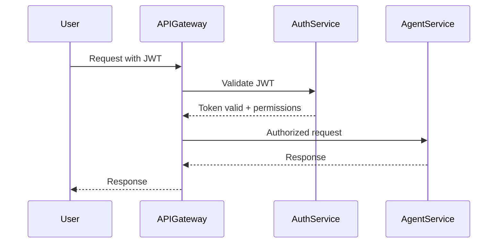

# Eunice Architecture Phase 3 - Microservices Transition

## 🎯 Phase 3 Overview

**Phase 3: Microservices Transition** transforms the Eunice Research Platform from the current enhanced modular architecture (completed in Phase 2) into a fully distributed microservices ecosystem. This phase focuses on containerization, service independence, enhanced security, and enterprise-grade scalability.

## 📋 Current Foundation (Phase 2 Complete)

### ✅ Phase 2 Achievements

- **Enhanced MCP Server**: Load balancing, circuit breakers, structured logging
- **API Gateway**: Unified REST interface with 21+ endpoints
- **Task Queue System**: Redis/RQ with asynchronous processing
- **Service Orchestration**: Complete stack via `start_eunice.sh`
- **Production-Ready**: Validated architecture with comprehensive testing

### 🏗️ Current Architecture

```
📋 Redis:       localhost:6379 (message broker)
⚙️  Workers:     Scalable task queue workers
🌐 API Gateway: http://localhost:8001 (unified REST interface)  
🔧 MCP Server:  http://localhost:9000 (enhanced with load balancing)
🤖 Agents:      4 research agents with load balancing
🖥️  Backend:    http://localhost:8000
🌐 Frontend:    http://localhost:3000
```

## 🚀 Phase 3 Objectives

### 1. Research Manager as Separate Orchestrator Service

**Goal**: Extract Research Manager from MCP ecosystem into independent service

**Implementation Plan**:

- Create dedicated `research-orchestrator` service
- Implement REST API for workflow management
- Add service discovery and health monitoring
- Enable independent scaling and deployment

**Technical Requirements**:

- FastAPI-based service with Pydantic models
- Direct database access for workflow persistence
- WebSocket support for real-time status updates
- Integration with existing agent services

### 2. Distributed Agent Deployment  

**Goal**: Deploy each agent as independent, containerized microservice

**Implementation Plan**:

- Container-based architecture (Docker)
- Service mesh for inter-agent communication
- Independent agent APIs and databases
- Horizontal scaling capabilities

**Agent Services to Extract**:

- **Literature Agent Service**: Academic search and verification
- **Planning Agent Service**: Research planning and task synthesis
- **Executor Agent Service**: Code execution and data processing
- **Memory Agent Service**: Knowledge base and document management

### 3. Enhanced Security and Authentication

**Goal**: Enterprise-grade security with comprehensive access control

**Implementation Plan**:

- JWT-based authentication system
- Role-based access control (RBAC)
- Service-to-service authentication
- API key management and rotation

**Security Features**:

- Multi-factor authentication (MFA)
- OAuth 2.0 / OpenID Connect integration
- Encrypted service communication (mTLS)
- Audit logging and compliance tracking

### 4. Performance Optimization and Caching Layers

**Goal**: High-performance distributed caching and optimization

**Implementation Plan**:

- Distributed Redis cluster for caching
- Database read replicas and connection pooling
- CDN integration for static assets
- Query optimization and result caching

**Performance Targets**:

- API response times < 100ms (90th percentile)
- Support 100+ concurrent users
- Literature search results < 5s
- Real-time collaboration latency < 200ms

### 5. Real-time Collaboration Features

**Goal**: Multi-user research collaboration capabilities

**Implementation Plan**:

- Real-time document collaboration
- Live research session sharing
- Team notification systems
- Conflict resolution for concurrent edits

**Collaboration Features**:

- Shared research workspaces
- Live cursor tracking and editing
- Comment and annotation systems
- Version control for research documents

## 🏗️ Target Microservices Architecture

### Core Services

#### 1. API Gateway Service

```yaml
Service: api-gateway
Port: 8001
Responsibilities:
  - Request routing and load balancing
  - Authentication and authorization
  - Rate limiting and security enforcement
  - API versioning and documentation
Dependencies: [auth-service, service-registry]
```

#### 2. Research Orchestrator Service

```yaml
Service: research-orchestrator  
Port: 8002
Responsibilities:
  - Workflow orchestration and management
  - Task delegation and monitoring
  - Resource allocation and cost tracking
  - Inter-service coordination
Dependencies: [database-service, message-broker]
```

#### 3. Literature Agent Services (4 Specialized Agents)

```yaml
Service: literature-search
Port: 8003
Responsibilities:
  - Academic literature search and discovery
  - Multi-source bibliographic data collection
  - Search result deduplication and normalization
  - Source metadata extraction and validation
Dependencies: [database-service]
```

```yaml
Service: screening-prisma
Port: 8004
Responsibilities:
  - Systematic review screening workflows
  - PRISMA-compliant audit trails and documentation
  - Inclusion/exclusion criteria application
  - Study quality assessment and validation
Dependencies: [ai-service, database-service]
```

```yaml
Service: synthesis-review
Port: 8005
Responsibilities:
  - Data extraction and evidence synthesis
  - Meta-analysis and statistical aggregation
  - Evidence table generation and management
  - Narrative synthesis and reporting
Dependencies: [ai-service, memory-service, database-service]
```

```yaml
Service: writer-agent
Port: 8006
Responsibilities:
  - Manuscript generation and academic writing
  - Citation formatting and bibliography management
  - Document template processing and export
  - PRISMA-to-thesis conversion workflows
Dependencies: [database-service, storage-service]
```

#### 4. Planning Agent Service

```yaml
Service: planning-agent
Port: 8007
Responsibilities:
  - Research planning and strategy
  - Task breakdown and synthesis
  - Resource requirement analysis
  - Timeline and milestone management
Dependencies: [ai-service, memory-service]
```

#### 5. Executor Agent Service

```yaml
Service: executor-agent
Port: 8008
Responsibilities:
  - Code execution and automation
  - Data processing and analysis
  - File operations and transformations
  - API integrations and external calls
Dependencies: [security-service, storage-service]
```

#### 6. Memory Agent Service

```yaml
Service: memory-agent
Port: 8009
Responsibilities:
  - Knowledge base management
  - Document storage and retrieval
  - Research artifact organization
  - Semantic search capabilities
Dependencies: [vector-database, storage-service]
```

### Supporting Services

#### 7. Authentication Service

```yaml
Service: auth-service
Port: 8007
Responsibilities:
  - User authentication and authorization
  - JWT token management
  - RBAC policy enforcement
  - Session management
Dependencies: [database-service]
```

#### 8. Database Service

```yaml
Service: database-service
Port: 8011
Responsibilities:
  - Centralized data access layer
  - Transaction management
  - Schema abstraction
  - Data consistency enforcement
Dependencies: [postgres-cluster]
```

#### 9. AI Service

```yaml
Service: ai-service
Port: 8010
Responsibilities:
  - Multi-provider AI model access
  - Request routing and load balancing
  - Cost optimization and tracking
  - Response caching and optimization
Dependencies: [external-ai-providers]
```

#### 10. Notification Service

```yaml
Service: notification-service
Port: 8012
Responsibilities:
  - Real-time notifications
  - WebSocket connection management
  - Event broadcasting
  - Collaboration updates
Dependencies: [message-broker, auth-service]
```

## 🐳 Containerization Strategy

### Docker Architecture

#### Base Images

```dockerfile
# Python base image for all services
FROM python:3.11-slim as python-base

# Node.js base image for frontend
FROM node:18-alpine as node-base

# Redis image for caching/messaging
FROM redis:7-alpine as redis-base

# PostgreSQL image for database
FROM postgres:15-alpine as postgres-base
```

#### Service Container Structure

```
eunice-microservices/
├── docker-compose.yml
├── docker-compose.override.yml
├── services/
│   ├── api-gateway/
│   │   ├── Dockerfile
│   │   ├── requirements.txt
│   │   └── src/
│   ├── research-orchestrator/
│   │   ├── Dockerfile
│   │   ├── requirements.txt
│   │   └── src/
│   ├── literature-agent/
│   │   ├── Dockerfile
│   │   ├── requirements.txt
│   │   └── src/
│   └── [other services...]
├── infrastructure/
│   ├── postgres/
│   ├── redis/
│   └── monitoring/
└── deployment/
    ├── k8s/
    └── helm/
```

### Container Orchestration Options

#### Option 1: Docker Compose (Development/Testing)

```yaml
version: '3.8'
services:
  api-gateway:
    build: ./services/api-gateway
    ports: ["8001:8001"]
    depends_on: [auth-service, service-registry]
    
  research-orchestrator:
    build: ./services/research-orchestrator  
    ports: ["8002:8002"]
    depends_on: [database-service]
    
  literature-search:
    build: ./services/literature-search
    ports: ["8003:8003"]
    depends_on: [database-service]
    
  screening-prisma:
    build: ./services/screening-prisma
    ports: ["8004:8004"]
    depends_on: [ai-service, database-service]

  synthesis-review:
    build: ./services/synthesis-review
    ports: ["8005:8005"]
    depends_on: [ai-service, memory-agent, database-service]

  writer-agent:
    build: ./services/writer-agent
    ports: ["8006:8006"]
    depends_on: [database-service, storage-service]
```

#### Option 2: Kubernetes (Production)

```yaml
apiVersion: apps/v1
kind: Deployment
metadata:
  name: api-gateway
spec:
  replicas: 3
  selector:
    matchLabels:
      app: api-gateway
  template:
    spec:
      containers:
      - name: api-gateway
        image: eunice/api-gateway:latest
        ports:
        - containerPort: 8001
```

## 🔐 Security Architecture

### Authentication Flow



### Role-Based Access Control (RBAC)

```yaml
Roles:
  - name: researcher
    permissions:
      - literature:read
      - literature:search  
      - research:create
      - research:read
      
  - name: admin
    permissions:
      - "*:*"  # Full access
      
  - name: collaborator
    permissions:
      - research:read
      - research:comment
      - literature:read
```

## 📊 Monitoring and Observability

### Metrics Collection

- **Prometheus**: Service metrics and health monitoring
- **Grafana**: Dashboards and alerting
- **Jaeger**: Distributed tracing across services
- **ELK Stack**: Centralized logging and analysis

### Health Checks

```python
@app.get("/health")
async def health_check():
    return {
        "status": "healthy",
        "timestamp": datetime.utcnow(),
        "version": "1.0.0",
        "dependencies": {
            "database": check_database_health(),
            "redis": check_redis_health(),
            "external_apis": check_external_apis()
        }
    }
```

## 🚧 Implementation Roadmap

### Phase 3.1: Service Extraction Foundation (Weeks 1-3)

#### Week 1: Research Orchestrator Service Extraction

**Days 1-2: Service Architecture Setup**

- [ ] Create `services/research-orchestrator/` directory structure
- [ ] Design FastAPI service architecture with Pydantic models
- [ ] Extract orchestration logic from current MCP system
- [ ] Implement basic REST API endpoints for workflow management

**Days 3-4: Database Integration**

- [ ] Implement database connection and ORM setup
- [ ] Create workflow persistence models
- [ ] Add transaction management for orchestration operations
- [ ] Test database connectivity and basic CRUD operations

**Days 5-7: Service Registration and Health Checks**

- [ ] Implement service discovery registration
- [ ] Add comprehensive health check endpoints
- [ ] Create service monitoring and metrics collection
- [ ] Test service startup and shutdown procedures

#### Week 2: Literature Agent Service Containerization

**Days 1-2: Docker Container Setup**

- [ ] Create `services/literature-search/Dockerfile`
- [ ] Extract literature search logic from current agent system
- [ ] Implement FastAPI service wrapper for literature operations
- [ ] Test container build and basic service functionality

**Days 3-4: Four Literature Agent Services**

- [ ] Extract and containerize Literature Search Agent (port 8003)
- [ ] Extract and containerize Screening & PRISMA Agent (port 8004)
- [ ] Extract and containerize Synthesis & Review Agent (port 8005)
- [ ] Extract and containerize Writer Agent (port 8006)

**Days 5-7: Inter-Service Communication**

- [ ] Implement service-to-service authentication
- [ ] Create service discovery mechanism
- [ ] Test communication between literature agents
- [ ] Validate end-to-end literature review pipeline

#### Week 3: Core Agent Services

**Days 1-3: Planning Agent Service**

- [ ] Extract Planning Agent logic (port 8007)
- [ ] Implement task synthesis and planning APIs
- [ ] Create resource requirement analysis endpoints
- [ ] Test planning workflows and dependencies

**Days 4-5: Executor Agent Service**

- [ ] Extract Executor Agent logic (port 8008)
- [ ] Implement secure code execution environment
- [ ] Add file operations and data processing endpoints
- [ ] Test sandbox security and resource limits

**Days 6-7: Memory Agent Service**

- [ ] Extract Memory Agent logic (port 8009)
- [ ] Implement knowledge base management APIs
- [ ] Create semantic search capabilities
- [ ] Test document storage and retrieval

### Phase 3.2: Security Enhancement (Weeks 4-5)

#### Week 4: Authentication Infrastructure

**Days 1-3: JWT Authentication Service**

- [ ] Implement JWT authentication service (port 8007)
- [ ] Create user registration and login endpoints
- [ ] Add token validation and refresh mechanisms
- [ ] Implement multi-factor authentication support

**Days 4-5: RBAC Authorization System**

- [ ] Design role-based access control schema
- [ ] Implement permission management system
- [ ] Create role assignment and policy enforcement
- [ ] Test fine-grained access controls

**Days 6-7: Service-to-Service Authentication**

- [ ] Implement service identity and credentials
- [ ] Add inter-service token validation
- [ ] Create API key management system
- [ ] Test secure service communication

#### Week 5: Security Hardening

**Days 1-3: Encryption and Security**

- [ ] Implement mTLS for service communication
- [ ] Add data encryption at rest and in transit
- [ ] Create audit logging and compliance tracking
- [ ] Test security controls and penetration testing

**Days 4-7: Security Validation**

- [ ] Conduct security assessment and vulnerability scanning
- [ ] Implement security monitoring and alerting
- [ ] Create incident response procedures
- [ ] Document security architecture and procedures

### Phase 3.3: Performance Optimization (Weeks 6-7)

#### Week 6: Caching and Database Optimization

**Days 1-3: Distributed Caching**

- [ ] Set up distributed Redis cluster
- [ ] Implement multi-layer caching strategy
- [ ] Add cache invalidation and consistency mechanisms
- [ ] Test caching performance and reliability

**Days 4-7: Database Optimization**

- [ ] Implement database read replicas
- [ ] Add connection pooling and query optimization
- [ ] Create database monitoring and performance tuning
- [ ] Test database scalability and failover

#### Week 7: Performance Testing and Tuning

**Days 1-4: Load Testing**

- [ ] Set up load testing infrastructure
- [ ] Create performance test scenarios
- [ ] Execute load tests and identify bottlenecks
- [ ] Optimize service performance based on results

**Days 5-7: Performance Validation**

- [ ] Validate API response time targets (< 100ms)
- [ ] Test concurrent user capacity (100+ users)
- [ ] Verify literature search performance (< 5s)
- [ ] Document performance characteristics and limits

### Phase 3.4: Collaboration Features (Weeks 8-9)

#### Week 8: Real-time Infrastructure

**Days 1-3: WebSocket Service**

- [ ] Implement real-time notification service (port 8012)
- [ ] Create WebSocket connection management
- [ ] Add event broadcasting and message routing
- [ ] Test real-time communication reliability

**Days 4-7: Collaboration Features**

- [ ] Implement document collaboration capabilities
- [ ] Add live cursor tracking and editing
- [ ] Create comment and annotation systems
- [ ] Test multi-user collaboration workflows

#### Week 9: Team Management

**Days 1-4: Team Coordination**

- [ ] Create shared research workspace management
- [ ] Implement team notification systems
- [ ] Add conflict resolution for concurrent edits
- [ ] Test collaborative research scenarios

**Days 5-7: Collaboration Testing**

- [ ] Validate real-time latency (< 200ms)
- [ ] Test collaborative editing reliability
- [ ] Verify notification delivery and accuracy
- [ ] Document collaboration features and limitations

### Phase 3.5: Production Deployment (Weeks 10-11)

#### Week 10: Infrastructure and DevOps

**Days 1-3: Kubernetes Setup**

- [ ] Set up Kubernetes cluster infrastructure
- [ ] Create service deployment manifests
- [ ] Implement auto-scaling and resource management
- [ ] Test cluster operations and management

**Days 4-7: CI/CD Pipeline**

- [ ] Implement continuous integration pipelines
- [ ] Create automated testing and deployment
- [ ] Add rollback and blue-green deployment
- [ ] Test end-to-end deployment automation

#### Week 11: Production Validation

**Days 1-4: Monitoring and Alerting**

- [ ] Set up Prometheus metrics collection
- [ ] Create Grafana dashboards and visualizations
- [ ] Implement alerting rules and escalation
- [ ] Test monitoring coverage and accuracy

**Days 5-7: Final Validation**

- [ ] Execute comprehensive end-to-end testing
- [ ] Perform final security and performance validation
- [ ] Create production runbooks and documentation
- [ ] Complete production readiness assessment

## 🎯 Success Metrics

### Performance Targets

- **API Response Time**: < 100ms (90th percentile)
- **Service Availability**: 99.9% uptime
- **Concurrent Users**: Support 100+ active users
- **Database Queries**: < 50ms average response time

### Scalability Targets

- **Horizontal Scaling**: Auto-scale based on load
- **Service Independence**: Zero-downtime deployments
- **Resource Efficiency**: < 2GB memory per service
- **Cost Optimization**: 30% reduction in infrastructure costs

### Security Targets

- **Authentication**: Multi-factor authentication support
- **Authorization**: Fine-grained permission system
- **Audit Compliance**: Complete audit trail
- **Data Protection**: Encryption at rest and in transit

## 🔄 Migration Strategy

### Gradual Migration Approach

1. **Phase 2 → Phase 3 Compatibility Layer**
   - Maintain existing API Gateway during transition
   - Implement service adapters for backward compatibility
   - Gradual service extraction with feature parity

2. **Service-by-Service Migration**
   - Start with Literature Agent (least dependencies)
   - Progress to Planning and Executor Agents
   - Finish with Research Orchestrator (most dependencies)

3. **Data Migration and Consistency**
   - Implement dual-write patterns during transition
   - Use event sourcing for data synchronization
   - Validate data consistency across services

### Rollback Strategy

- **Blue-Green Deployment**: Maintain parallel environments
- **Feature Flags**: Control service activation/deactivation
- **Database Snapshots**: Point-in-time recovery capability
- **Service Versioning**: API version compatibility

---

**Phase 3 Status**: 🔄 Ready to Begin Implementation  
**Prerequisites**: ✅ Phase 2 Complete (Enhanced MCP, API Gateway, Task Queue)  
**Target Completion**: 11 weeks from start date  
**Expected Benefits**: Enterprise scalability, enhanced security, real-time collaboration

---

*This document serves as the comprehensive implementation guide for Phase 3 of the Eunice Research Platform architecture evolution.*
